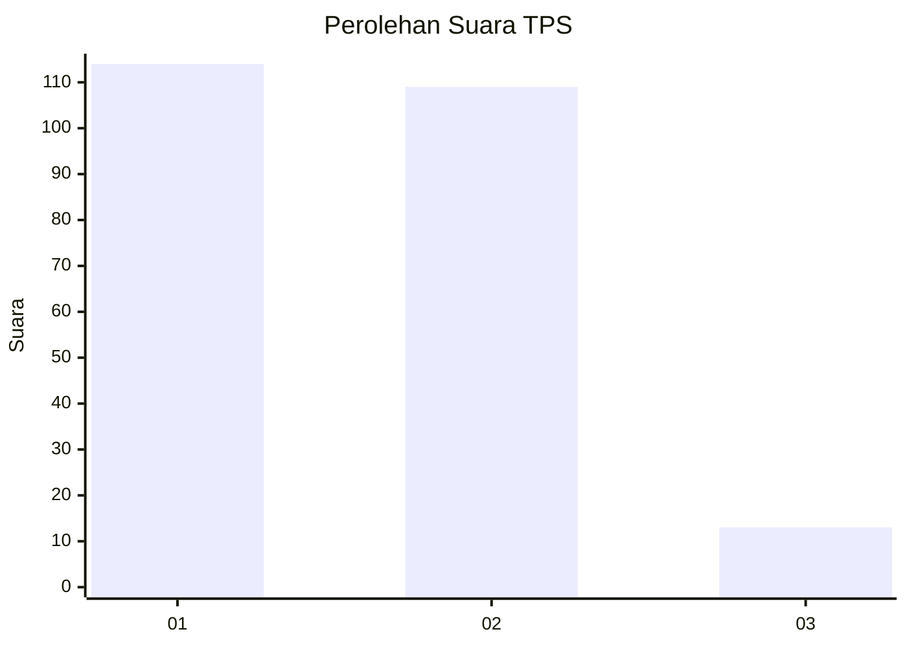
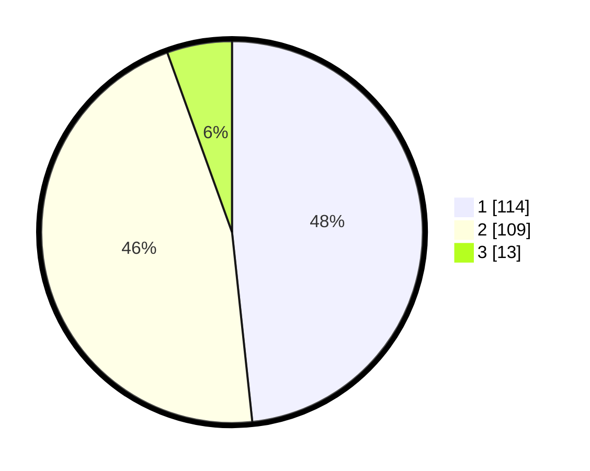

# Hasil

## Grafik

## Tabel

| No. | Nama Paslon    | Suara | Suara (raw) | Persentase |
|:--- |:-------------- | -----:| -----------:| ----------:|
| 1   | ANIES MUHAIMIN | 114   | [114][p-1]  | 48,31      |
| 2   | PRABOWO GIBRAN | 109   | [109][p-2]  | 46,19      |
| 3   | GANJAR MAHFUD  | 13    | [13][p-3]   | 5,51       |

[p-1]: https://github.com/gigit-pemilu/pemilu-2024-36-banten/blob/main/pilpres/hitung-suara/sub/36-banten/sub/73-kota-serang/sub/01-serang/sub/1001-serang/sub/003-tps/sub/paslon-1.txt
[p-2]: https://github.com/gigit-pemilu/pemilu-2024-36-banten/blob/main/pilpres/hitung-suara/sub/36-banten/sub/73-kota-serang/sub/01-serang/sub/1001-serang/sub/003-tps/sub/paslon-2.txt
[p-3]: https://github.com/gigit-pemilu/pemilu-2024-36-banten/blob/main/pilpres/hitung-suara/sub/36-banten/sub/73-kota-serang/sub/01-serang/sub/1001-serang/sub/003-tps/sub/paslon-3.txt

## Foto C Plano

https://sirekap-obj-formc.kpu.go.id/049a/pemilu/ppwp/36/73/01/10/01/3673011001003-20240214-231815--27b2301c-328e-4220-b393-7357d991d038.jpg

https://sirekap-obj-formc.kpu.go.id/049a/pemilu/ppwp/36/73/01/10/01/3673011001003-20240214-212817--e5f2986f-797c-4c3c-a832-f2a48f32f2ed.jpg

https://sirekap-obj-formc.kpu.go.id/049a/pemilu/ppwp/36/73/01/10/01/3673011001003-20240214-232243--d8e95ea2-9862-4abb-ae49-794374b6b52c.jpg

## Metadata

| Key        | Value               |
| ---------- | ------------------- |
| Time Stamp | 2024-02-16 21:01:00 |

