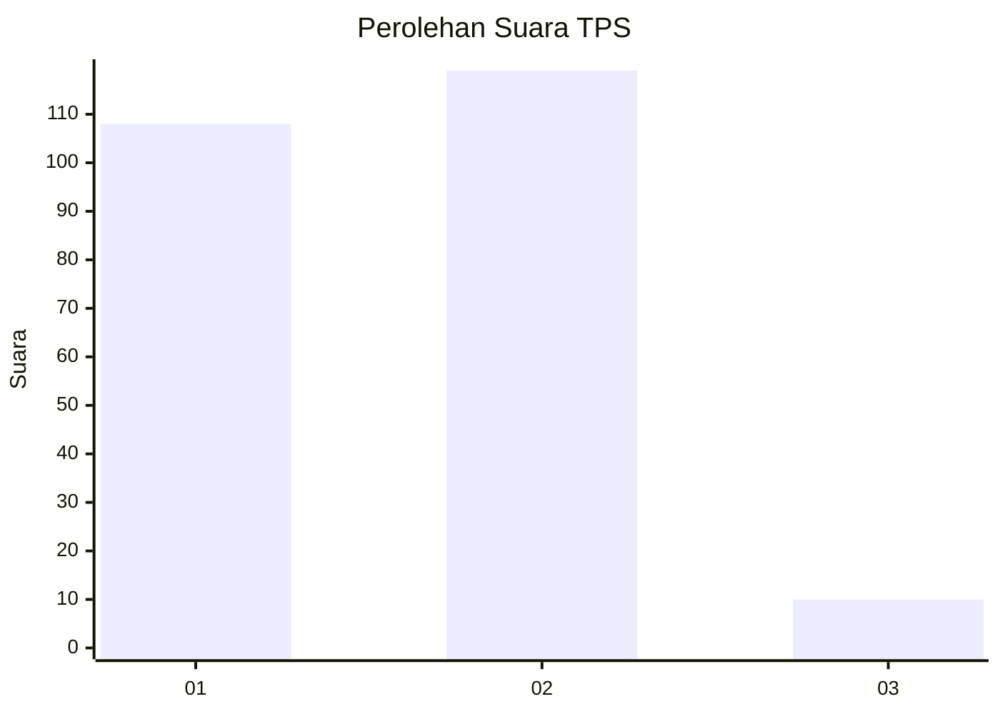
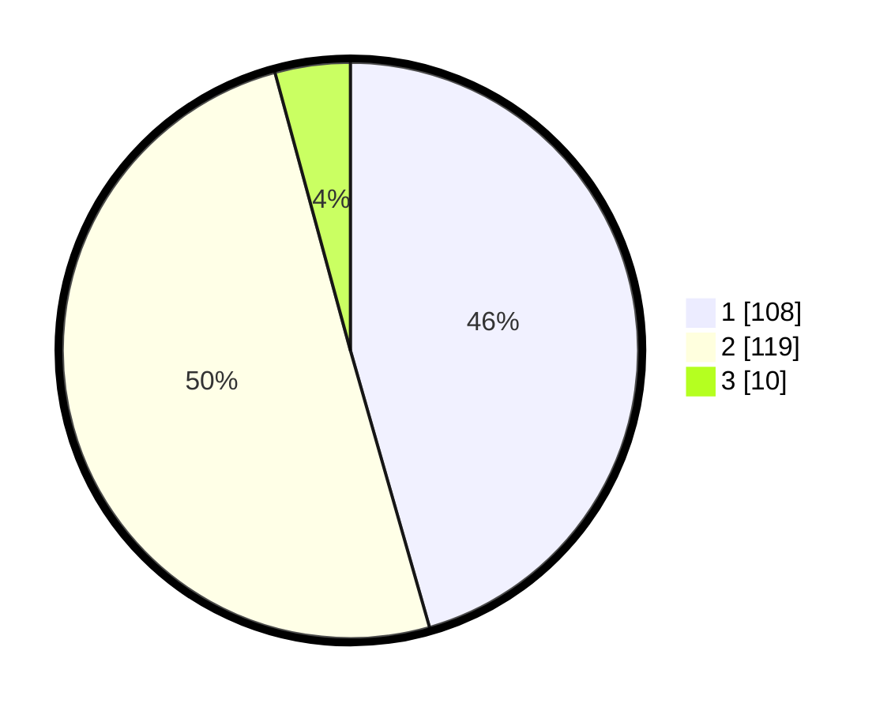

# Hasil

## Grafik

## Tabel

| No. | Nama Paslon    | Suara | Suara (raw) | Persentase |
|:--- |:-------------- | -----:| -----------:| ----------:|
| 1   | ANIES MUHAIMIN | 108   | [108][p-1]  | 45,57      |
| 2   | PRABOWO GIBRAN | 119   | [119][p-2]  | 50,21      |
| 3   | GANJAR MAHFUD  | 10    | [10][p-3]   | 4,22       |

[p-1]: https://github.com/gigit-pemilu/pemilu-2024/blob/main/pilpres/hitung-suara/sub/36-banten/sub/73-kota-serang/sub/01-serang/sub/1001-serang/sub/004-tps/sub/paslon-1.txt
[p-2]: https://github.com/gigit-pemilu/pemilu-2024/blob/main/pilpres/hitung-suara/sub/36-banten/sub/73-kota-serang/sub/01-serang/sub/1001-serang/sub/004-tps/sub/paslon-2.txt
[p-3]: https://github.com/gigit-pemilu/pemilu-2024/blob/main/pilpres/hitung-suara/sub/36-banten/sub/73-kota-serang/sub/01-serang/sub/1001-serang/sub/004-tps/sub/paslon-3.txt

## Foto C Plano

https://sirekap-obj-formc.kpu.go.id/f66d/pemilu/ppwp/36/73/01/10/01/3673011001004-20240215-000537--733fb247-0a4e-4e7f-9109-e8915cb8baeb.jpg

https://sirekap-obj-formc.kpu.go.id/f66d/pemilu/ppwp/36/73/01/10/01/3673011001004-20240215-000611--4be8cb9c-2635-4a28-9d77-bc9f7ccf5d51.jpg

https://sirekap-obj-formc.kpu.go.id/f66d/pemilu/ppwp/36/73/01/10/01/3673011001004-20240215-000449--6ffcb0b8-22fe-4c50-86b8-f21bc62c9c1b.jpg

## Metadata

| Key        | Value               |
| ---------- | ------------------- |
| Time Stamp | 2024-02-16 21:01:00 |

