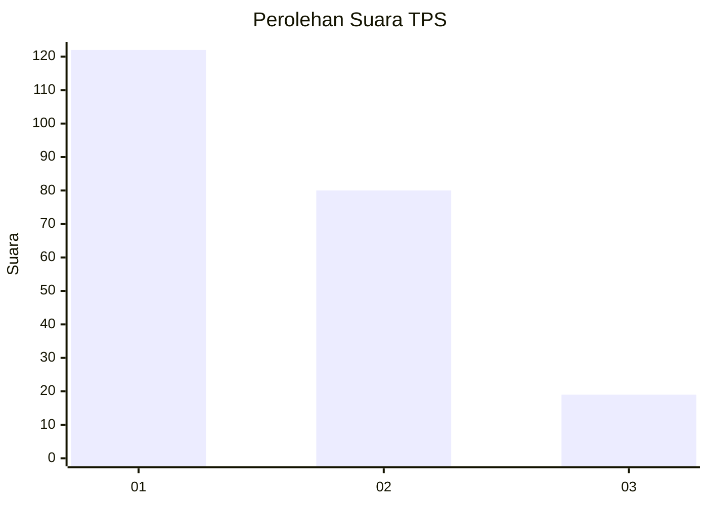
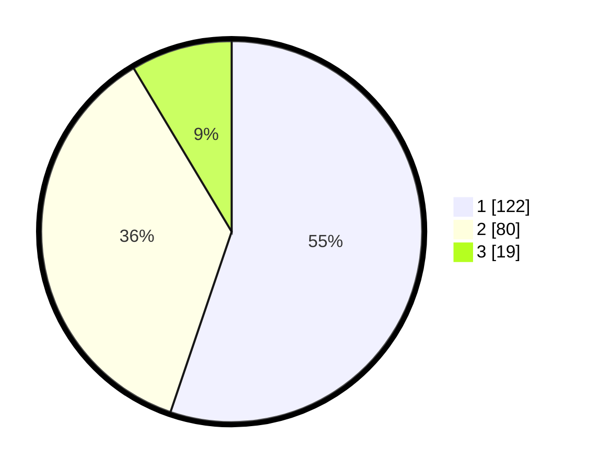

# Hasil

## Grafik

## Tabel

| No. | Nama Paslon    | Suara | Suara (raw) | Persentase |
|:--- |:-------------- | -----:| -----------:| ----------:|
| 1   | ANIES MUHAIMIN | 122   | [122][p-1]  | 55,20      |
| 2   | PRABOWO GIBRAN | 80    | [80][p-2]   | 36,20      |
| 3   | GANJAR MAHFUD  | 19    | [19][p-3]   | 8,60       |

[p-1]: https://github.com/gigit-pemilu/pemilu-2024/blob/main/pilpres/hitung-suara/sub/36-banten/sub/73-kota-serang/sub/01-serang/sub/1001-serang/sub/005-tps/sub/paslon-1.txt
[p-2]: https://github.com/gigit-pemilu/pemilu-2024/blob/main/pilpres/hitung-suara/sub/36-banten/sub/73-kota-serang/sub/01-serang/sub/1001-serang/sub/005-tps/sub/paslon-2.txt
[p-3]: https://github.com/gigit-pemilu/pemilu-2024/blob/main/pilpres/hitung-suara/sub/36-banten/sub/73-kota-serang/sub/01-serang/sub/1001-serang/sub/005-tps/sub/paslon-3.txt

## Foto C Plano

https://sirekap-obj-formc.kpu.go.id/5ba2/pemilu/ppwp/36/73/01/10/01/3673011001005-20240214-234240--4d6d6264-fa3d-447a-a31b-e879af3db17a.jpg

https://sirekap-obj-formc.kpu.go.id/5ba2/pemilu/ppwp/36/73/01/10/01/3673011001005-20240214-202122--14f9d1ca-06bd-433b-9c01-44c1406c40e2.jpg

https://sirekap-obj-formc.kpu.go.id/5ba2/pemilu/ppwp/36/73/01/10/01/3673011001005-20240214-202126--ee680307-45a3-431c-a47d-8583d0835973.jpg

## Metadata

| Key        | Value               |
| ---------- | ------------------- |
| Time Stamp | 2024-02-15 15:30:25 |

