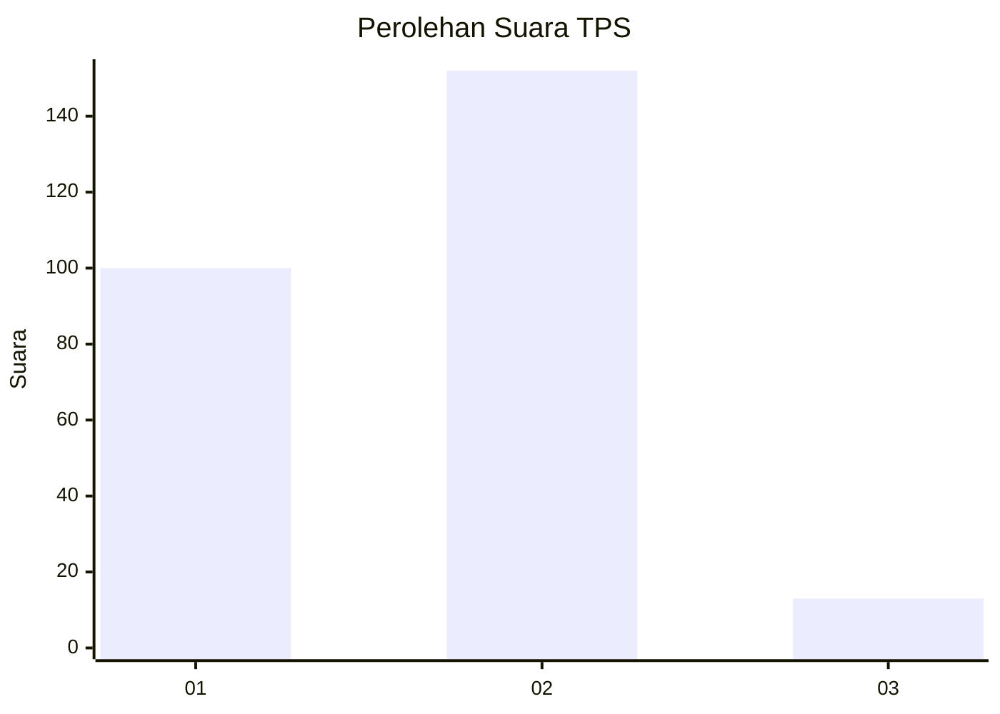
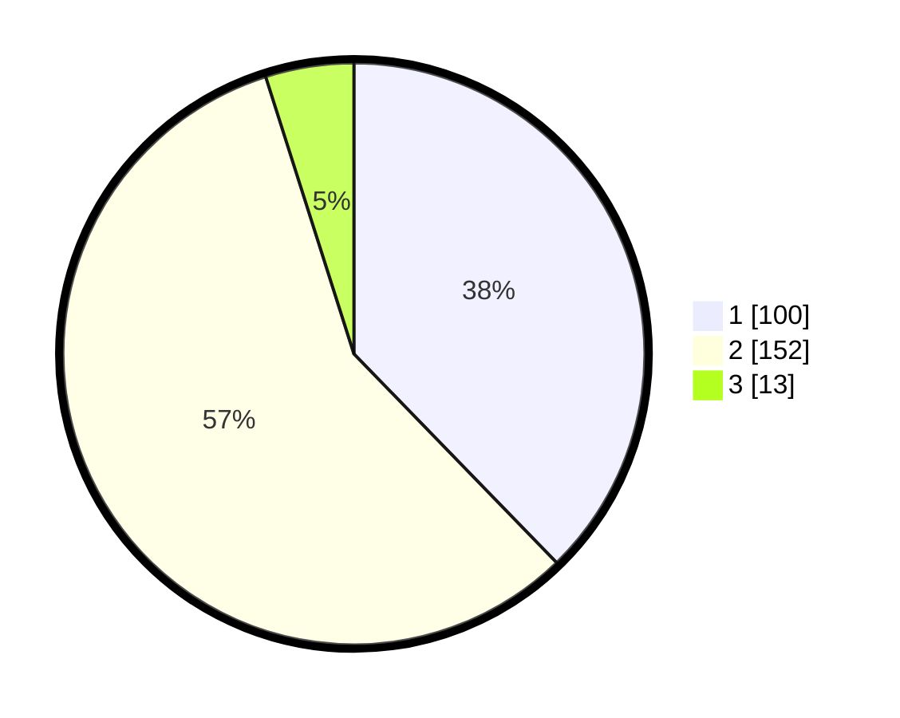

# Hasil

## Grafik

## Tabel

| No. | Nama Paslon    | Suara | Suara (raw) | Persentase |
|:--- |:-------------- | -----:| -----------:| ----------:|
| 1   | ANIES MUHAIMIN | 100   | [100][p-1]  | 37,74      |
| 2   | PRABOWO GIBRAN | 152   | [152][p-2]  | 57,36      |
| 3   | GANJAR MAHFUD  | 13    | [13][p-3]   | 4,91       |

[p-1]: https://github.com/gigit-pemilu/pemilu-2024-36-banten/blob/main/pilpres/hitung-suara/sub/36-banten/sub/73-kota-serang/sub/01-serang/sub/1001-serang/sub/015-tps/sub/paslon-1.txt
[p-2]: https://github.com/gigit-pemilu/pemilu-2024-36-banten/blob/main/pilpres/hitung-suara/sub/36-banten/sub/73-kota-serang/sub/01-serang/sub/1001-serang/sub/015-tps/sub/paslon-2.txt
[p-3]: https://github.com/gigit-pemilu/pemilu-2024-36-banten/blob/main/pilpres/hitung-suara/sub/36-banten/sub/73-kota-serang/sub/01-serang/sub/1001-serang/sub/015-tps/sub/paslon-3.txt

## Foto C Plano

https://sirekap-obj-formc.kpu.go.id/4b48/pemilu/ppwp/36/73/01/10/01/3673011001015-20240215-124000--e46f974d-7d50-4d6e-986d-38cb7344914d.jpg

https://sirekap-obj-formc.kpu.go.id/4b48/pemilu/ppwp/36/73/01/10/01/3673011001015-20240215-131521--c85d7061-dc4f-4f8a-903a-103a0f7019c3.jpg

https://sirekap-obj-formc.kpu.go.id/4b48/pemilu/ppwp/36/73/01/10/01/3673011001015-20240214-201650--66efda14-9a74-4fd0-8379-a122be1521c2.jpg

## Metadata

| Key        | Value               |
| ---------- | ------------------- |
| Time Stamp | 2024-02-21 10:00:00 |

