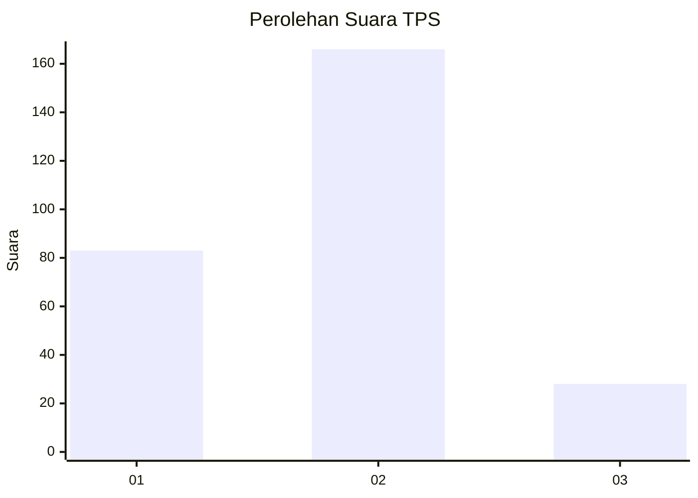
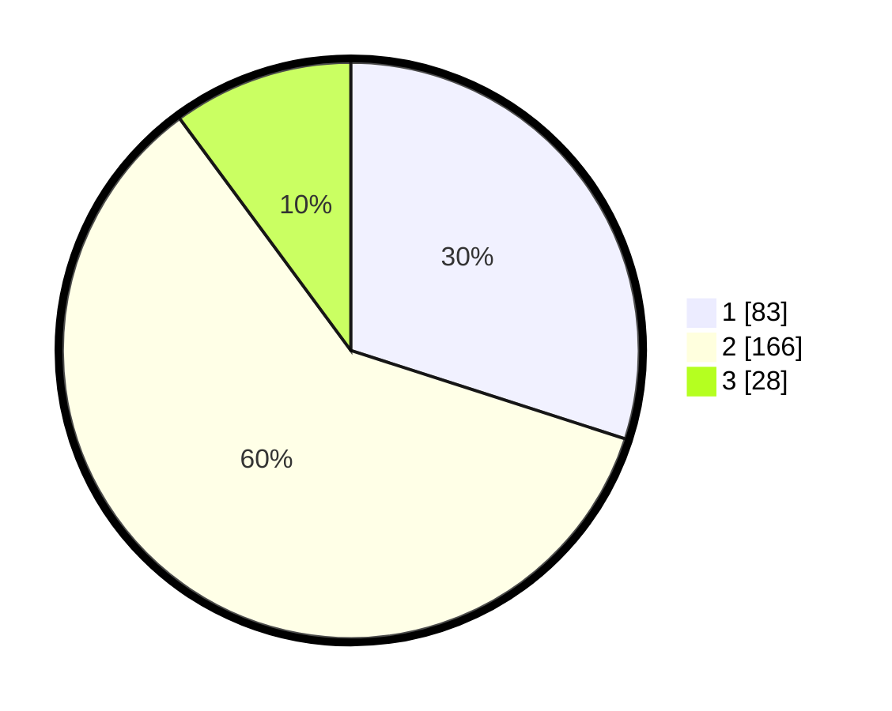

# Hasil

## Grafik

## Tabel

| No. | Nama Paslon    | Suara | Suara (raw) | Persentase |
|:--- |:-------------- | -----:| -----------:| ----------:|
| 1   | ANIES MUHAIMIN | 83    | [83][p-1]   | 29,96      |
| 2   | PRABOWO GIBRAN | 166   | [166][p-2]  | 59,93      |
| 3   | GANJAR MAHFUD  | 28    | [28][p-3]   | 10,11      |

[p-1]: https://github.com/gigit-pemilu/pemilu-2024-36-banten/blob/main/pilpres/hitung-suara/sub/36-banten/sub/73-kota-serang/sub/01-serang/sub/1001-serang/sub/026-tps/sub/paslon-1.txt
[p-2]: https://github.com/gigit-pemilu/pemilu-2024-36-banten/blob/main/pilpres/hitung-suara/sub/36-banten/sub/73-kota-serang/sub/01-serang/sub/1001-serang/sub/026-tps/sub/paslon-2.txt
[p-3]: https://github.com/gigit-pemilu/pemilu-2024-36-banten/blob/main/pilpres/hitung-suara/sub/36-banten/sub/73-kota-serang/sub/01-serang/sub/1001-serang/sub/026-tps/sub/paslon-3.txt

## Foto C Plano

https://sirekap-obj-formc.kpu.go.id/8f7c/pemilu/ppwp/36/73/01/10/01/3673011001026-20240214-222429--c6b5c957-5300-42d6-9813-1e43e8dda08e.jpg

https://sirekap-obj-formc.kpu.go.id/8f7c/pemilu/ppwp/36/73/01/10/01/3673011001026-20240214-222854--134b18e3-eff2-4174-9a6e-0b97b436114c.jpg

https://sirekap-obj-formc.kpu.go.id/8f7c/pemilu/ppwp/36/73/01/10/01/3673011001026-20240214-223313--e8470666-6db8-44f5-a30c-b1f0708f7896.jpg

## Metadata

| Key        | Value               |
| ---------- | ------------------- |
| Time Stamp | 2024-02-15 17:00:25 |

