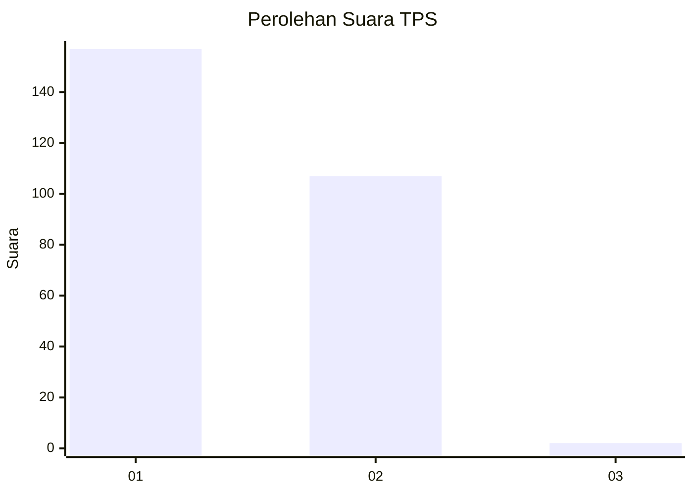
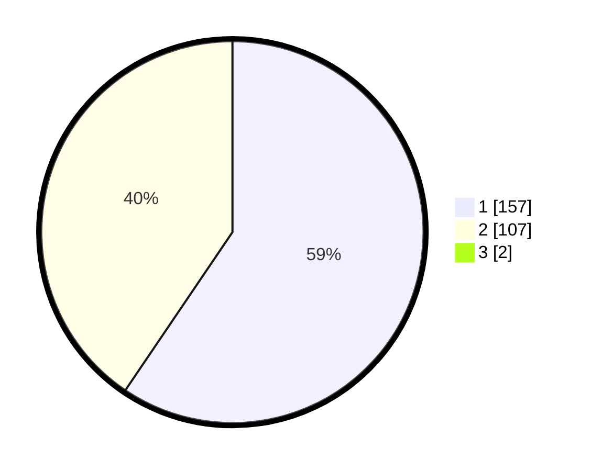

# Hasil

## Grafik

## Tabel

| No. | Nama Paslon    | Suara | Suara (raw) | Persentase |
|:--- |:-------------- | -----:| -----------:| ----------:|
| 1   | ANIES MUHAIMIN | 157   | [157][p-1]  | 59,02      |
| 2   | PRABOWO GIBRAN | 107   | [107][p-2]  | 40,23      |
| 3   | GANJAR MAHFUD  | 2     | [2][p-3]    | 0,75       |

[p-1]: https://github.com/gigit-pemilu/pemilu-2024/blob/main/pilpres/hitung-suara/sub/36-banten/sub/73-kota-serang/sub/01-serang/sub/1007-unyur/sub/069-tps/sub/paslon-1.txt
[p-2]: https://github.com/gigit-pemilu/pemilu-2024/blob/main/pilpres/hitung-suara/sub/36-banten/sub/73-kota-serang/sub/01-serang/sub/1007-unyur/sub/069-tps/sub/paslon-2.txt
[p-3]: https://github.com/gigit-pemilu/pemilu-2024/blob/main/pilpres/hitung-suara/sub/36-banten/sub/73-kota-serang/sub/01-serang/sub/1007-unyur/sub/069-tps/sub/paslon-3.txt

## Foto C Plano

https://sirekap-obj-formc.kpu.go.id/0633/pemilu/ppwp/36/73/01/10/07/3673011007069-20240214-221218--ac52e2f9-f54f-433a-a2d3-ee494caa2714.jpg

https://sirekap-obj-formc.kpu.go.id/0633/pemilu/ppwp/36/73/01/10/07/3673011007069-20240215-053950--5295accd-890b-44b9-9b8a-a5770be62803.jpg

https://sirekap-obj-formc.kpu.go.id/0633/pemilu/ppwp/36/73/01/10/07/3673011007069-20240215-054120--96e2aaed-ef39-4550-b8f8-96f05e0f3bb9.jpg

## Metadata

| Key        | Value               |
| ---------- | ------------------- |
| Time Stamp | 2024-02-15 17:30:25 |

