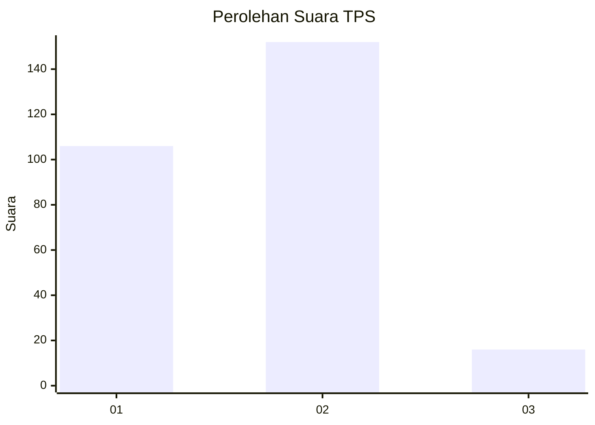
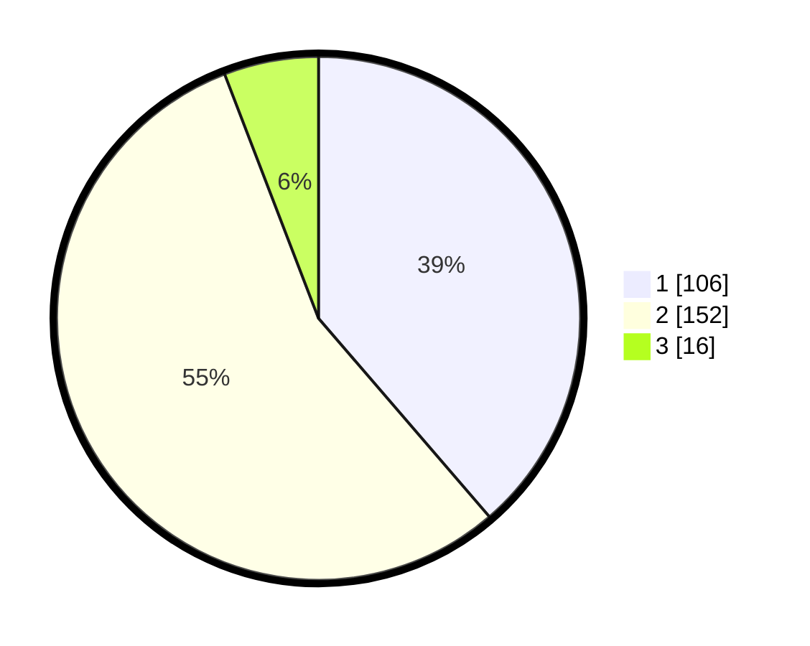

# Hasil

## Grafik

## Tabel

| No. | Nama Paslon    | Suara | Suara (raw) | Persentase |
|:--- |:-------------- | -----:| -----------:| ----------:|
| 1   | ANIES MUHAIMIN | 106   | [106][p-1]  | 38,69      |
| 2   | PRABOWO GIBRAN | 152   | [152][p-2]  | 55,47      |
| 3   | GANJAR MAHFUD  | 16    | [16][p-3]   | 5,84       |

[p-1]: https://github.com/gigit-pemilu/pemilu-2024/blob/main/pilpres/hitung-suara/sub/36-banten/sub/73-kota-serang/sub/01-serang/sub/1007-unyur/sub/122-tps/sub/paslon-1.txt
[p-2]: https://github.com/gigit-pemilu/pemilu-2024/blob/main/pilpres/hitung-suara/sub/36-banten/sub/73-kota-serang/sub/01-serang/sub/1007-unyur/sub/122-tps/sub/paslon-2.txt
[p-3]: https://github.com/gigit-pemilu/pemilu-2024/blob/main/pilpres/hitung-suara/sub/36-banten/sub/73-kota-serang/sub/01-serang/sub/1007-unyur/sub/122-tps/sub/paslon-3.txt

## Foto C Plano

https://sirekap-obj-formc.kpu.go.id/7acf/pemilu/ppwp/36/73/01/10/07/3673011007122-20240215-011257--ec3548f9-d578-4e06-9f56-c0d4446c06ee.jpg

https://sirekap-obj-formc.kpu.go.id/7acf/pemilu/ppwp/36/73/01/10/07/3673011007122-20240217-104241--eb9a66d1-9225-41af-b079-8f8794689ceb.jpg

https://sirekap-obj-formc.kpu.go.id/7acf/pemilu/ppwp/36/73/01/10/07/3673011007122-20240215-180223--e34c41f8-d608-46d1-849b-833fb0082a4c.jpg

## Metadata

| Key        | Value               |
| ---------- | ------------------- |
| Time Stamp | 2024-02-24 22:31:28 |

