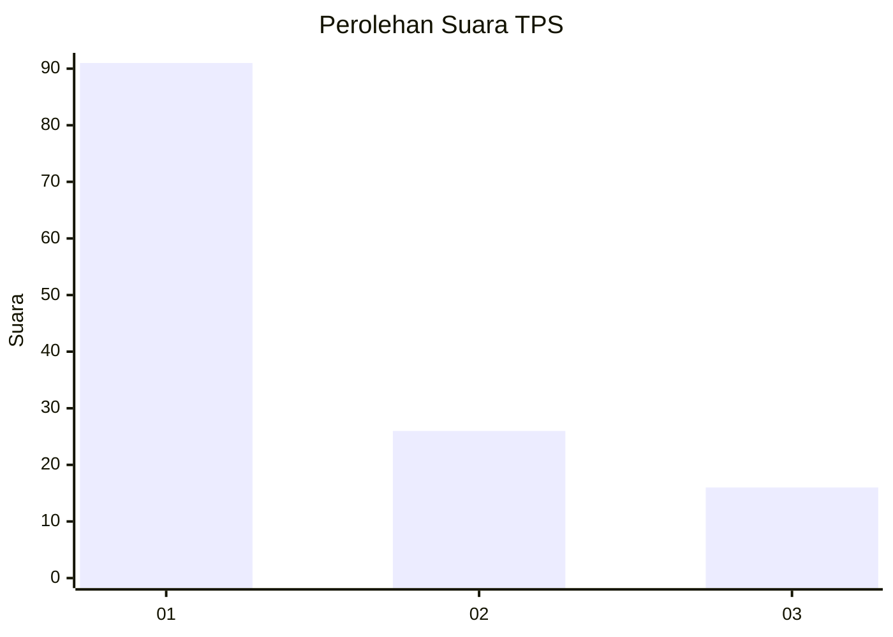
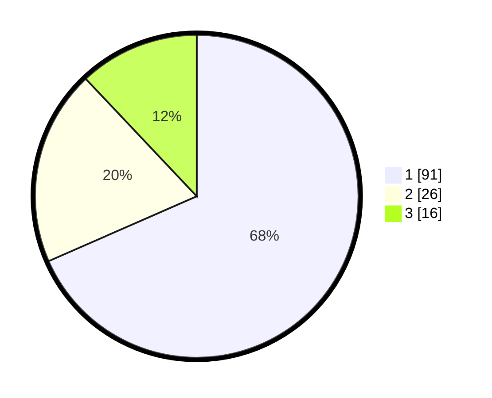

# Hasil

## Grafik

## Tabel

| No. | Nama Paslon    | Suara | Suara (raw) | Persentase |
|:--- |:-------------- | -----:| -----------:| ----------:|
| 1   | ANIES MUHAIMIN | 91    | [91][p-1]   | 68,42      |
| 2   | PRABOWO GIBRAN | 26    | [26][p-2]   | 19,55      |
| 3   | GANJAR MAHFUD  | 16    | [16][p-3]   | 12,03      |

[p-1]: https://github.com/gigit-pemilu/pemilu-2024/blob/main/pilpres/hitung-suara/sub/36-banten/sub/73-kota-serang/sub/01-serang/sub/1010-kaligandu/sub/050-tps/sub/paslon-1.txt
[p-2]: https://github.com/gigit-pemilu/pemilu-2024/blob/main/pilpres/hitung-suara/sub/36-banten/sub/73-kota-serang/sub/01-serang/sub/1010-kaligandu/sub/050-tps/sub/paslon-2.txt
[p-3]: https://github.com/gigit-pemilu/pemilu-2024/blob/main/pilpres/hitung-suara/sub/36-banten/sub/73-kota-serang/sub/01-serang/sub/1010-kaligandu/sub/050-tps/sub/paslon-3.txt

## Foto C Plano

https://sirekap-obj-formc.kpu.go.id/4866/pemilu/ppwp/36/73/01/10/10/3673011010050-20240215-021003--2c05e4e2-e8f0-4649-9af0-32cb4114f0d7.jpg

https://sirekap-obj-formc.kpu.go.id/4866/pemilu/ppwp/36/73/01/10/10/3673011010050-20240215-021120--ac73abb6-c818-4341-9346-01df38b5b4e5.jpg

https://sirekap-obj-formc.kpu.go.id/4866/pemilu/ppwp/36/73/01/10/10/3673011010050-20240215-021231--389d2bf1-95b8-4cbf-875a-591270ab1596.jpg

## Metadata

| Key        | Value               |
| ---------- | ------------------- |
| Time Stamp | 2024-02-15 18:30:25 |

