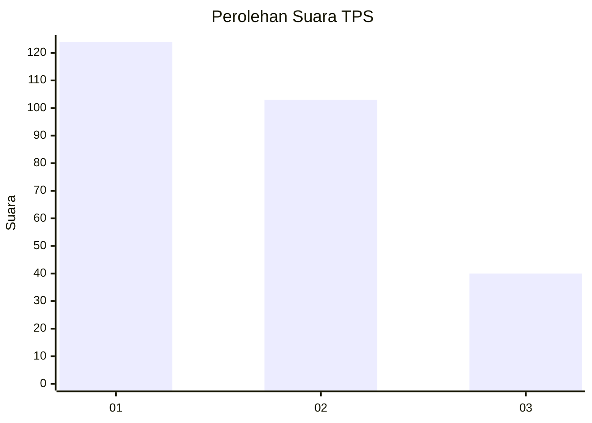
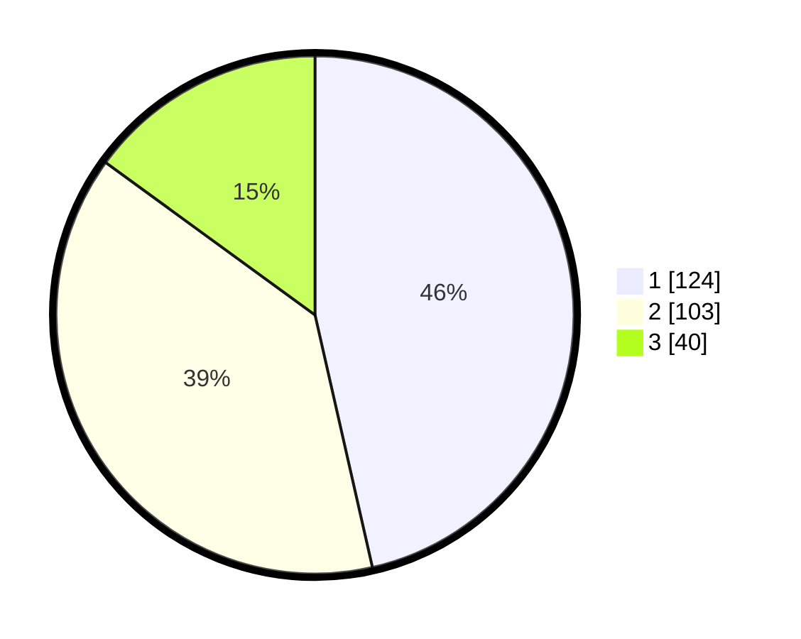

# Hasil

## Grafik

## Tabel

| No. | Nama Paslon    | Suara | Suara (raw) | Persentase |
|:--- |:-------------- | -----:| -----------:| ----------:|
| 1   | ANIES MUHAIMIN | 124   | [124][p-1]  | 46,44      |
| 2   | PRABOWO GIBRAN | 103   | [103][p-2]  | 38,58      |
| 3   | GANJAR MAHFUD  | 40    | [40][p-3]   | 14,98      |

[p-1]: https://github.com/gigit-pemilu/pemilu-2024/blob/main/pilpres/hitung-suara/sub/36-banten/sub/73-kota-serang/sub/01-serang/sub/1011-terondol/sub/010-tps/sub/paslon-1.txt
[p-2]: https://github.com/gigit-pemilu/pemilu-2024/blob/main/pilpres/hitung-suara/sub/36-banten/sub/73-kota-serang/sub/01-serang/sub/1011-terondol/sub/010-tps/sub/paslon-2.txt
[p-3]: https://github.com/gigit-pemilu/pemilu-2024/blob/main/pilpres/hitung-suara/sub/36-banten/sub/73-kota-serang/sub/01-serang/sub/1011-terondol/sub/010-tps/sub/paslon-3.txt

## Foto C Plano

https://sirekap-obj-formc.kpu.go.id/16d9/pemilu/ppwp/36/73/01/10/11/3673011011010-20240214-232441--36bbb315-efd0-4555-b946-5be686834e22.jpg

https://sirekap-obj-formc.kpu.go.id/16d9/pemilu/ppwp/36/73/01/10/11/3673011011010-20240214-232558--29be4395-9de8-4103-bb84-1b1a30a1ba1d.jpg

https://sirekap-obj-formc.kpu.go.id/16d9/pemilu/ppwp/36/73/01/10/11/3673011011010-20240214-232812--1b742743-03e3-467f-a193-5df417206e0b.jpg

## Metadata

| Key        | Value               |
| ---------- | ------------------- |
| Time Stamp | 2024-02-15 18:30:25 |

