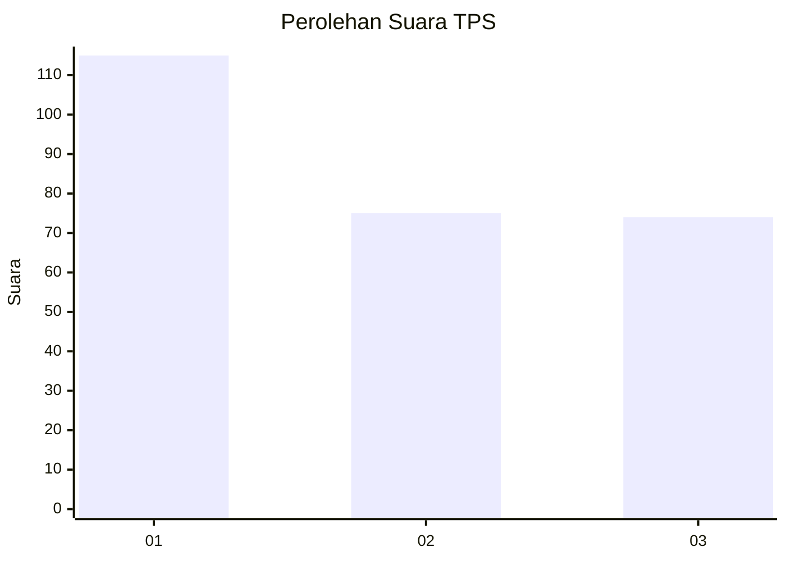
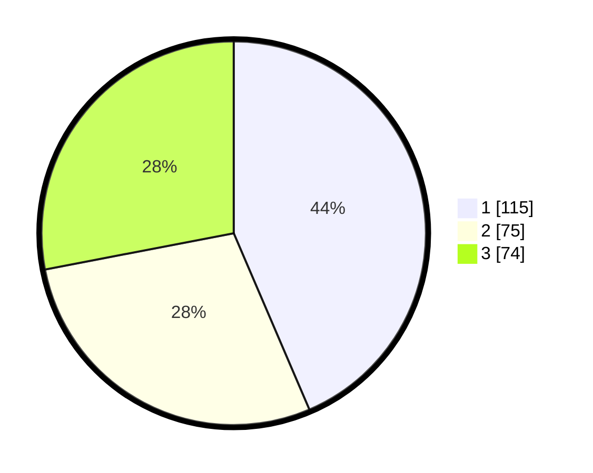

# Hasil

## Grafik

## Tabel

| No. | Nama Paslon    | Suara | Suara (raw) | Persentase |
|:--- |:-------------- | -----:| -----------:| ----------:|
| 1   | ANIES MUHAIMIN | 115   | [115][p-1]  | 43,56      |
| 2   | PRABOWO GIBRAN | 75    | [75][p-2]   | 28,41      |
| 3   | GANJAR MAHFUD  | 74    | [74][p-3]   | 28,03      |

[p-1]: https://github.com/gigit-pemilu/pemilu-2024-36-banten/blob/main/pilpres/hitung-suara/sub/36-banten/sub/73-kota-serang/sub/01-serang/sub/1012-kagungan/sub/026-tps/sub/paslon-1.txt
[p-2]: https://github.com/gigit-pemilu/pemilu-2024-36-banten/blob/main/pilpres/hitung-suara/sub/36-banten/sub/73-kota-serang/sub/01-serang/sub/1012-kagungan/sub/026-tps/sub/paslon-2.txt
[p-3]: https://github.com/gigit-pemilu/pemilu-2024-36-banten/blob/main/pilpres/hitung-suara/sub/36-banten/sub/73-kota-serang/sub/01-serang/sub/1012-kagungan/sub/026-tps/sub/paslon-3.txt

## Foto C Plano

https://sirekap-obj-formc.kpu.go.id/bd7a/pemilu/ppwp/36/73/01/10/12/3673011012026-20240214-212359--2ded9982-3538-41a9-9c47-60e43ebe293b.jpg

https://sirekap-obj-formc.kpu.go.id/bd7a/pemilu/ppwp/36/73/01/10/12/3673011012026-20240214-212509--31a664c5-2d42-4922-b964-f82c12336529.jpg

https://sirekap-obj-formc.kpu.go.id/bd7a/pemilu/ppwp/36/73/01/10/12/3673011012026-20240214-212606--3b68be9e-fec2-44a7-96af-1669ca5185b1.jpg

## Metadata

| Key        | Value               |
| ---------- | ------------------- |
| Time Stamp | 2024-02-15 15:00:29 |

