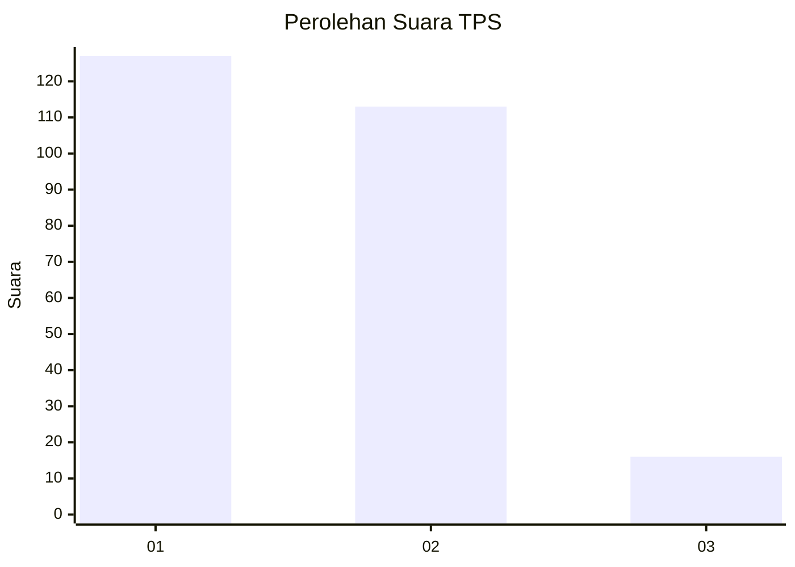
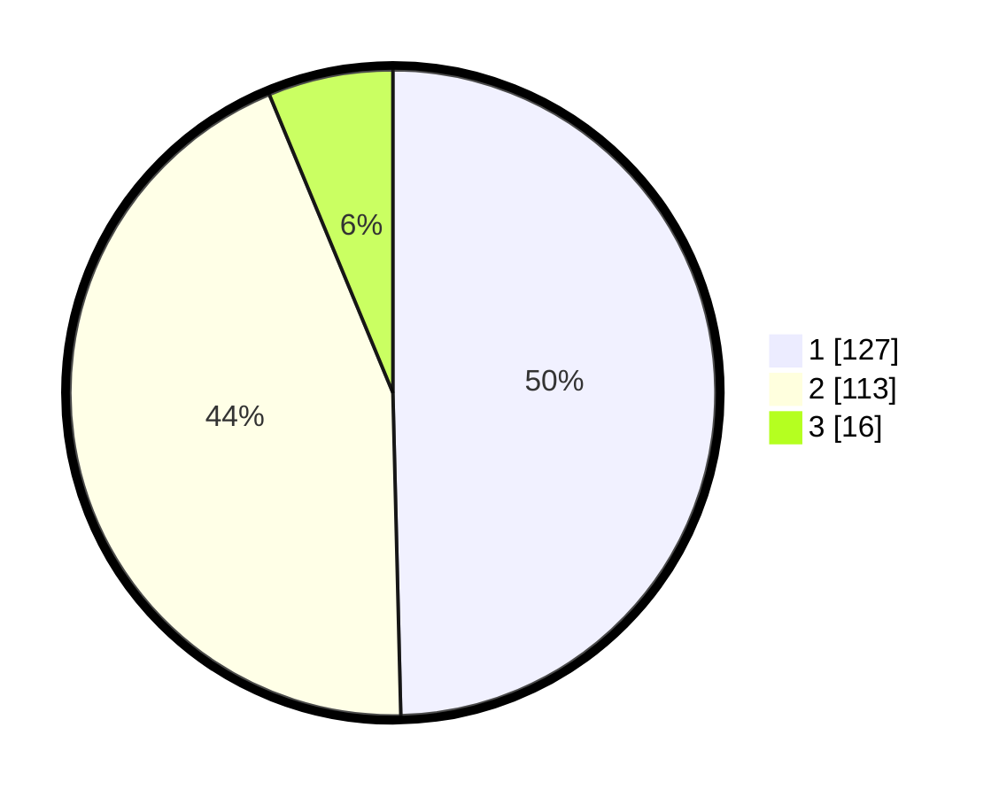

# Hasil

## Grafik

## Tabel

| No. | Nama Paslon    | Suara | Suara (raw) | Persentase |
|:--- |:-------------- | -----:| -----------:| ----------:|
| 1   | ANIES MUHAIMIN | 127   | [127][p-1]  | 49,61      |
| 2   | PRABOWO GIBRAN | 113   | [113][p-2]  | 44,14      |
| 3   | GANJAR MAHFUD  | 16    | [16][p-3]   | 6,25       |

[p-1]: https://github.com/gigit-pemilu/pemilu-2024-36-banten/blob/main/pilpres/hitung-suara/sub/36-banten/sub/73-kota-serang/sub/02-kasemen/sub/1001-kasemen/sub/006-tps/sub/paslon-1.txt
[p-2]: https://github.com/gigit-pemilu/pemilu-2024-36-banten/blob/main/pilpres/hitung-suara/sub/36-banten/sub/73-kota-serang/sub/02-kasemen/sub/1001-kasemen/sub/006-tps/sub/paslon-2.txt
[p-3]: https://github.com/gigit-pemilu/pemilu-2024-36-banten/blob/main/pilpres/hitung-suara/sub/36-banten/sub/73-kota-serang/sub/02-kasemen/sub/1001-kasemen/sub/006-tps/sub/paslon-3.txt

## Foto C Plano

https://sirekap-obj-formc.kpu.go.id/8358/pemilu/ppwp/36/73/02/10/01/3673021001006-20240214-201523--e308ec3d-d132-4c8f-8afb-e51bfd8f0b0c.jpg

https://sirekap-obj-formc.kpu.go.id/8358/pemilu/ppwp/36/73/02/10/01/3673021001006-20240214-201531--ce7f7f9a-a2ad-4ff6-8db8-8f93714844bd.jpg

https://sirekap-obj-formc.kpu.go.id/8358/pemilu/ppwp/36/73/02/10/01/3673021001006-20240214-201538--581f9801-f126-42dc-aa5d-784c8faf688e.jpg

## Metadata

| Key        | Value               |
| ---------- | ------------------- |
| Time Stamp | 2024-02-14 21:46:01 |

