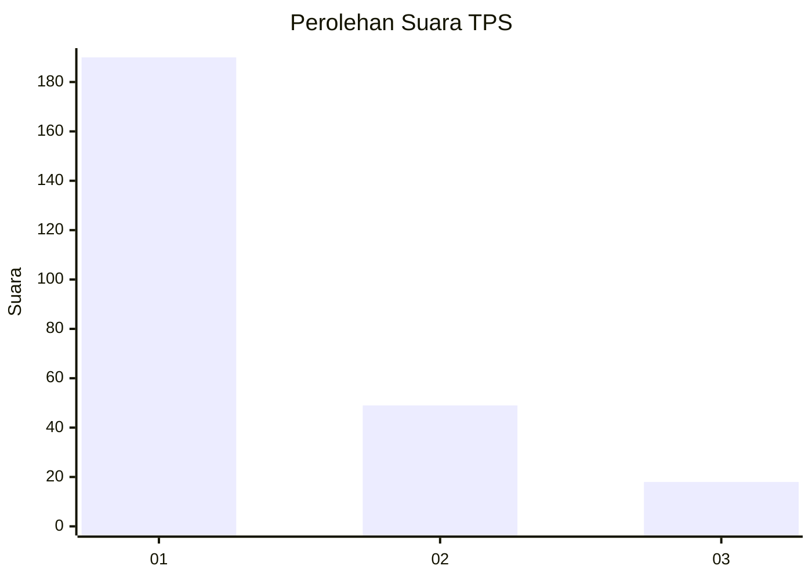
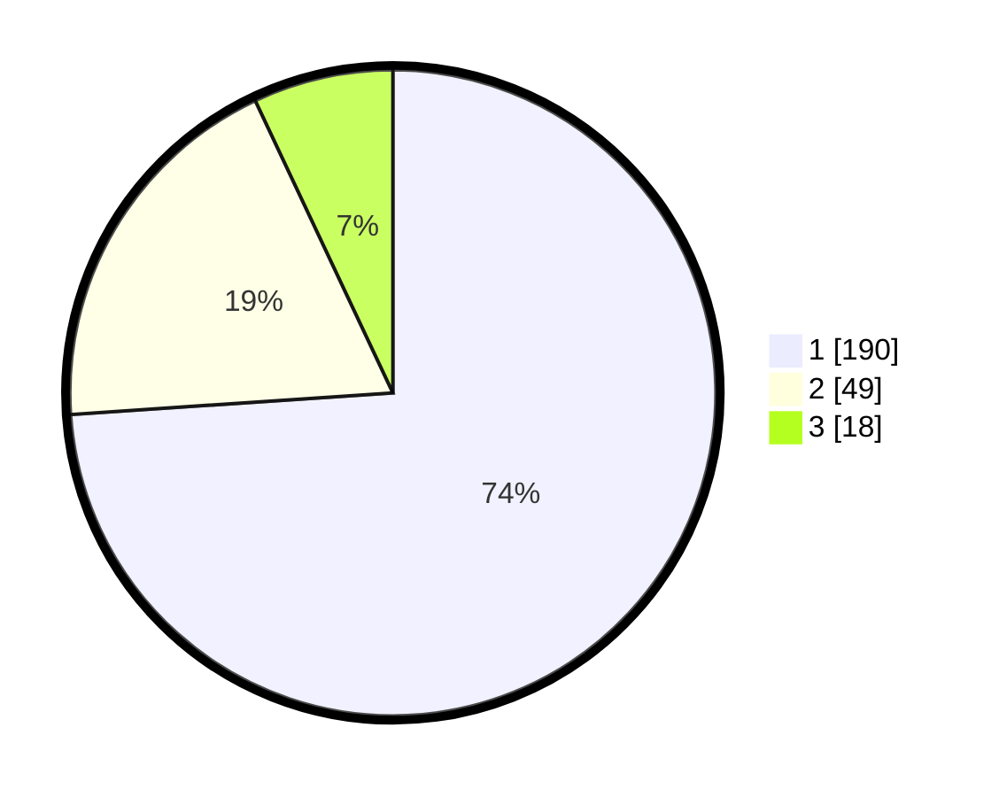

# Hasil

## Grafik

## Tabel

| No. | Nama Paslon    | Suara | Suara (raw) | Persentase |
|:--- |:-------------- | -----:| -----------:| ----------:|
| 1   | ANIES MUHAIMIN | 190   | [190][p-1]  | 73,93      |
| 2   | PRABOWO GIBRAN | 49    | [49][p-2]   | 19,07      |
| 3   | GANJAR MAHFUD  | 18    | [18][p-3]   | 7,00       |

[p-1]: https://github.com/gigit-pemilu/pemilu-2024-36-banten/blob/main/pilpres/hitung-suara/sub/36-banten/sub/73-kota-serang/sub/02-kasemen/sub/1003-terumbu/sub/016-tps/sub/paslon-1.txt
[p-2]: https://github.com/gigit-pemilu/pemilu-2024-36-banten/blob/main/pilpres/hitung-suara/sub/36-banten/sub/73-kota-serang/sub/02-kasemen/sub/1003-terumbu/sub/016-tps/sub/paslon-2.txt
[p-3]: https://github.com/gigit-pemilu/pemilu-2024-36-banten/blob/main/pilpres/hitung-suara/sub/36-banten/sub/73-kota-serang/sub/02-kasemen/sub/1003-terumbu/sub/016-tps/sub/paslon-3.txt

## Foto C Plano

https://sirekap-obj-formc.kpu.go.id/349a/pemilu/ppwp/36/73/02/10/03/3673021003016-20240214-155920--54c400e5-2385-4f61-a6cd-3044790b8ddc.jpg

https://sirekap-obj-formc.kpu.go.id/349a/pemilu/ppwp/36/73/02/10/03/3673021003016-20240214-155614--1f05e4c7-0bd5-4744-8e13-d8fa74a2e206.jpg

https://sirekap-obj-formc.kpu.go.id/349a/pemilu/ppwp/36/73/02/10/03/3673021003016-20240214-155728--93bdf42a-9c8b-4eb7-befc-b44b2a63561d.jpg

## Metadata

| Key        | Value               |
| ---------- | ------------------- |
| Time Stamp | 2024-02-15 00:41:44 |

