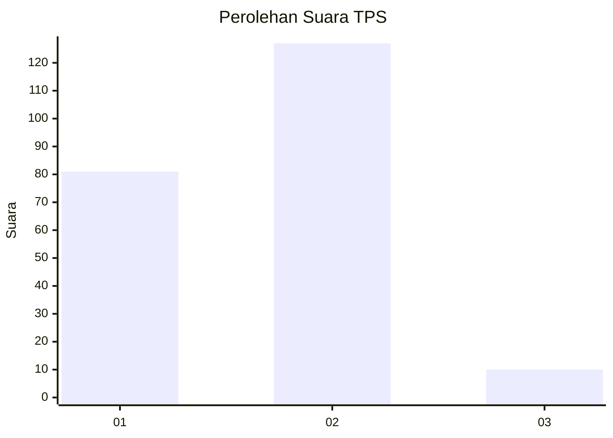
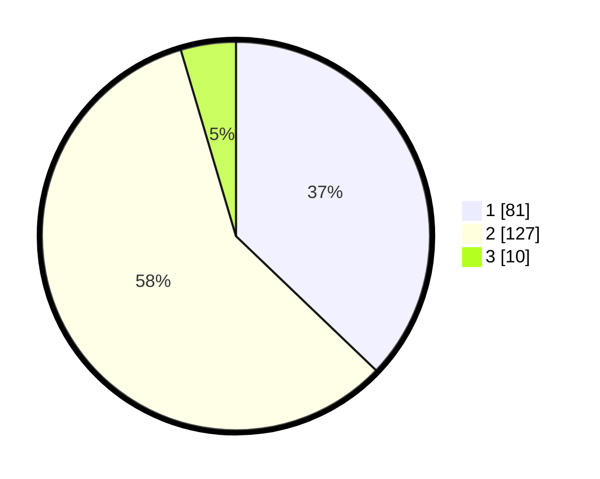

# Hasil

## Grafik

## Tabel

| No. | Nama Paslon    | Suara | Suara (raw) | Persentase |
|:--- |:-------------- | -----:| -----------:| ----------:|
| 1   | ANIES MUHAIMIN | 81    | [81][p-1]   | 37,16      |
| 2   | PRABOWO GIBRAN | 127   | [127][p-2]  | 58,26      |
| 3   | GANJAR MAHFUD  | 10    | [10][p-3]   | 4,59       |

[p-1]: https://github.com/gigit-pemilu/pemilu-2024/blob/main/pilpres/hitung-suara/sub/36-banten/sub/73-kota-serang/sub/02-kasemen/sub/1004-warung-jaud/sub/013-tps/sub/paslon-1.txt
[p-2]: https://github.com/gigit-pemilu/pemilu-2024/blob/main/pilpres/hitung-suara/sub/36-banten/sub/73-kota-serang/sub/02-kasemen/sub/1004-warung-jaud/sub/013-tps/sub/paslon-2.txt
[p-3]: https://github.com/gigit-pemilu/pemilu-2024/blob/main/pilpres/hitung-suara/sub/36-banten/sub/73-kota-serang/sub/02-kasemen/sub/1004-warung-jaud/sub/013-tps/sub/paslon-3.txt

## Foto C Plano

https://sirekap-obj-formc.kpu.go.id/b1f0/pemilu/ppwp/36/73/02/10/04/3673021004013-20240215-000559--f153a08d-d7d9-4a2b-ac1d-0b9465c0ebf1.jpg

https://sirekap-obj-formc.kpu.go.id/b1f0/pemilu/ppwp/36/73/02/10/04/3673021004013-20240215-000747--8653fe2b-1cbd-4d2d-afc8-c19647a38721.jpg

https://sirekap-obj-formc.kpu.go.id/b1f0/pemilu/ppwp/36/73/02/10/04/3673021004013-20240215-001208--32c17120-67a7-48a8-a510-14f624f44d9d.jpg

## Metadata

| Key        | Value               |
| ---------- | ------------------- |
| Time Stamp | 2024-02-15 20:00:44 |

