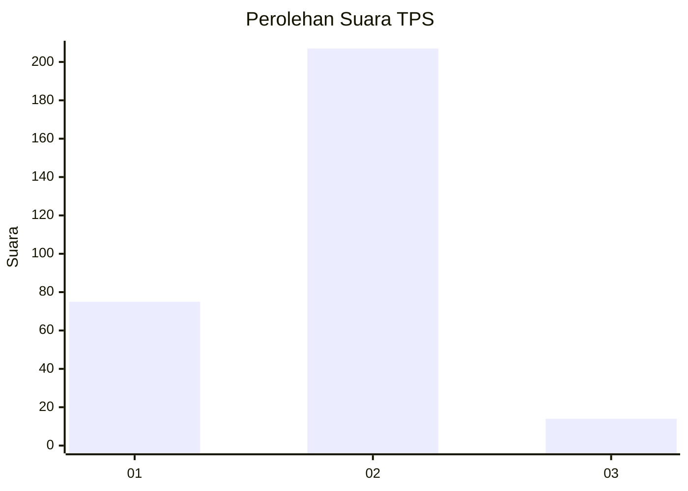
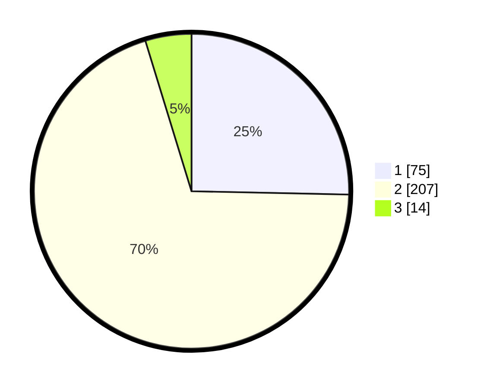

# Hasil

## Grafik

## Tabel

| No. | Nama Paslon    | Suara | Suara (raw) | Persentase |
|:--- |:-------------- | -----:| -----------:| ----------:|
| 1   | ANIES MUHAIMIN | 75    | [75][p-1]   | 25,34      |
| 2   | PRABOWO GIBRAN | 207   | [207][p-2]  | 69,93      |
| 3   | GANJAR MAHFUD  | 14    | [14][p-3]   | 4,73       |

[p-1]: https://github.com/gigit-pemilu/pemilu-2024/blob/main/pilpres/hitung-suara/sub/36-banten/sub/73-kota-serang/sub/02-kasemen/sub/1004-warung-jaud/sub/028-tps/sub/paslon-1.txt
[p-2]: https://github.com/gigit-pemilu/pemilu-2024/blob/main/pilpres/hitung-suara/sub/36-banten/sub/73-kota-serang/sub/02-kasemen/sub/1004-warung-jaud/sub/028-tps/sub/paslon-2.txt
[p-3]: https://github.com/gigit-pemilu/pemilu-2024/blob/main/pilpres/hitung-suara/sub/36-banten/sub/73-kota-serang/sub/02-kasemen/sub/1004-warung-jaud/sub/028-tps/sub/paslon-3.txt

## Foto C Plano

https://sirekap-obj-formc.kpu.go.id/bcd6/pemilu/ppwp/36/73/02/10/04/3673021004028-20240214-233217--670288c7-2a70-412d-aa2c-3126359512f8.jpg

https://sirekap-obj-formc.kpu.go.id/bcd6/pemilu/ppwp/36/73/02/10/04/3673021004028-20240214-233339--90aa7040-beaa-4939-ae1a-4192c94d465d.jpg

https://sirekap-obj-formc.kpu.go.id/bcd6/pemilu/ppwp/36/73/02/10/04/3673021004028-20240214-232655--1ea4da7d-7a22-4faf-ad66-6adf38ab6ad8.jpg

## Metadata

| Key        | Value               |
| ---------- | ------------------- |
| Time Stamp | 2024-02-24 22:31:28 |

