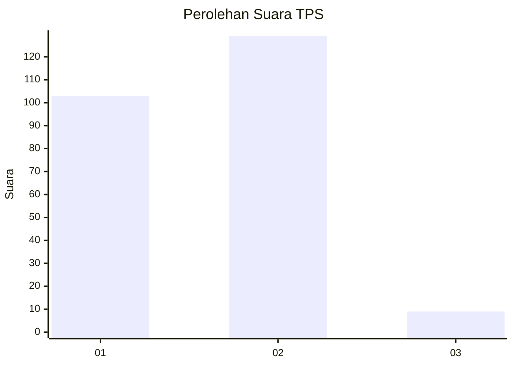
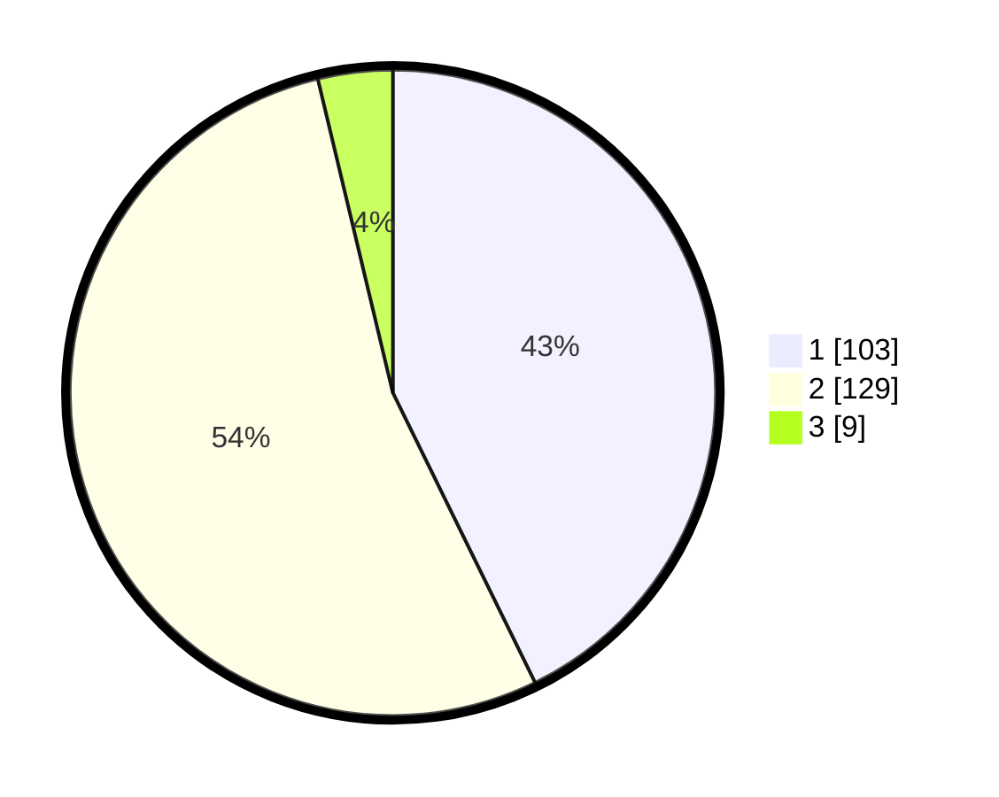

# Hasil

## Grafik

## Tabel

| No. | Nama Paslon    | Suara | Suara (raw) | Persentase |
|:--- |:-------------- | -----:| -----------:| ----------:|
| 1   | ANIES MUHAIMIN | 103   | [103][p-1]  | 42,74      |
| 2   | PRABOWO GIBRAN | 129   | [129][p-2]  | 53,53      |
| 3   | GANJAR MAHFUD  | 9     | [9][p-3]    | 3,73       |

[p-1]: https://github.com/gigit-pemilu/pemilu-2024-36-banten/blob/main/pilpres/hitung-suara/sub/36-banten/sub/73-kota-serang/sub/03-walantaka/sub/1001-walantaka/sub/003-tps/sub/paslon-1.txt
[p-2]: https://github.com/gigit-pemilu/pemilu-2024-36-banten/blob/main/pilpres/hitung-suara/sub/36-banten/sub/73-kota-serang/sub/03-walantaka/sub/1001-walantaka/sub/003-tps/sub/paslon-2.txt
[p-3]: https://github.com/gigit-pemilu/pemilu-2024-36-banten/blob/main/pilpres/hitung-suara/sub/36-banten/sub/73-kota-serang/sub/03-walantaka/sub/1001-walantaka/sub/003-tps/sub/paslon-3.txt

## Foto C Plano

https://sirekap-obj-formc.kpu.go.id/d14e/pemilu/ppwp/36/73/03/10/01/3673031001003-20240215-011634--05ccc295-320a-4ec4-a4ed-984d47aee078.jpg

https://sirekap-obj-formc.kpu.go.id/d14e/pemilu/ppwp/36/73/03/10/01/3673031001003-20240215-011801--45397847-5a98-4755-ae02-48cefa59a22b.jpg

https://sirekap-obj-formc.kpu.go.id/d14e/pemilu/ppwp/36/73/03/10/01/3673031001003-20240215-011924--cd735d12-4e62-40b5-9ddf-2d647bf4c8d2.jpg

## Metadata

| Key        | Value               |
| ---------- | ------------------- |
| Time Stamp | 2024-02-15 15:00:29 |

