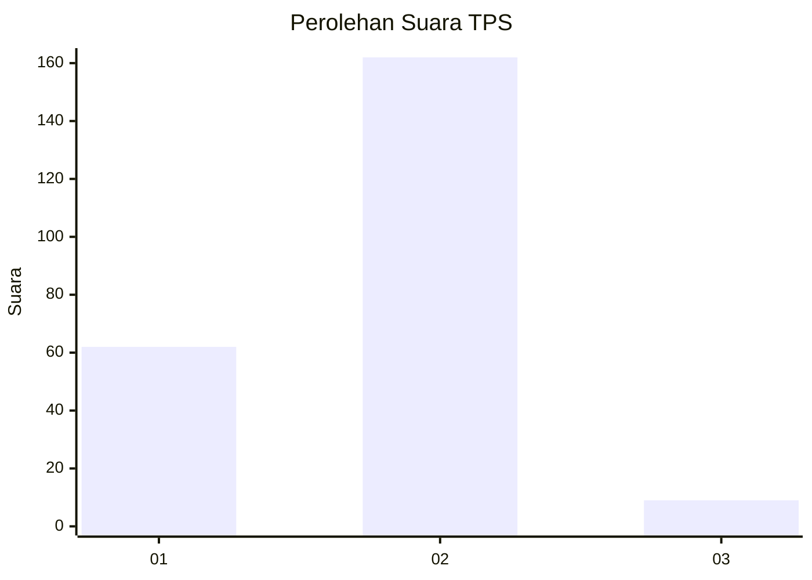
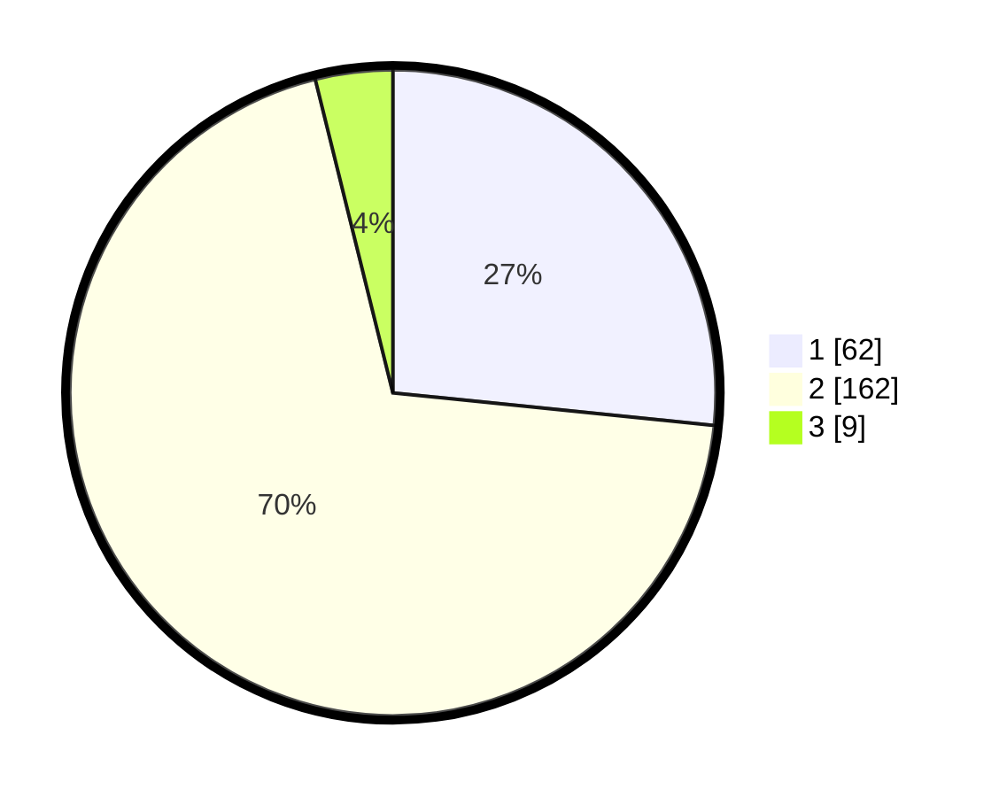

# Hasil

## Grafik

## Tabel

| No. | Nama Paslon    | Suara | Suara (raw) | Persentase |
|:--- |:-------------- | -----:| -----------:| ----------:|
| 1   | ANIES MUHAIMIN | 62    | [62][p-1]   | 26,61      |
| 2   | PRABOWO GIBRAN | 162   | [162][p-2]  | 69,53      |
| 3   | GANJAR MAHFUD  | 9     | [9][p-3]    | 3,86       |

[p-1]: https://github.com/gigit-pemilu/pemilu-2024-36-banten/blob/main/pilpres/hitung-suara/sub/36-banten/sub/73-kota-serang/sub/04-curug/sub/1001-curug/sub/002-tps/sub/paslon-1.txt
[p-2]: https://github.com/gigit-pemilu/pemilu-2024-36-banten/blob/main/pilpres/hitung-suara/sub/36-banten/sub/73-kota-serang/sub/04-curug/sub/1001-curug/sub/002-tps/sub/paslon-2.txt
[p-3]: https://github.com/gigit-pemilu/pemilu-2024-36-banten/blob/main/pilpres/hitung-suara/sub/36-banten/sub/73-kota-serang/sub/04-curug/sub/1001-curug/sub/002-tps/sub/paslon-3.txt

## Foto C Plano

https://sirekap-obj-formc.kpu.go.id/914e/pemilu/ppwp/36/73/04/10/01/3673041001002-20240215-020859--4fa0e07f-ae4c-4110-8ada-c69d8aae1056.jpg

https://sirekap-obj-formc.kpu.go.id/914e/pemilu/ppwp/36/73/04/10/01/3673041001002-20240215-021202--413140b3-56d6-47ab-8f0f-0681683616c2.jpg

https://sirekap-obj-formc.kpu.go.id/914e/pemilu/ppwp/36/73/04/10/01/3673041001002-20240215-021323--d5be1e3e-7f8a-4c95-b9ac-c85d7708578f.jpg

## Metadata

| Key        | Value               |
| ---------- | ------------------- |
| Time Stamp | 2024-02-15 17:30:25 |

