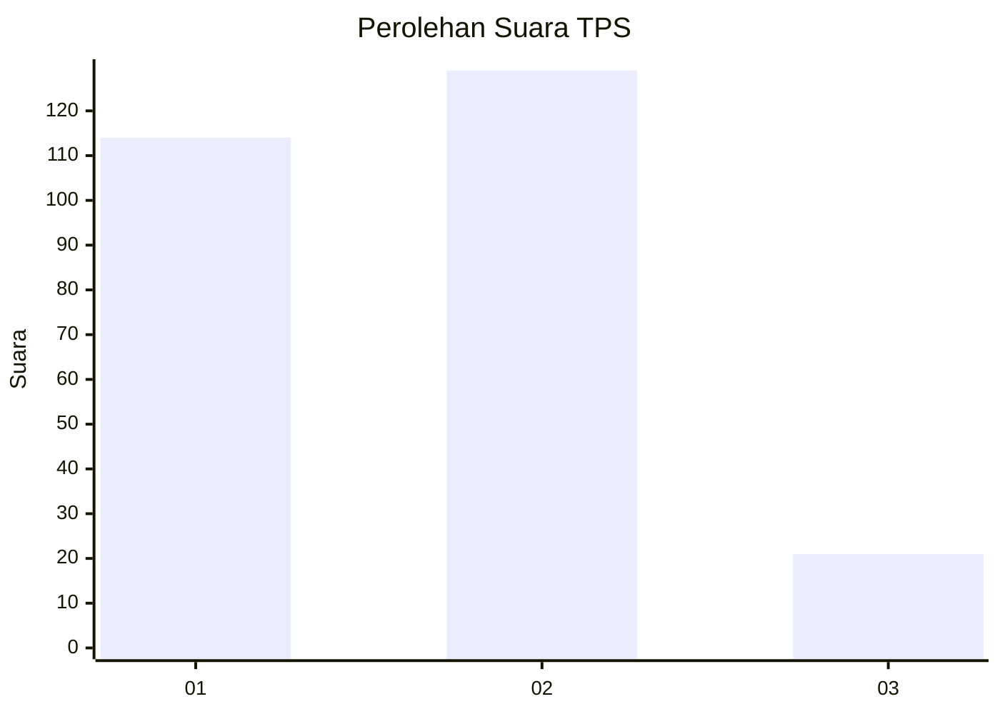
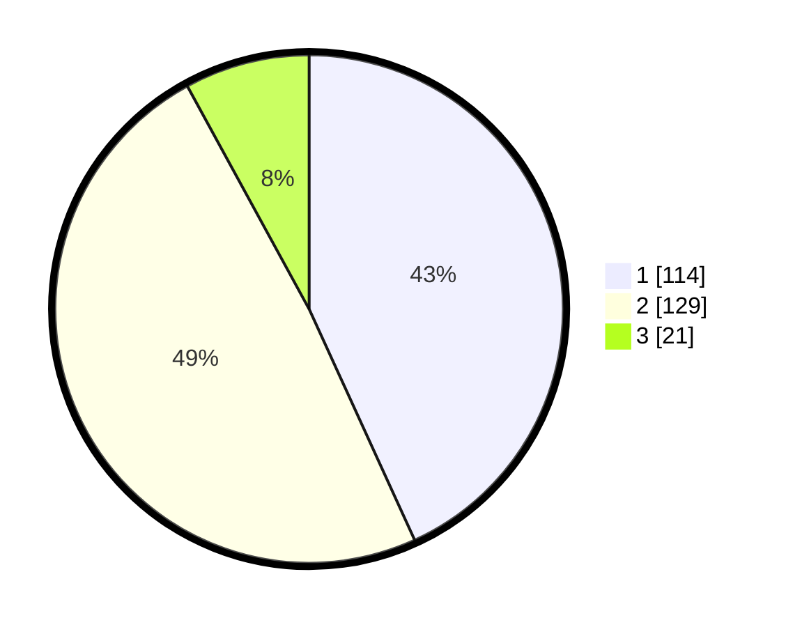

# Hasil

## Grafik

## Tabel

| No. | Nama Paslon    | Suara | Suara (raw) | Persentase |
|:--- |:-------------- | -----:| -----------:| ----------:|
| 1   | ANIES MUHAIMIN | 114   | [114][p-1]  | 43,18      |
| 2   | PRABOWO GIBRAN | 129   | [129][p-2]  | 48,86      |
| 3   | GANJAR MAHFUD  | 21    | [21][p-3]   | 7,95       |

[p-1]: https://github.com/gigit-pemilu/pemilu-2024-36-banten/blob/main/pilpres/hitung-suara/sub/36-banten/sub/73-kota-serang/sub/04-curug/sub/1002-tinggar/sub/016-tps/sub/paslon-1.txt
[p-2]: https://github.com/gigit-pemilu/pemilu-2024-36-banten/blob/main/pilpres/hitung-suara/sub/36-banten/sub/73-kota-serang/sub/04-curug/sub/1002-tinggar/sub/016-tps/sub/paslon-2.txt
[p-3]: https://github.com/gigit-pemilu/pemilu-2024-36-banten/blob/main/pilpres/hitung-suara/sub/36-banten/sub/73-kota-serang/sub/04-curug/sub/1002-tinggar/sub/016-tps/sub/paslon-3.txt

## Foto C Plano

https://sirekap-obj-formc.kpu.go.id/6d7d/pemilu/ppwp/36/73/04/10/02/3673041002016-20240215-070913--e610d3ac-32cb-43ec-afa9-a61626bd99ab.jpg

https://sirekap-obj-formc.kpu.go.id/6d7d/pemilu/ppwp/36/73/04/10/02/3673041002016-20240215-071059--70f0af40-947a-41f0-90b6-b8df52ae0046.jpg

https://sirekap-obj-formc.kpu.go.id/6d7d/pemilu/ppwp/36/73/04/10/02/3673041002016-20240215-071859--519ad206-3375-42b3-be5e-d81d088f00ea.jpg

## Metadata

| Key        | Value               |
| ---------- | ------------------- |
| Time Stamp | 2024-02-15 22:00:27 |

