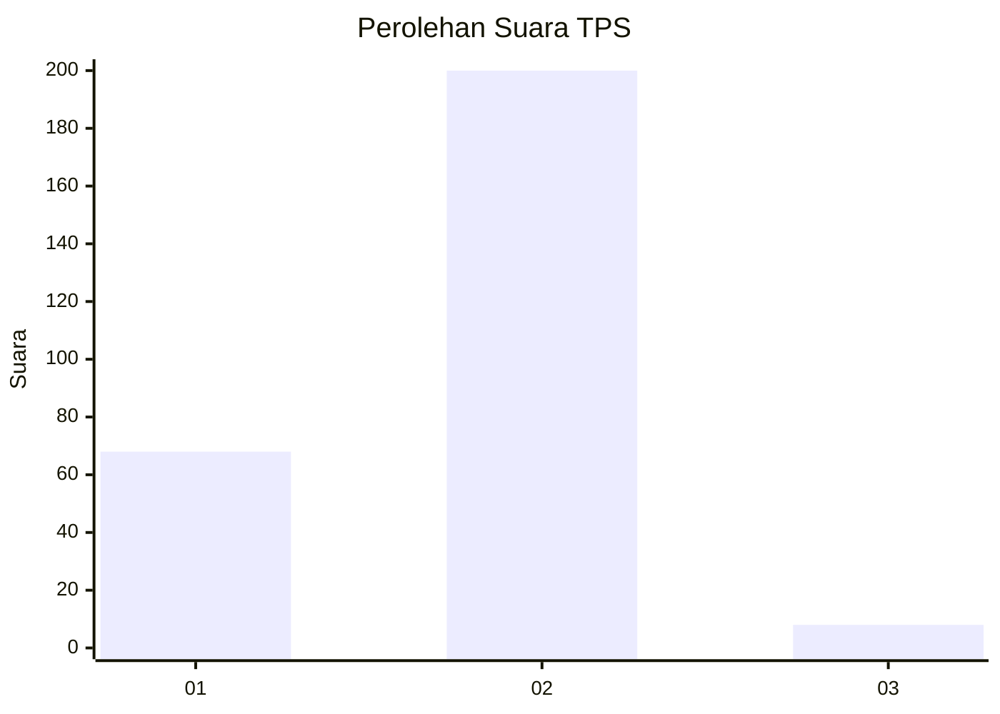
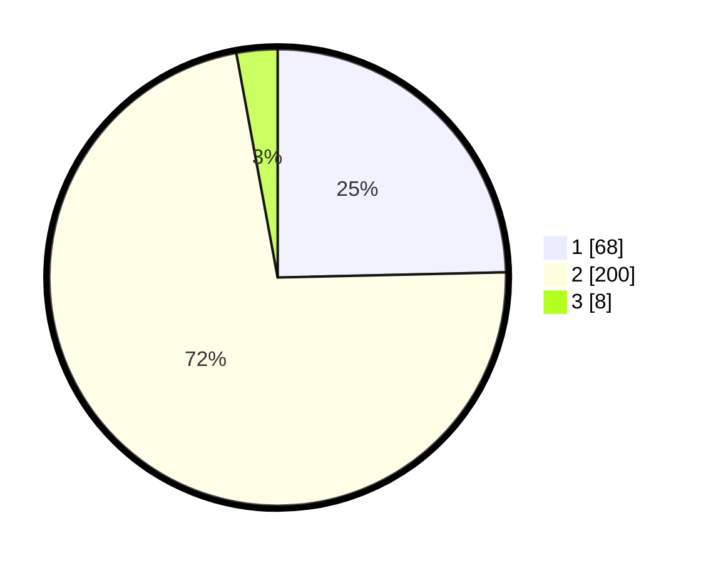

# Hasil

## Grafik

## Tabel

| No. | Nama Paslon    | Suara | Suara (raw) | Persentase |
|:--- |:-------------- | -----:| -----------:| ----------:|
| 1   | ANIES MUHAIMIN | 68    | [68][p-1]   | 24,64      |
| 2   | PRABOWO GIBRAN | 200   | [200][p-2]  | 72,46      |
| 3   | GANJAR MAHFUD  | 8     | [8][p-3]    | 2,90       |

[p-1]: https://github.com/gigit-pemilu/pemilu-2024-36-banten/blob/main/pilpres/hitung-suara/sub/36-banten/sub/73-kota-serang/sub/04-curug/sub/1003-kemanisan/sub/003-tps/sub/paslon-1.txt
[p-2]: https://github.com/gigit-pemilu/pemilu-2024-36-banten/blob/main/pilpres/hitung-suara/sub/36-banten/sub/73-kota-serang/sub/04-curug/sub/1003-kemanisan/sub/003-tps/sub/paslon-2.txt
[p-3]: https://github.com/gigit-pemilu/pemilu-2024-36-banten/blob/main/pilpres/hitung-suara/sub/36-banten/sub/73-kota-serang/sub/04-curug/sub/1003-kemanisan/sub/003-tps/sub/paslon-3.txt

## Foto C Plano

https://sirekap-obj-formc.kpu.go.id/feb5/pemilu/ppwp/36/73/04/10/03/3673041003003-20240214-214459--c952850f-2be5-4328-9167-ca0c1b8a1994.jpg

https://sirekap-obj-formc.kpu.go.id/feb5/pemilu/ppwp/36/73/04/10/03/3673041003003-20240214-214942--3e51ba37-2abc-44ae-8160-96be8961e083.jpg

https://sirekap-obj-formc.kpu.go.id/feb5/pemilu/ppwp/36/73/04/10/03/3673041003003-20240214-215045--b3596b8b-096d-44de-8776-e6a69b2430ed.jpg

## Metadata

| Key        | Value               |
| ---------- | ------------------- |
| Time Stamp | 2024-02-19 06:16:00 |

