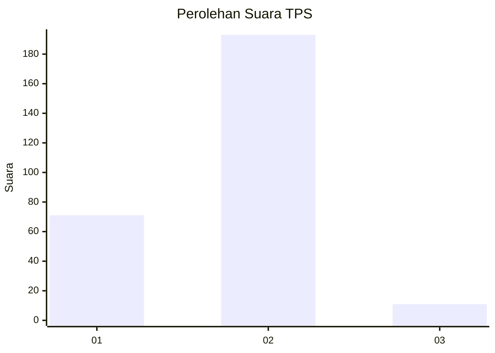
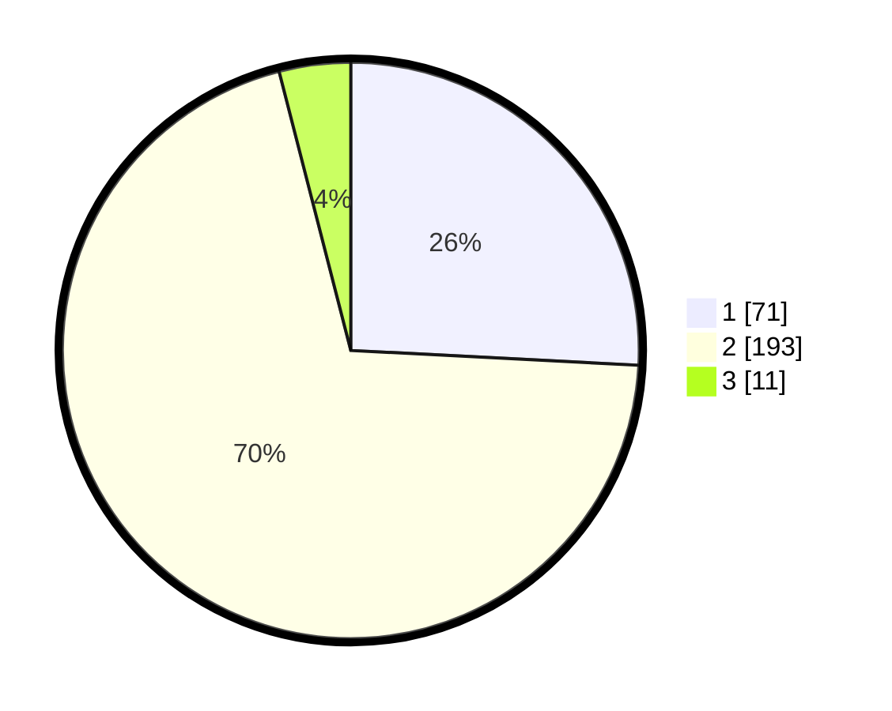

# Hasil

## Grafik

## Tabel

| No. | Nama Paslon    | Suara | Suara (raw) | Persentase |
|:--- |:-------------- | -----:| -----------:| ----------:|
| 1   | ANIES MUHAIMIN | 71    | [71][p-1]   | 25,82      |
| 2   | PRABOWO GIBRAN | 193   | [193][p-2]  | 70,18      |
| 3   | GANJAR MAHFUD  | 11    | [11][p-3]   | 4,00       |

[p-1]: https://github.com/gigit-pemilu/pemilu-2024-36-banten/blob/main/pilpres/hitung-suara/sub/36-banten/sub/73-kota-serang/sub/04-curug/sub/1003-kemanisan/sub/005-tps/sub/paslon-1.txt
[p-2]: https://github.com/gigit-pemilu/pemilu-2024-36-banten/blob/main/pilpres/hitung-suara/sub/36-banten/sub/73-kota-serang/sub/04-curug/sub/1003-kemanisan/sub/005-tps/sub/paslon-2.txt
[p-3]: https://github.com/gigit-pemilu/pemilu-2024-36-banten/blob/main/pilpres/hitung-suara/sub/36-banten/sub/73-kota-serang/sub/04-curug/sub/1003-kemanisan/sub/005-tps/sub/paslon-3.txt

## Foto C Plano

https://sirekap-obj-formc.kpu.go.id/153d/pemilu/ppwp/36/73/04/10/03/3673041003005-20240214-192328--c98e1864-576d-402c-9c1d-4408f465e2fa.jpg

https://sirekap-obj-formc.kpu.go.id/153d/pemilu/ppwp/36/73/04/10/03/3673041003005-20240214-192454--cf535d67-69eb-47ed-af5e-13c164c7fa7d.jpg

https://sirekap-obj-formc.kpu.go.id/153d/pemilu/ppwp/36/73/04/10/03/3673041003005-20240214-192611--710eeade-a0ee-4f30-a093-e7fa6fbb1ad0.jpg

## Metadata

| Key        | Value               |
| ---------- | ------------------- |
| Time Stamp | 2024-02-24 22:31:28 |

