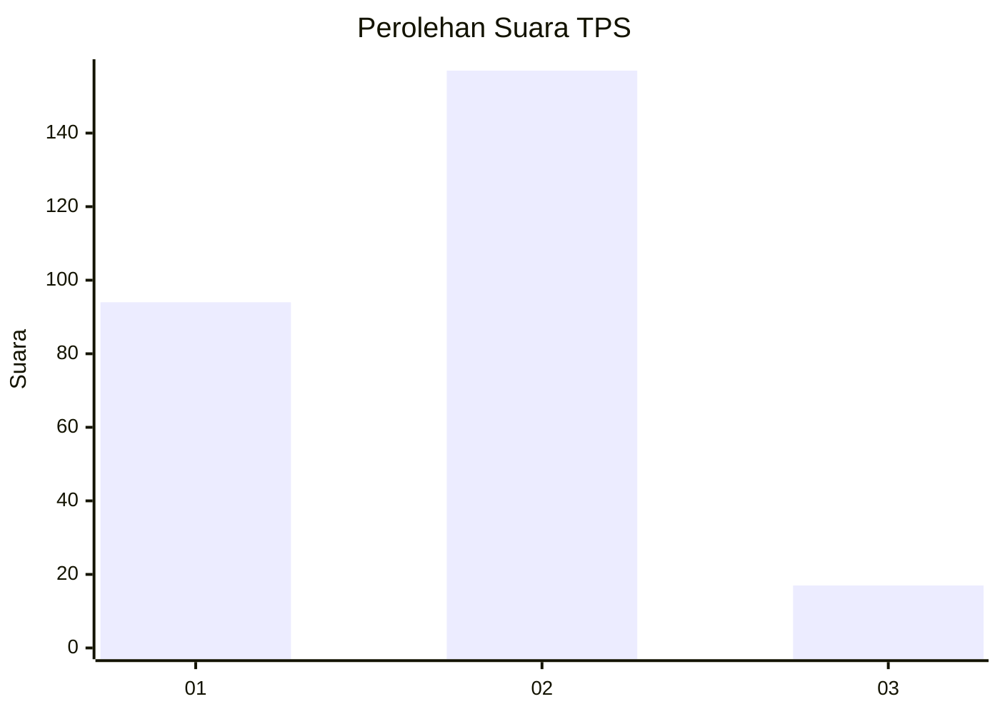
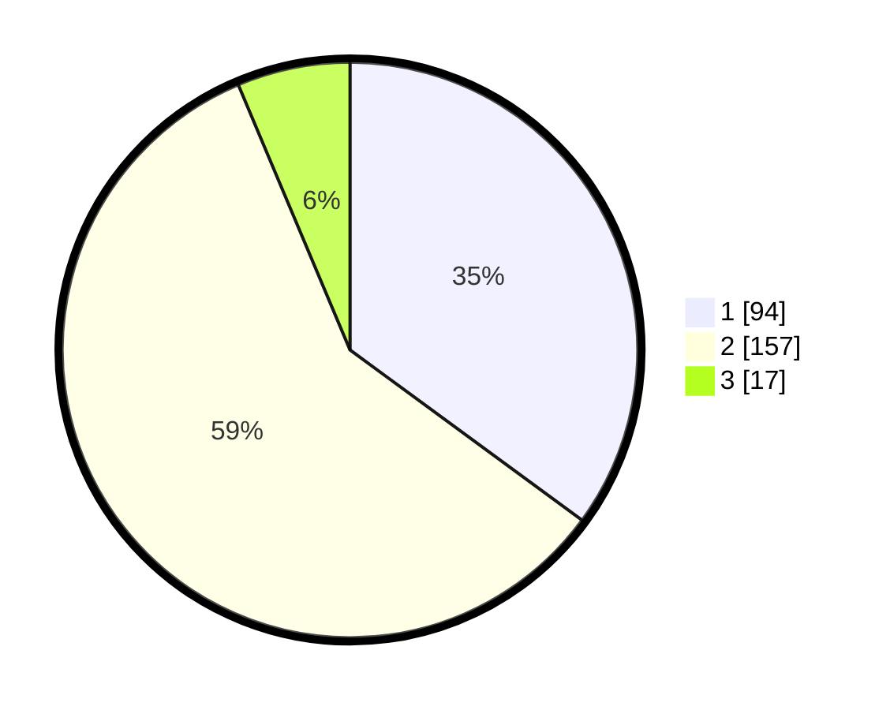

# Hasil

## Grafik

## Tabel

| No. | Nama Paslon    | Suara | Suara (raw) | Persentase |
|:--- |:-------------- | -----:| -----------:| ----------:|
| 1   | ANIES MUHAIMIN | 94    | [94][p-1]   | 35,07      |
| 2   | PRABOWO GIBRAN | 157   | [157][p-2]  | 58,58      |
| 3   | GANJAR MAHFUD  | 17    | [17][p-3]   | 6,34       |

[p-1]: https://github.com/gigit-pemilu/pemilu-2024/blob/main/pilpres/hitung-suara/sub/36-banten/sub/73-kota-serang/sub/04-curug/sub/1003-kemanisan/sub/015-tps/sub/paslon-1.txt
[p-2]: https://github.com/gigit-pemilu/pemilu-2024/blob/main/pilpres/hitung-suara/sub/36-banten/sub/73-kota-serang/sub/04-curug/sub/1003-kemanisan/sub/015-tps/sub/paslon-2.txt
[p-3]: https://github.com/gigit-pemilu/pemilu-2024/blob/main/pilpres/hitung-suara/sub/36-banten/sub/73-kota-serang/sub/04-curug/sub/1003-kemanisan/sub/015-tps/sub/paslon-3.txt

## Foto C Plano

https://sirekap-obj-formc.kpu.go.id/4239/pemilu/ppwp/36/73/04/10/03/3673041003015-20240214-222341--fe0ad14a-ce25-4ce6-b807-08e54efa8462.jpg

https://sirekap-obj-formc.kpu.go.id/4239/pemilu/ppwp/36/73/04/10/03/3673041003015-20240214-222329--9ac2d3ea-bdd8-44de-9ba8-0183954b3841.jpg

https://sirekap-obj-formc.kpu.go.id/4239/pemilu/ppwp/36/73/04/10/03/3673041003015-20240214-220700--d3583216-2dff-4503-bc0e-8ccfbc773aa6.jpg

## Metadata

| Key        | Value               |
| ---------- | ------------------- |
| Time Stamp | 2024-02-15 16:00:26 |

