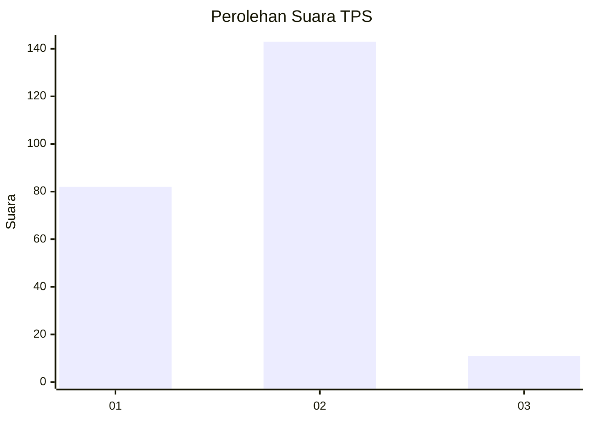
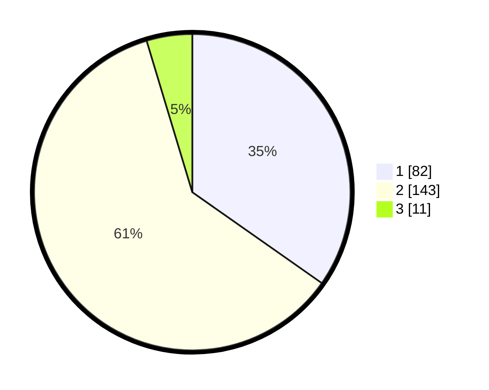

# Hasil

## Grafik

## Tabel

| No. | Nama Paslon    | Suara | Suara (raw) | Persentase |
|:--- |:-------------- | -----:| -----------:| ----------:|
| 1   | ANIES MUHAIMIN | 82    | [82][p-1]   | 34,75      |
| 2   | PRABOWO GIBRAN | 143   | [143][p-2]  | 60,59      |
| 3   | GANJAR MAHFUD  | 11    | [11][p-3]   | 4,66       |

[p-1]: https://github.com/gigit-pemilu/pemilu-2024-36-banten/blob/main/pilpres/hitung-suara/sub/36-banten/sub/73-kota-serang/sub/05-cipocok-jaya/sub/1001-cipocok-jaya/sub/002-tps/sub/paslon-1.txt
[p-2]: https://github.com/gigit-pemilu/pemilu-2024-36-banten/blob/main/pilpres/hitung-suara/sub/36-banten/sub/73-kota-serang/sub/05-cipocok-jaya/sub/1001-cipocok-jaya/sub/002-tps/sub/paslon-2.txt
[p-3]: https://github.com/gigit-pemilu/pemilu-2024-36-banten/blob/main/pilpres/hitung-suara/sub/36-banten/sub/73-kota-serang/sub/05-cipocok-jaya/sub/1001-cipocok-jaya/sub/002-tps/sub/paslon-3.txt

## Foto C Plano

https://sirekap-obj-formc.kpu.go.id/df18/pemilu/ppwp/36/73/05/10/01/3673051001002-20240214-213311--f57725cf-7c10-4525-bc3b-e9f04d060a85.jpg

https://sirekap-obj-formc.kpu.go.id/df18/pemilu/ppwp/36/73/05/10/01/3673051001002-20240214-213413--7553b93d-8684-4ad4-9359-9c67d6615704.jpg

https://sirekap-obj-formc.kpu.go.id/df18/pemilu/ppwp/36/73/05/10/01/3673051001002-20240214-213654--38661f1d-dc91-4cb3-a8f0-429bd4c50cd0.jpg

## Metadata

| Key        | Value               |
| ---------- | ------------------- |
| Time Stamp | 2024-02-15 15:00:29 |

