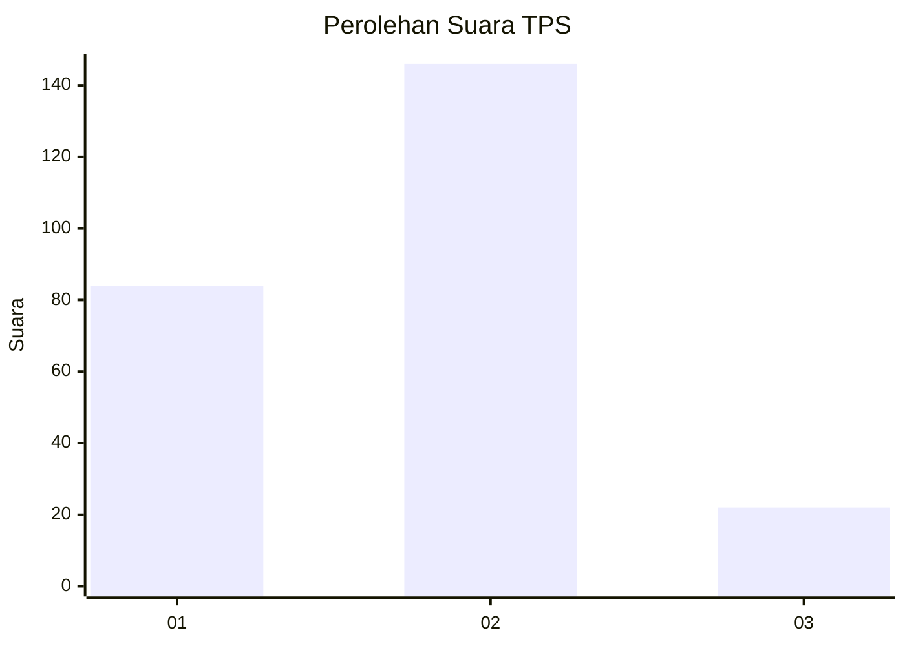
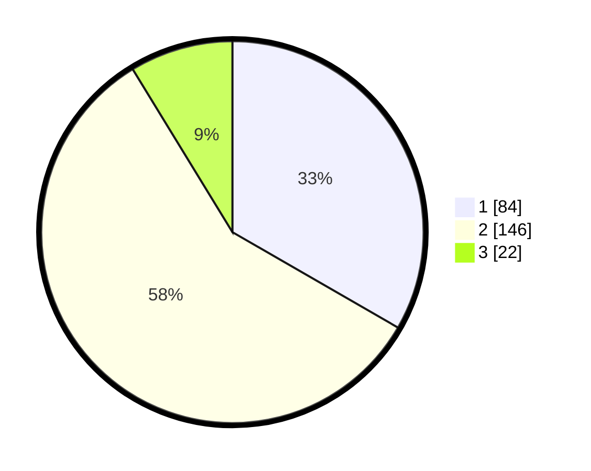

# Hasil

## Grafik

## Tabel

| No. | Nama Paslon    | Suara | Suara (raw) | Persentase |
|:--- |:-------------- | -----:| -----------:| ----------:|
| 1   | ANIES MUHAIMIN | 84    | [84][p-1]   | 33,33      |
| 2   | PRABOWO GIBRAN | 146   | [146][p-2]  | 57,94      |
| 3   | GANJAR MAHFUD  | 22    | [22][p-3]   | 8,73       |

[p-1]: https://github.com/gigit-pemilu/pemilu-2024-36-banten/blob/main/pilpres/hitung-suara/sub/36-banten/sub/73-kota-serang/sub/05-cipocok-jaya/sub/1001-cipocok-jaya/sub/003-tps/sub/paslon-1.txt
[p-2]: https://github.com/gigit-pemilu/pemilu-2024-36-banten/blob/main/pilpres/hitung-suara/sub/36-banten/sub/73-kota-serang/sub/05-cipocok-jaya/sub/1001-cipocok-jaya/sub/003-tps/sub/paslon-2.txt
[p-3]: https://github.com/gigit-pemilu/pemilu-2024-36-banten/blob/main/pilpres/hitung-suara/sub/36-banten/sub/73-kota-serang/sub/05-cipocok-jaya/sub/1001-cipocok-jaya/sub/003-tps/sub/paslon-3.txt

## Foto C Plano

https://sirekap-obj-formc.kpu.go.id/72f3/pemilu/ppwp/36/73/05/10/01/3673051001003-20240215-033742--e0fad7fa-3e0a-4798-8d6d-c14fa43156ab.jpg

https://sirekap-obj-formc.kpu.go.id/72f3/pemilu/ppwp/36/73/05/10/01/3673051001003-20240215-033911--2bc84845-2cb1-4a4b-a11f-99dd12c0b580.jpg

https://sirekap-obj-formc.kpu.go.id/72f3/pemilu/ppwp/36/73/05/10/01/3673051001003-20240215-033953--1114edc2-b8e8-4624-8706-d65756533cf5.jpg

## Metadata

| Key        | Value               |
| ---------- | ------------------- |
| Time Stamp | 2024-02-15 16:30:25 |

