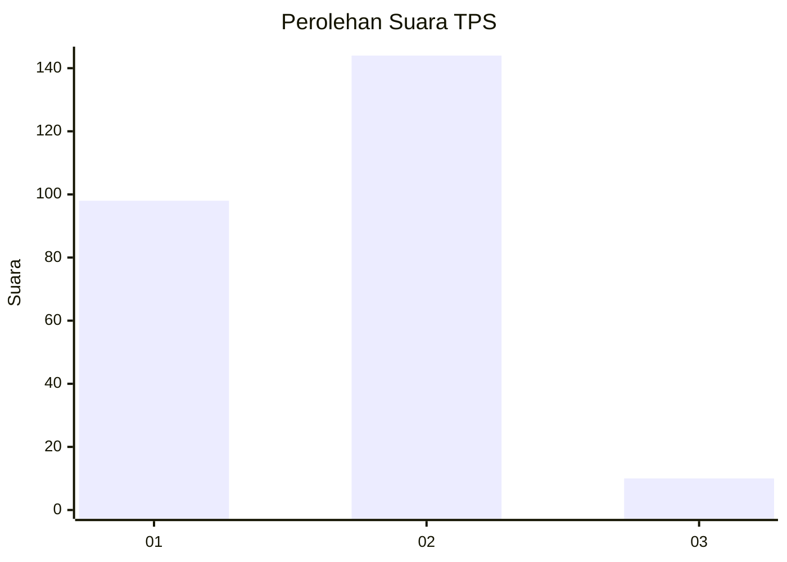
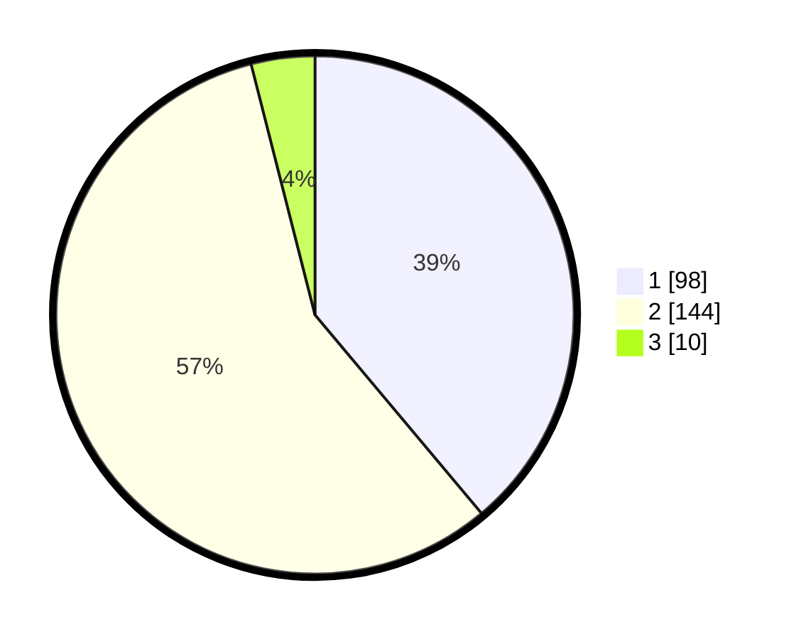

# Hasil

## Grafik

## Tabel

| No. | Nama Paslon    | Suara | Suara (raw) | Persentase |
|:--- |:-------------- | -----:| -----------:| ----------:|
| 1   | ANIES MUHAIMIN | 98    | [98][p-1]   | 38,89      |
| 2   | PRABOWO GIBRAN | 144   | [144][p-2]  | 57,14      |
| 3   | GANJAR MAHFUD  | 10    | [10][p-3]   | 3,97       |

[p-1]: https://github.com/gigit-pemilu/pemilu-2024/blob/main/pilpres/hitung-suara/sub/36-banten/sub/73-kota-serang/sub/05-cipocok-jaya/sub/1001-cipocok-jaya/sub/006-tps/sub/paslon-1.txt
[p-2]: https://github.com/gigit-pemilu/pemilu-2024/blob/main/pilpres/hitung-suara/sub/36-banten/sub/73-kota-serang/sub/05-cipocok-jaya/sub/1001-cipocok-jaya/sub/006-tps/sub/paslon-2.txt
[p-3]: https://github.com/gigit-pemilu/pemilu-2024/blob/main/pilpres/hitung-suara/sub/36-banten/sub/73-kota-serang/sub/05-cipocok-jaya/sub/1001-cipocok-jaya/sub/006-tps/sub/paslon-3.txt

## Foto C Plano

https://sirekap-obj-formc.kpu.go.id/bbf6/pemilu/ppwp/36/73/05/10/01/3673051001006-20240215-001617--b8a6e110-47e9-4028-a70b-115f5961bcf2.jpg

https://sirekap-obj-formc.kpu.go.id/bbf6/pemilu/ppwp/36/73/05/10/01/3673051001006-20240215-000054--3cb1b927-6529-404a-990b-fa87be8df62b.jpg

https://sirekap-obj-formc.kpu.go.id/bbf6/pemilu/ppwp/36/73/05/10/01/3673051001006-20240215-000325--7c2b85c9-1239-4e65-82ca-f9a52c9e54a0.jpg

## Metadata

| Key        | Value               |
| ---------- | ------------------- |
| Time Stamp | 2024-02-15 15:00:29 |

