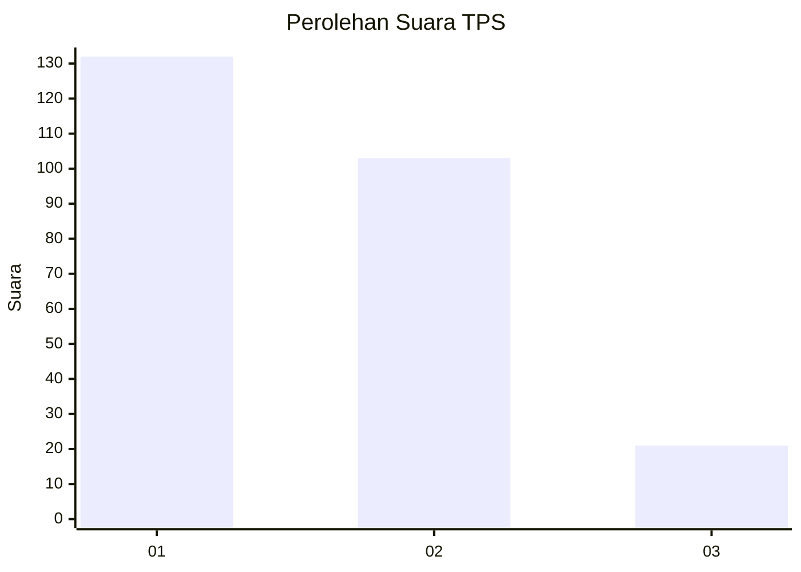
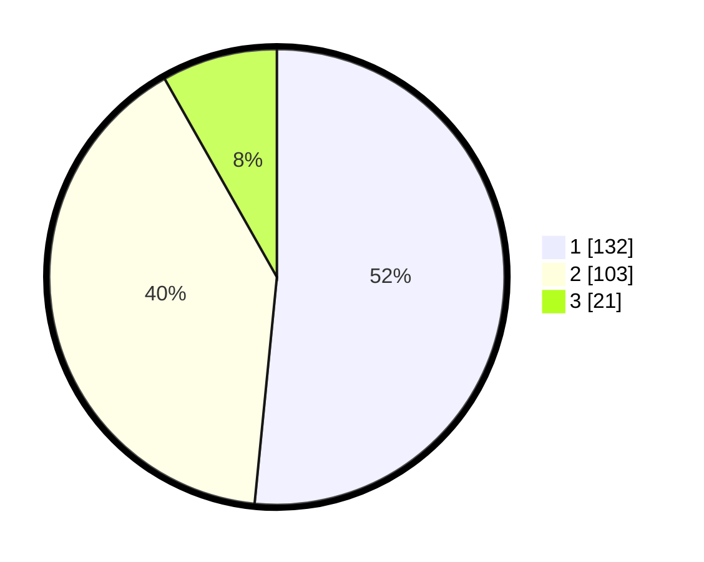

# Hasil

## Grafik

## Tabel

| No. | Nama Paslon    | Suara | Suara (raw) | Persentase |
|:--- |:-------------- | -----:| -----------:| ----------:|
| 1   | ANIES MUHAIMIN | 132   | [132][p-1]  | 51,56      |
| 2   | PRABOWO GIBRAN | 103   | [103][p-2]  | 40,23      |
| 3   | GANJAR MAHFUD  | 21    | [21][p-3]   | 8,20       |

[p-1]: https://github.com/gigit-pemilu/pemilu-2024-36-banten/blob/main/pilpres/hitung-suara/sub/36-banten/sub/73-kota-serang/sub/05-cipocok-jaya/sub/1001-cipocok-jaya/sub/008-tps/sub/paslon-1.txt
[p-2]: https://github.com/gigit-pemilu/pemilu-2024-36-banten/blob/main/pilpres/hitung-suara/sub/36-banten/sub/73-kota-serang/sub/05-cipocok-jaya/sub/1001-cipocok-jaya/sub/008-tps/sub/paslon-2.txt
[p-3]: https://github.com/gigit-pemilu/pemilu-2024-36-banten/blob/main/pilpres/hitung-suara/sub/36-banten/sub/73-kota-serang/sub/05-cipocok-jaya/sub/1001-cipocok-jaya/sub/008-tps/sub/paslon-3.txt

## Foto C Plano

https://sirekap-obj-formc.kpu.go.id/bca7/pemilu/ppwp/36/73/05/10/01/3673051001008-20240215-003940--844f45ad-ee1d-4e98-87d6-dd5e7be4ed5a.jpg

https://sirekap-obj-formc.kpu.go.id/bca7/pemilu/ppwp/36/73/05/10/01/3673051001008-20240214-215025--df925de5-1450-4bfb-8ce8-acd7cf8f483d.jpg

https://sirekap-obj-formc.kpu.go.id/bca7/pemilu/ppwp/36/73/05/10/01/3673051001008-20240214-215155--4567551e-52cd-49ba-b310-e757c656845c.jpg

## Metadata

| Key        | Value               |
| ---------- | ------------------- |
| Time Stamp | 2024-02-15 16:30:25 |

