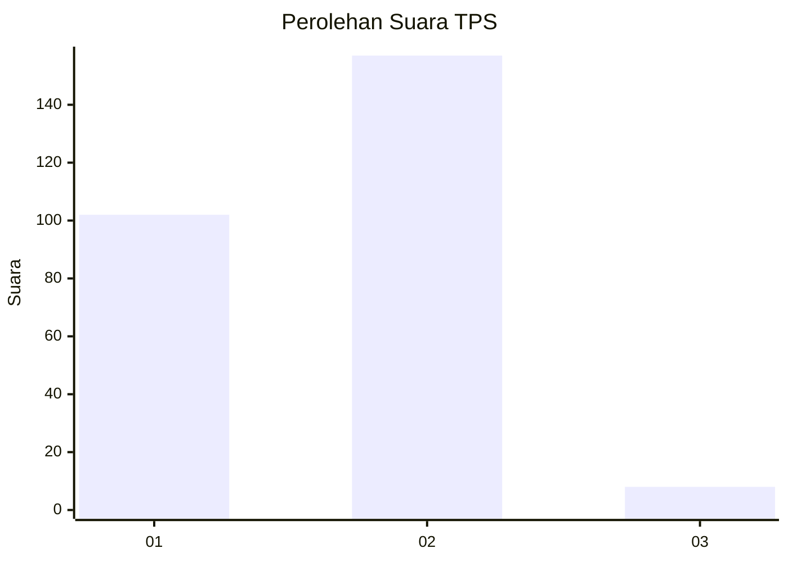
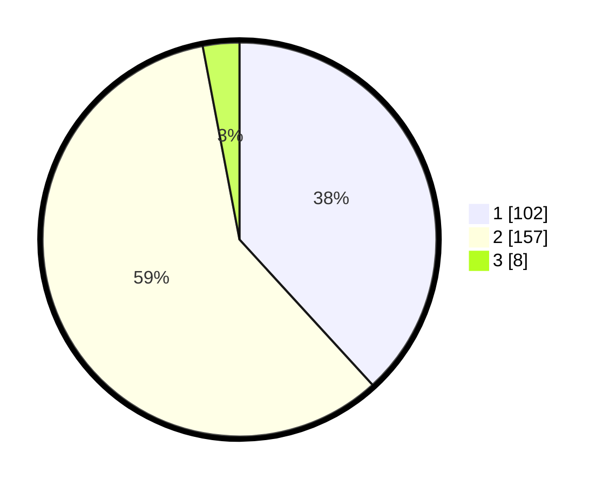

# Hasil

## Grafik

## Tabel

| No. | Nama Paslon    | Suara | Suara (raw) | Persentase |
|:--- |:-------------- | -----:| -----------:| ----------:|
| 1   | ANIES MUHAIMIN | 102   | [102][p-1]  | 38,20      |
| 2   | PRABOWO GIBRAN | 157   | [157][p-2]  | 58,80      |
| 3   | GANJAR MAHFUD  | 8     | [8][p-3]    | 3,00       |

[p-1]: https://github.com/gigit-pemilu/pemilu-2024/blob/main/pilpres/hitung-suara/sub/36-banten/sub/73-kota-serang/sub/05-cipocok-jaya/sub/1002-karundang/sub/008-tps/sub/paslon-1.txt
[p-2]: https://github.com/gigit-pemilu/pemilu-2024/blob/main/pilpres/hitung-suara/sub/36-banten/sub/73-kota-serang/sub/05-cipocok-jaya/sub/1002-karundang/sub/008-tps/sub/paslon-2.txt
[p-3]: https://github.com/gigit-pemilu/pemilu-2024/blob/main/pilpres/hitung-suara/sub/36-banten/sub/73-kota-serang/sub/05-cipocok-jaya/sub/1002-karundang/sub/008-tps/sub/paslon-3.txt

## Foto C Plano

https://sirekap-obj-formc.kpu.go.id/4fb7/pemilu/ppwp/36/73/05/10/02/3673051002008-20240214-225448--cc61cd28-9539-4e65-9a30-1e66e3fba2ab.jpg

https://sirekap-obj-formc.kpu.go.id/4fb7/pemilu/ppwp/36/73/05/10/02/3673051002008-20240214-225730--a7c87af0-d5cb-4aff-b0ca-7a8dc257acba.jpg

https://sirekap-obj-formc.kpu.go.id/4fb7/pemilu/ppwp/36/73/05/10/02/3673051002008-20240214-225827--d41b1abb-cae9-47e4-948a-c282aebc54ac.jpg

## Metadata

| Key        | Value               |
| ---------- | ------------------- |
| Time Stamp | 2024-02-15 17:00:25 |

