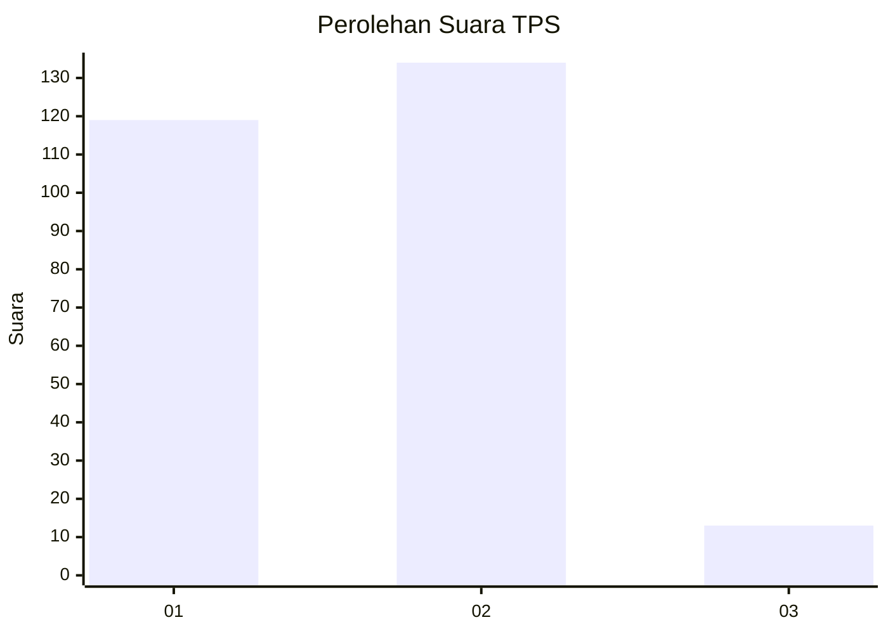
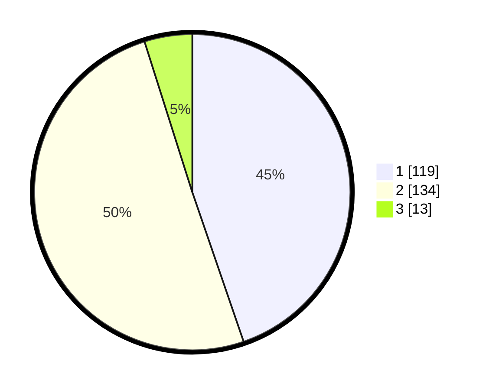

# Hasil

## Grafik

## Tabel

| No. | Nama Paslon    | Suara | Suara (raw) | Persentase |
|:--- |:-------------- | -----:| -----------:| ----------:|
| 1   | ANIES MUHAIMIN | 119   | [119][p-1]  | 44,74      |
| 2   | PRABOWO GIBRAN | 134   | [134][p-2]  | 50,38      |
| 3   | GANJAR MAHFUD  | 13    | [13][p-3]   | 4,89       |

[p-1]: https://github.com/gigit-pemilu/pemilu-2024/blob/main/pilpres/hitung-suara/sub/36-banten/sub/73-kota-serang/sub/05-cipocok-jaya/sub/1002-karundang/sub/016-tps/sub/paslon-1.txt
[p-2]: https://github.com/gigit-pemilu/pemilu-2024/blob/main/pilpres/hitung-suara/sub/36-banten/sub/73-kota-serang/sub/05-cipocok-jaya/sub/1002-karundang/sub/016-tps/sub/paslon-2.txt
[p-3]: https://github.com/gigit-pemilu/pemilu-2024/blob/main/pilpres/hitung-suara/sub/36-banten/sub/73-kota-serang/sub/05-cipocok-jaya/sub/1002-karundang/sub/016-tps/sub/paslon-3.txt

## Foto C Plano

https://sirekap-obj-formc.kpu.go.id/0672/pemilu/ppwp/36/73/05/10/02/3673051002016-20240214-205641--e913b475-cd55-4f24-9af8-12344b4fe22d.jpg

https://sirekap-obj-formc.kpu.go.id/0672/pemilu/ppwp/36/73/05/10/02/3673051002016-20240214-205704--2bdb832a-f39b-4c1b-82b8-c4fbc9182778.jpg

https://sirekap-obj-formc.kpu.go.id/0672/pemilu/ppwp/36/73/05/10/02/3673051002016-20240214-210001--7faef9c1-e8b0-42e4-a763-192b04a3b227.jpg

## Metadata

| Key        | Value               |
| ---------- | ------------------- |
| Time Stamp | 2024-02-15 15:00:29 |

