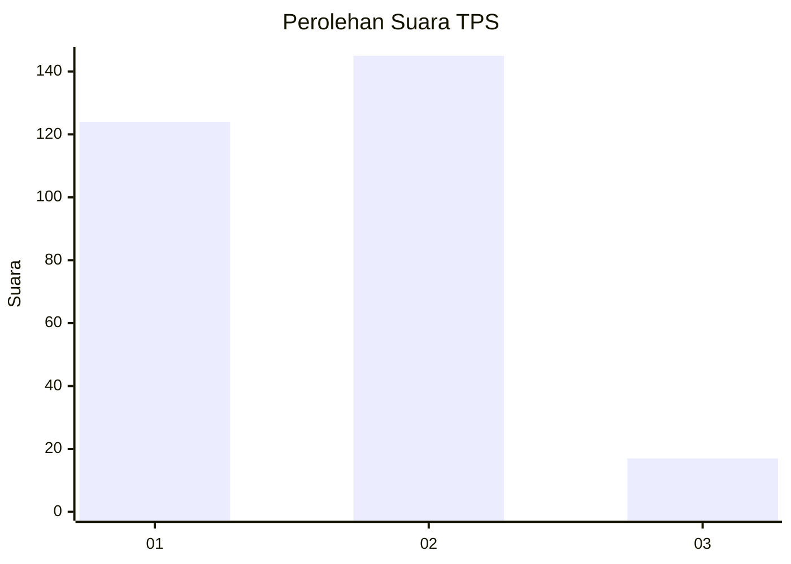
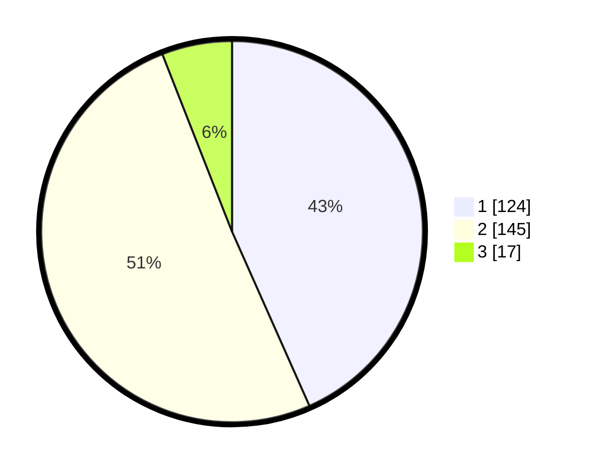

# Hasil

## Grafik

## Tabel

| No. | Nama Paslon    | Suara | Suara (raw) | Persentase |
|:--- |:-------------- | -----:| -----------:| ----------:|
| 1   | ANIES MUHAIMIN | 124   | [124][p-1]  | 43,36      |
| 2   | PRABOWO GIBRAN | 145   | [145][p-2]  | 50,70      |
| 3   | GANJAR MAHFUD  | 17    | [17][p-3]   | 5,94       |

[p-1]: https://github.com/gigit-pemilu/pemilu-2024-36-banten/blob/main/pilpres/hitung-suara/sub/36-banten/sub/73-kota-serang/sub/05-cipocok-jaya/sub/1004-banjar-agung/sub/012-tps/sub/paslon-1.txt
[p-2]: https://github.com/gigit-pemilu/pemilu-2024-36-banten/blob/main/pilpres/hitung-suara/sub/36-banten/sub/73-kota-serang/sub/05-cipocok-jaya/sub/1004-banjar-agung/sub/012-tps/sub/paslon-2.txt
[p-3]: https://github.com/gigit-pemilu/pemilu-2024-36-banten/blob/main/pilpres/hitung-suara/sub/36-banten/sub/73-kota-serang/sub/05-cipocok-jaya/sub/1004-banjar-agung/sub/012-tps/sub/paslon-3.txt

## Foto C Plano

https://sirekap-obj-formc.kpu.go.id/9319/pemilu/ppwp/36/73/05/10/04/3673051004012-20240214-155754--aceab78a-d5d0-4431-9a02-3b69e62b8bc7.jpg

https://sirekap-obj-formc.kpu.go.id/9319/pemilu/ppwp/36/73/05/10/04/3673051004012-20240214-160148--20a253d1-cb79-4020-8f16-5f9da98f124a.jpg

https://sirekap-obj-formc.kpu.go.id/9319/pemilu/ppwp/36/73/05/10/04/3673051004012-20240214-160057--9b76edf0-57a6-427b-91da-4d5458b5068c.jpg

## Metadata

| Key        | Value               |
| ---------- | ------------------- |
| Time Stamp | 2024-02-14 21:46:01 |

