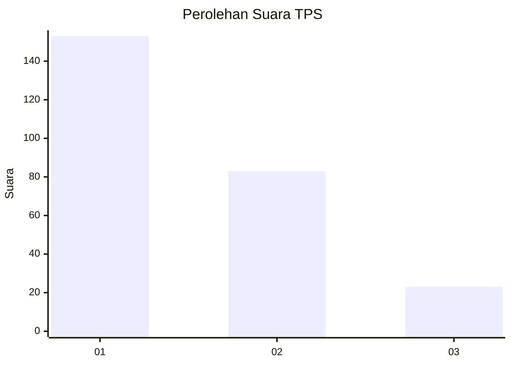
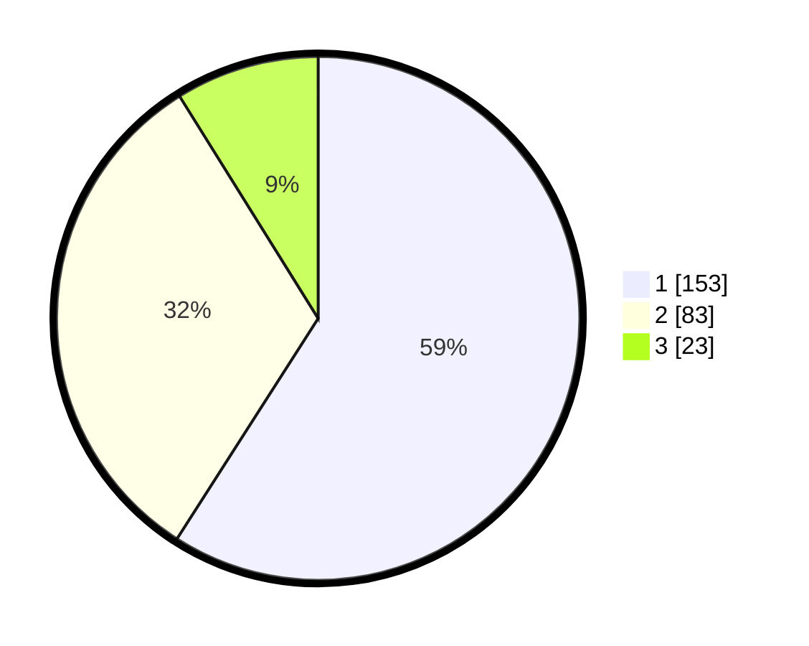

# Hasil

## Grafik

## Tabel

| No. | Nama Paslon    | Suara | Suara (raw) | Persentase |
|:--- |:-------------- | -----:| -----------:| ----------:|
| 1   | ANIES MUHAIMIN | 153   | [153][p-1]  | 59,07      |
| 2   | PRABOWO GIBRAN | 83    | [83][p-2]   | 32,05      |
| 3   | GANJAR MAHFUD  | 23    | [23][p-3]   | 8,88       |

[p-1]: https://github.com/gigit-pemilu/pemilu-2024-36-banten/blob/main/pilpres/hitung-suara/sub/36-banten/sub/73-kota-serang/sub/05-cipocok-jaya/sub/1004-banjar-agung/sub/037-tps/sub/paslon-1.txt
[p-2]: https://github.com/gigit-pemilu/pemilu-2024-36-banten/blob/main/pilpres/hitung-suara/sub/36-banten/sub/73-kota-serang/sub/05-cipocok-jaya/sub/1004-banjar-agung/sub/037-tps/sub/paslon-2.txt
[p-3]: https://github.com/gigit-pemilu/pemilu-2024-36-banten/blob/main/pilpres/hitung-suara/sub/36-banten/sub/73-kota-serang/sub/05-cipocok-jaya/sub/1004-banjar-agung/sub/037-tps/sub/paslon-3.txt

## Foto C Plano

https://sirekap-obj-formc.kpu.go.id/59cc/pemilu/ppwp/36/73/05/10/04/3673051004037-20240214-220411--39ab9e8f-6dc2-4434-bfb3-2c30a40d6a9a.jpg

https://sirekap-obj-formc.kpu.go.id/59cc/pemilu/ppwp/36/73/05/10/04/3673051004037-20240214-220302--c7e0aa95-fe7d-4061-ab93-0f774556475a.jpg

https://sirekap-obj-formc.kpu.go.id/59cc/pemilu/ppwp/36/73/05/10/04/3673051004037-20240214-203415--d4e72b8b-e052-42fa-9269-ba3f279d6b05.jpg

## Metadata

| Key        | Value               |
| ---------- | ------------------- |
| Time Stamp | 2024-02-15 17:30:25 |

