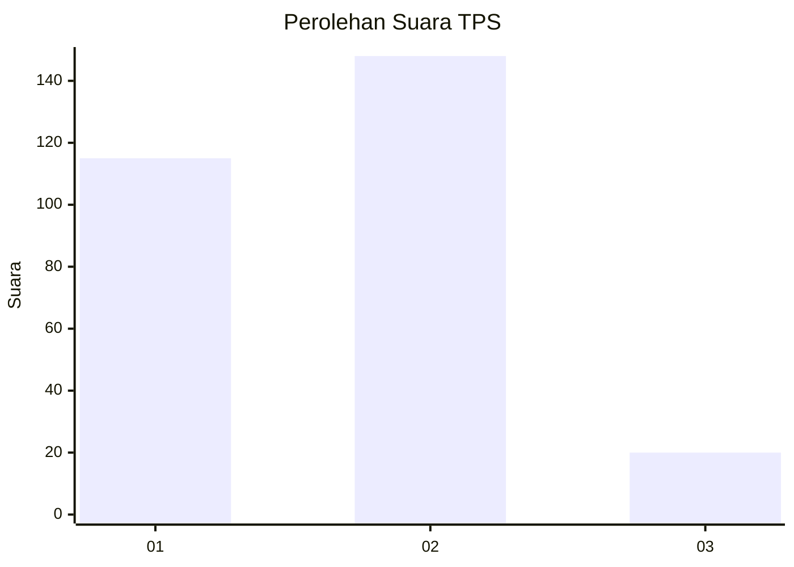

# Hasil

## Grafik

## Tabel

| No. | Nama Paslon    | Suara | Suara (raw) | Persentase |
|:--- |:-------------- | -----:| -----------:| ----------:|
| 1   | ANIES MUHAIMIN | 115   | [115][p-1]  | 40,64      |
| 2   | PRABOWO GIBRAN | 148   | [148][p-2]  | 52,30      |
| 3   | GANJAR MAHFUD  | 20    | [20][p-3]   | 7,07       |

[p-1]: https://github.com/gigit-pemilu/pemilu-2024/blob/main/pilpres/hitung-suara/sub/36-banten/sub/73-kota-serang/sub/05-cipocok-jaya/sub/1006-tembong/sub/001-tps/sub/paslon-1.txt
[p-2]: https://github.com/gigit-pemilu/pemilu-2024/blob/main/pilpres/hitung-suara/sub/36-banten/sub/73-kota-serang/sub/05-cipocok-jaya/sub/1006-tembong/sub/001-tps/sub/paslon-2.txt
[p-3]: https://github.com/gigit-pemilu/pemilu-2024/blob/main/pilpres/hitung-suara/sub/36-banten/sub/73-kota-serang/sub/05-cipocok-jaya/sub/1006-tembong/sub/001-tps/sub/paslon-3.txt

## Foto C Plano

https://sirekap-obj-formc.kpu.go.id/7c14/pemilu/ppwp/36/73/05/10/06/3673051006001-20240214-215019--04634234-14cb-485b-bce4-0292d6560a59.jpg

https://sirekap-obj-formc.kpu.go.id/7c14/pemilu/ppwp/36/73/05/10/06/3673051006001-20240214-215213--4540092a-ae26-416b-8bd8-3267e76bc863.jpg

https://sirekap-obj-formc.kpu.go.id/7c14/pemilu/ppwp/36/73/05/10/06/3673051006001-20240214-215353--0e954da2-d4bb-44fb-a2a0-f65e8c017d78.jpg

## Metadata

| Key        | Value               |
| ---------- | ------------------- |
| Time Stamp | 2024-02-15 16:00:26 |

