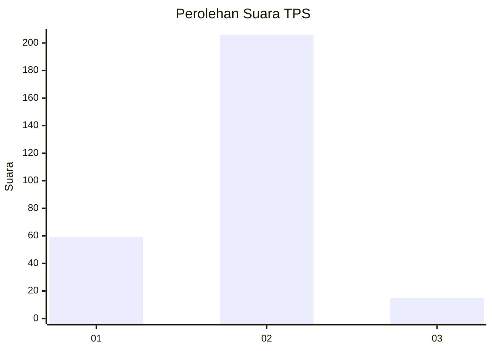
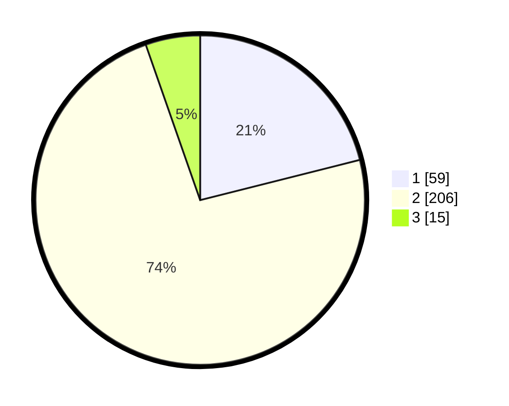

# Hasil

## Grafik

## Tabel

| No. | Nama Paslon    | Suara | Suara (raw) | Persentase |
|:--- |:-------------- | -----:| -----------:| ----------:|
| 1   | ANIES MUHAIMIN | 59    | [59][p-1]   | 21,07      |
| 2   | PRABOWO GIBRAN | 206   | [206][p-2]  | 73,57      |
| 3   | GANJAR MAHFUD  | 15    | [15][p-3]   | 5,36       |

[p-1]: https://github.com/gigit-pemilu/pemilu-2024/blob/main/pilpres/hitung-suara/sub/36-banten/sub/73-kota-serang/sub/05-cipocok-jaya/sub/1007-dalung/sub/002-tps/sub/paslon-1.txt
[p-2]: https://github.com/gigit-pemilu/pemilu-2024/blob/main/pilpres/hitung-suara/sub/36-banten/sub/73-kota-serang/sub/05-cipocok-jaya/sub/1007-dalung/sub/002-tps/sub/paslon-2.txt
[p-3]: https://github.com/gigit-pemilu/pemilu-2024/blob/main/pilpres/hitung-suara/sub/36-banten/sub/73-kota-serang/sub/05-cipocok-jaya/sub/1007-dalung/sub/002-tps/sub/paslon-3.txt

## Foto C Plano

https://sirekap-obj-formc.kpu.go.id/31cb/pemilu/ppwp/36/73/05/10/07/3673051007002-20240215-033738--dda84f77-08d7-4aca-9f49-67f1c5f93bb8.jpg

https://sirekap-obj-formc.kpu.go.id/31cb/pemilu/ppwp/36/73/05/10/07/3673051007002-20240215-033802--a7e52b9b-b82e-4de6-93e8-42ed88da9b07.jpg

https://sirekap-obj-formc.kpu.go.id/31cb/pemilu/ppwp/36/73/05/10/07/3673051007002-20240215-030437--bc26a444-547b-4afe-b629-a7328ebf0af3.jpg

## Metadata

| Key        | Value               |
| ---------- | ------------------- |
| Time Stamp | 2024-02-25 15:00:00 |

