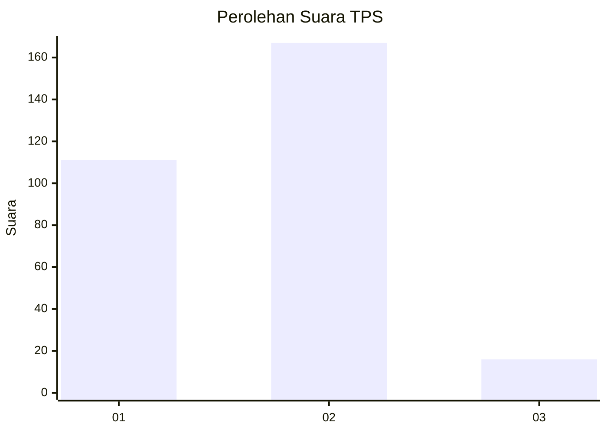
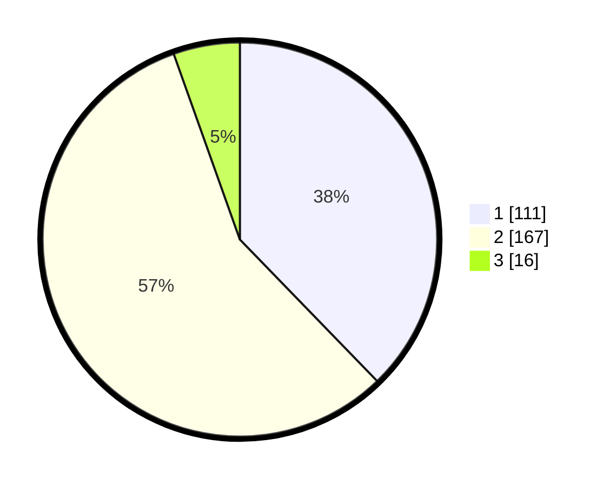

# Hasil

## Grafik

## Tabel

| No. | Nama Paslon    | Suara | Suara (raw) | Persentase |
|:--- |:-------------- | -----:| -----------:| ----------:|
| 1   | ANIES MUHAIMIN | 111   | [111][p-1]  | 37,76      |
| 2   | PRABOWO GIBRAN | 167   | [167][p-2]  | 56,80      |
| 3   | GANJAR MAHFUD  | 16    | [16][p-3]   | 5,44       |

[p-1]: https://github.com/gigit-pemilu/pemilu-2024-36-banten/blob/main/pilpres/hitung-suara/sub/36-banten/sub/73-kota-serang/sub/05-cipocok-jaya/sub/1008-gelam/sub/007-tps/sub/paslon-1.txt
[p-2]: https://github.com/gigit-pemilu/pemilu-2024-36-banten/blob/main/pilpres/hitung-suara/sub/36-banten/sub/73-kota-serang/sub/05-cipocok-jaya/sub/1008-gelam/sub/007-tps/sub/paslon-2.txt
[p-3]: https://github.com/gigit-pemilu/pemilu-2024-36-banten/blob/main/pilpres/hitung-suara/sub/36-banten/sub/73-kota-serang/sub/05-cipocok-jaya/sub/1008-gelam/sub/007-tps/sub/paslon-3.txt

## Foto C Plano

https://sirekap-obj-formc.kpu.go.id/1a45/pemilu/ppwp/36/73/05/10/08/3673051008007-20240215-025108--b5c63cc8-52df-4c26-8c5a-9c97d1f6d4b6.jpg

https://sirekap-obj-formc.kpu.go.id/1a45/pemilu/ppwp/36/73/05/10/08/3673051008007-20240215-024335--ce7e4370-e032-404e-9d6a-837608d49a78.jpg

https://sirekap-obj-formc.kpu.go.id/1a45/pemilu/ppwp/36/73/05/10/08/3673051008007-20240215-024623--5c3433b7-6bdb-4222-820d-a16e3117b434.jpg

## Metadata

| Key        | Value               |
| ---------- | ------------------- |
| Time Stamp | 2024-02-15 15:00:29 |

