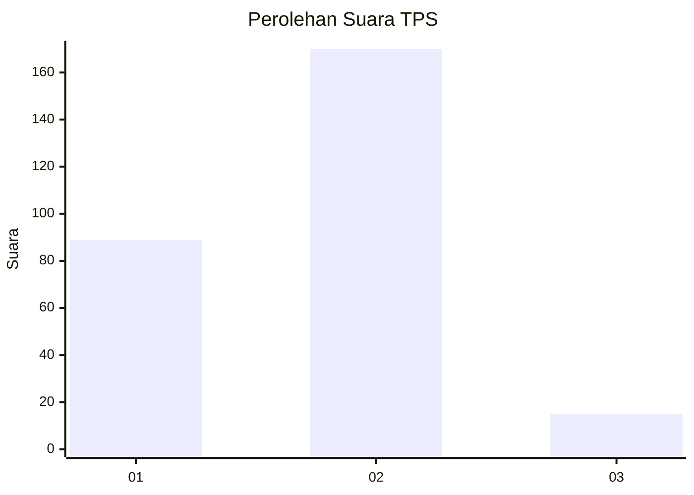
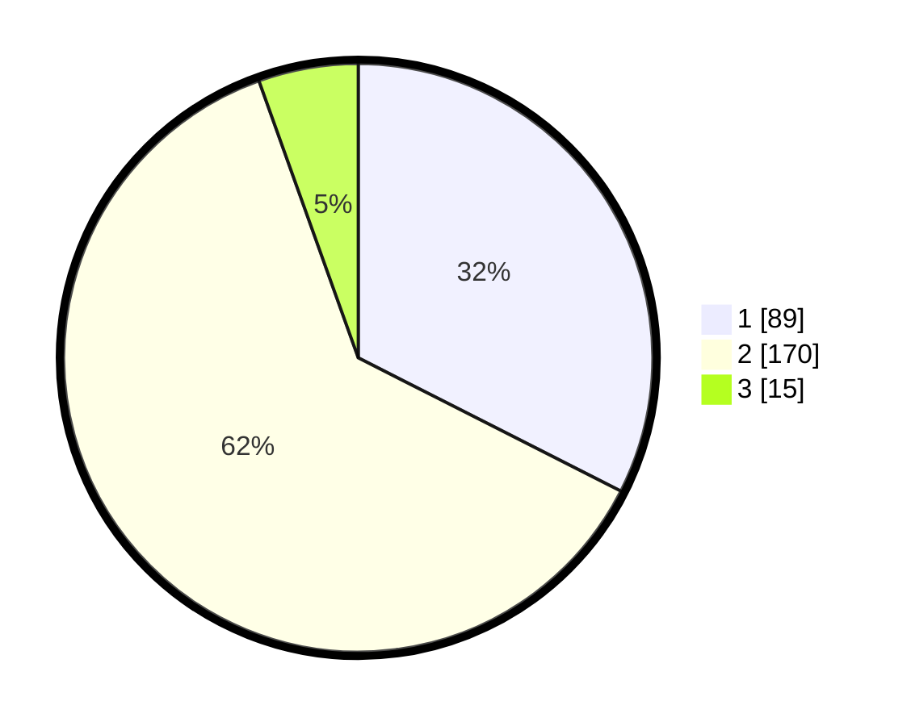

# Hasil

## Grafik

## Tabel

| No. | Nama Paslon    | Suara | Suara (raw) | Persentase |
|:--- |:-------------- | -----:| -----------:| ----------:|
| 1   | ANIES MUHAIMIN | 89    | [89][p-1]   | 32,48      |
| 2   | PRABOWO GIBRAN | 170   | [170][p-2]  | 62,04      |
| 3   | GANJAR MAHFUD  | 15    | [15][p-3]   | 5,47       |

[p-1]: https://github.com/gigit-pemilu/pemilu-2024/blob/main/pilpres/hitung-suara/sub/36-banten/sub/73-kota-serang/sub/05-cipocok-jaya/sub/1008-gelam/sub/013-tps/sub/paslon-1.txt
[p-2]: https://github.com/gigit-pemilu/pemilu-2024/blob/main/pilpres/hitung-suara/sub/36-banten/sub/73-kota-serang/sub/05-cipocok-jaya/sub/1008-gelam/sub/013-tps/sub/paslon-2.txt
[p-3]: https://github.com/gigit-pemilu/pemilu-2024/blob/main/pilpres/hitung-suara/sub/36-banten/sub/73-kota-serang/sub/05-cipocok-jaya/sub/1008-gelam/sub/013-tps/sub/paslon-3.txt

## Foto C Plano

https://sirekap-obj-formc.kpu.go.id/362a/pemilu/ppwp/36/73/05/10/08/3673051008013-20240214-184538--585f44d2-60d2-4771-a05a-953808751015.jpg

https://sirekap-obj-formc.kpu.go.id/362a/pemilu/ppwp/36/73/05/10/08/3673051008013-20240214-185413--e457b855-60f1-403d-b1e3-b38c76da03e8.jpg

https://sirekap-obj-formc.kpu.go.id/362a/pemilu/ppwp/36/73/05/10/08/3673051008013-20240214-185624--58cdddc3-6887-4e93-8add-3723ba6cbfad.jpg

## Metadata

| Key        | Value               |
| ---------- | ------------------- |
| Time Stamp | 2024-02-15 15:00:29 |

