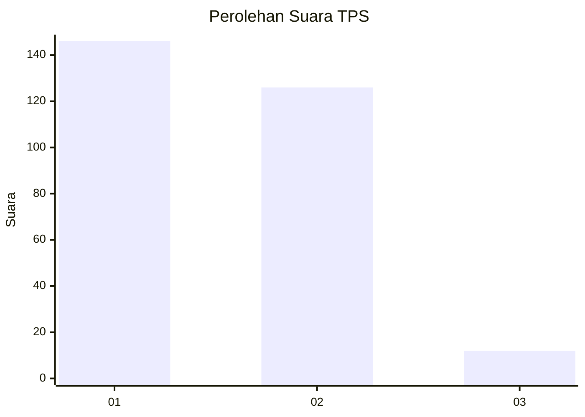
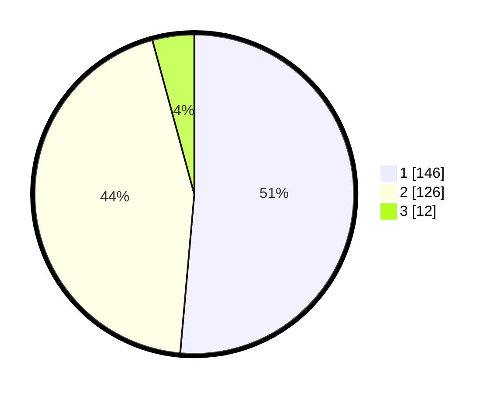

# Hasil

## Grafik

## Tabel

| No. | Nama Paslon    | Suara | Suara (raw) | Persentase |
|:--- |:-------------- | -----:| -----------:| ----------:|
| 1   | ANIES MUHAIMIN | 146   | [146][p-1]  | 51,41      |
| 2   | PRABOWO GIBRAN | 126   | [126][p-2]  | 44,37      |
| 3   | GANJAR MAHFUD  | 12    | [12][p-3]   | 4,23       |

[p-1]: https://github.com/gigit-pemilu/pemilu-2024/blob/main/pilpres/hitung-suara/sub/36-banten/sub/73-kota-serang/sub/05-cipocok-jaya/sub/1008-gelam/sub/021-tps/sub/paslon-1.txt
[p-2]: https://github.com/gigit-pemilu/pemilu-2024/blob/main/pilpres/hitung-suara/sub/36-banten/sub/73-kota-serang/sub/05-cipocok-jaya/sub/1008-gelam/sub/021-tps/sub/paslon-2.txt
[p-3]: https://github.com/gigit-pemilu/pemilu-2024/blob/main/pilpres/hitung-suara/sub/36-banten/sub/73-kota-serang/sub/05-cipocok-jaya/sub/1008-gelam/sub/021-tps/sub/paslon-3.txt

## Foto C Plano

https://sirekap-obj-formc.kpu.go.id/130c/pemilu/ppwp/36/73/05/10/08/3673051008021-20240215-063346--c13c4062-511a-4a14-aafa-22b13fdf939b.jpg

https://sirekap-obj-formc.kpu.go.id/130c/pemilu/ppwp/36/73/05/10/08/3673051008021-20240215-015740--4ca8e1da-f27d-4895-a47d-996f56b0cf88.jpg

https://sirekap-obj-formc.kpu.go.id/130c/pemilu/ppwp/36/73/05/10/08/3673051008021-20240215-020127--f4d70bfa-4481-4b01-be59-eeb32dedfd98.jpg

## Metadata

| Key        | Value               |
| ---------- | ------------------- |
| Time Stamp | 2024-02-15 17:00:25 |

