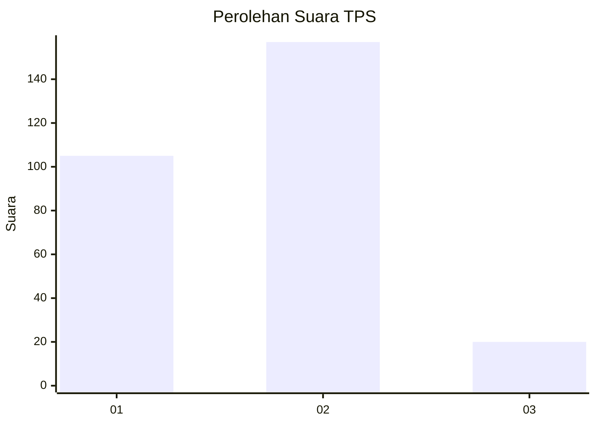

# Hasil

## Grafik

## Tabel

| No. | Nama Paslon    | Suara | Suara (raw) | Persentase |
|:--- |:-------------- | -----:| -----------:| ----------:|
| 1   | ANIES MUHAIMIN | 105   | [105][p-1]  | 37,23      |
| 2   | PRABOWO GIBRAN | 157   | [157][p-2]  | 55,67      |
| 3   | GANJAR MAHFUD  | 20    | [20][p-3]   | 7,09       |

[p-1]: https://github.com/gigit-pemilu/pemilu-2024/blob/main/pilpres/hitung-suara/sub/36-banten/sub/73-kota-serang/sub/05-cipocok-jaya/sub/1008-gelam/sub/024-tps/sub/paslon-1.txt
[p-2]: https://github.com/gigit-pemilu/pemilu-2024/blob/main/pilpres/hitung-suara/sub/36-banten/sub/73-kota-serang/sub/05-cipocok-jaya/sub/1008-gelam/sub/024-tps/sub/paslon-2.txt
[p-3]: https://github.com/gigit-pemilu/pemilu-2024/blob/main/pilpres/hitung-suara/sub/36-banten/sub/73-kota-serang/sub/05-cipocok-jaya/sub/1008-gelam/sub/024-tps/sub/paslon-3.txt

## Foto C Plano

https://sirekap-obj-formc.kpu.go.id/9a0f/pemilu/ppwp/36/73/05/10/08/3673051008024-20240214-204407--401108fc-8478-4ae2-b37a-116917803780.jpg

https://sirekap-obj-formc.kpu.go.id/9a0f/pemilu/ppwp/36/73/05/10/08/3673051008024-20240214-194201--0386e003-7594-4a04-b478-93d2da6b8553.jpg

https://sirekap-obj-formc.kpu.go.id/9a0f/pemilu/ppwp/36/73/05/10/08/3673051008024-20240214-194153--c4b061cc-b85e-4c3d-85a2-70f440495f82.jpg

## Metadata

| Key        | Value               |
| ---------- | ------------------- |
| Time Stamp | 2024-02-15 15:00:29 |

