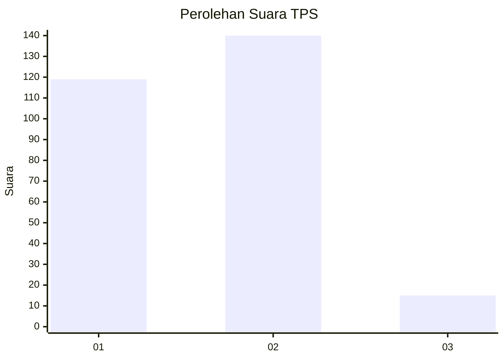
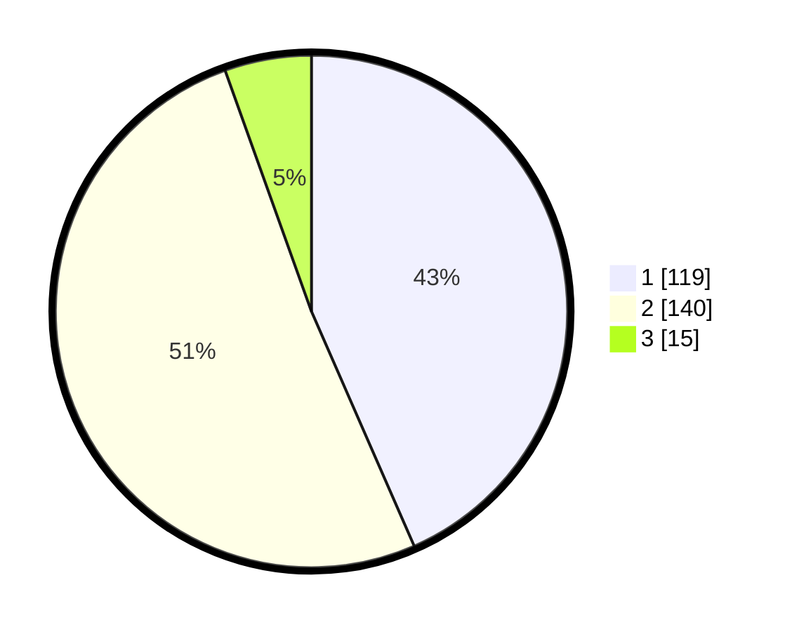

# Hasil

## Grafik

## Tabel

| No. | Nama Paslon    | Suara | Suara (raw) | Persentase |
|:--- |:-------------- | -----:| -----------:| ----------:|
| 1   | ANIES MUHAIMIN | 119   | [119][p-1]  | 43,43      |
| 2   | PRABOWO GIBRAN | 140   | [140][p-2]  | 51,09      |
| 3   | GANJAR MAHFUD  | 15    | [15][p-3]   | 5,47       |

[p-1]: https://github.com/gigit-pemilu/pemilu-2024-36-banten/blob/main/pilpres/hitung-suara/sub/36-banten/sub/73-kota-serang/sub/06-taktakan/sub/1001-taktakan/sub/013-tps/sub/paslon-1.txt
[p-2]: https://github.com/gigit-pemilu/pemilu-2024-36-banten/blob/main/pilpres/hitung-suara/sub/36-banten/sub/73-kota-serang/sub/06-taktakan/sub/1001-taktakan/sub/013-tps/sub/paslon-2.txt
[p-3]: https://github.com/gigit-pemilu/pemilu-2024-36-banten/blob/main/pilpres/hitung-suara/sub/36-banten/sub/73-kota-serang/sub/06-taktakan/sub/1001-taktakan/sub/013-tps/sub/paslon-3.txt

## Foto C Plano

https://sirekap-obj-formc.kpu.go.id/e723/pemilu/ppwp/36/73/06/10/01/3673061001013-20240223-150953--1cdea2ec-cef4-4164-bb5c-1863a341a02a.jpg

https://sirekap-obj-formc.kpu.go.id/e723/pemilu/ppwp/36/73/06/10/01/3673061001013-20240215-024748--f48cea5c-7f17-4099-804a-454e50bb3cd6.jpg

https://sirekap-obj-formc.kpu.go.id/e723/pemilu/ppwp/36/73/06/10/01/3673061001013-20240215-025010--67c2fde7-141a-482e-993d-fb17fb6ae905.jpg

## Metadata

| Key        | Value               |
| ---------- | ------------------- |
| Time Stamp | 2024-02-24 22:31:28 |

