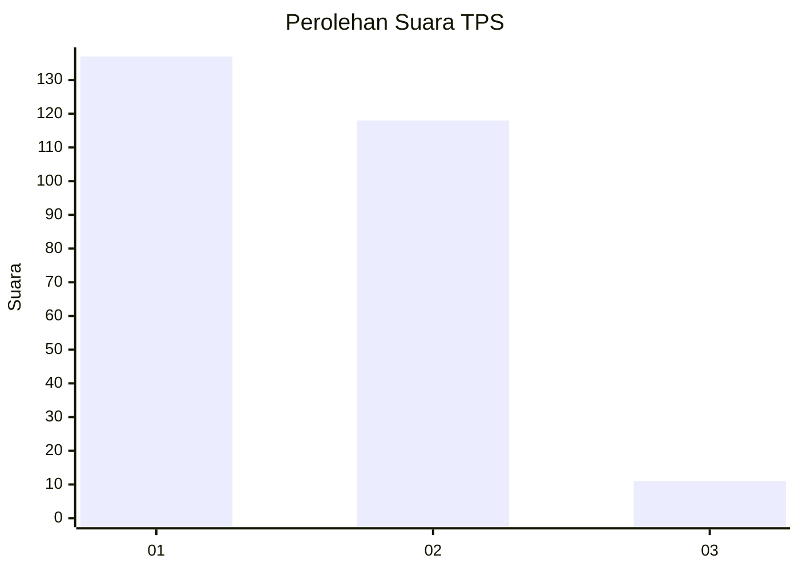
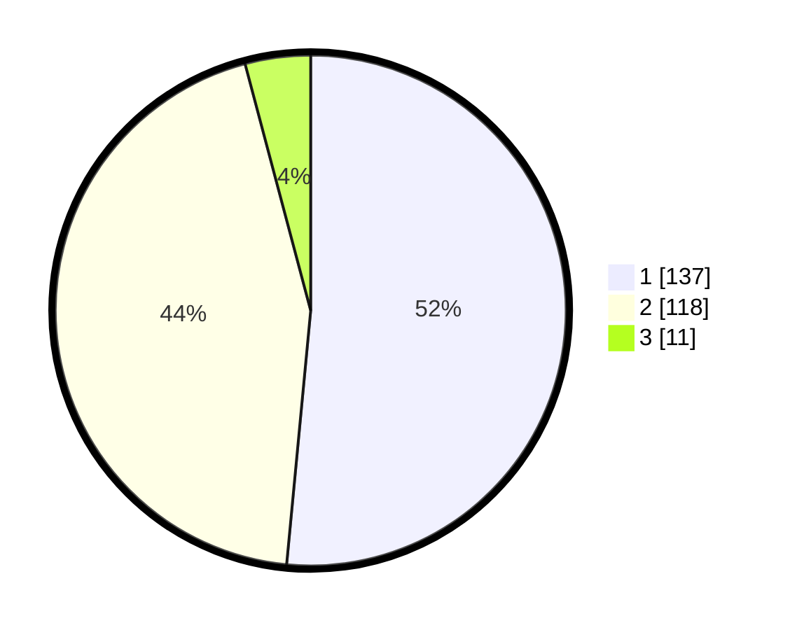

# Hasil

## Grafik

## Tabel

| No. | Nama Paslon    | Suara | Suara (raw) | Persentase |
|:--- |:-------------- | -----:| -----------:| ----------:|
| 1   | ANIES MUHAIMIN | 137   | [137][p-1]  | 51,50      |
| 2   | PRABOWO GIBRAN | 118   | [118][p-2]  | 44,36      |
| 3   | GANJAR MAHFUD  | 11    | [11][p-3]   | 4,14       |

[p-1]: https://github.com/gigit-pemilu/pemilu-2024-36-banten/blob/main/pilpres/hitung-suara/sub/36-banten/sub/73-kota-serang/sub/06-taktakan/sub/1001-taktakan/sub/014-tps/sub/paslon-1.txt
[p-2]: https://github.com/gigit-pemilu/pemilu-2024-36-banten/blob/main/pilpres/hitung-suara/sub/36-banten/sub/73-kota-serang/sub/06-taktakan/sub/1001-taktakan/sub/014-tps/sub/paslon-2.txt
[p-3]: https://github.com/gigit-pemilu/pemilu-2024-36-banten/blob/main/pilpres/hitung-suara/sub/36-banten/sub/73-kota-serang/sub/06-taktakan/sub/1001-taktakan/sub/014-tps/sub/paslon-3.txt

## Foto C Plano

https://sirekap-obj-formc.kpu.go.id/ede8/pemilu/ppwp/36/73/06/10/01/3673061001014-20240214-215107--ebb04658-62e0-48ea-a4fc-7c3ee2e7e5c7.jpg

https://sirekap-obj-formc.kpu.go.id/ede8/pemilu/ppwp/36/73/06/10/01/3673061001014-20240214-215549--acf903e8-6284-4645-8fda-c744ce09020d.jpg

https://sirekap-obj-formc.kpu.go.id/ede8/pemilu/ppwp/36/73/06/10/01/3673061001014-20240214-220223--291e49b3-b091-4663-99c0-13986d6014fc.jpg

## Metadata

| Key        | Value               |
| ---------- | ------------------- |
| Time Stamp | 2024-02-15 15:00:29 |

