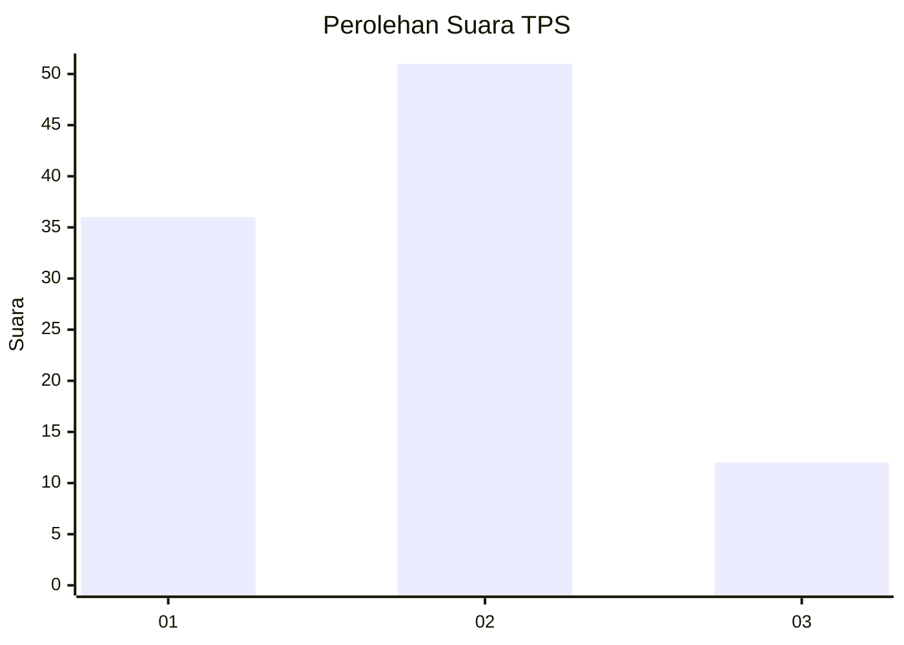
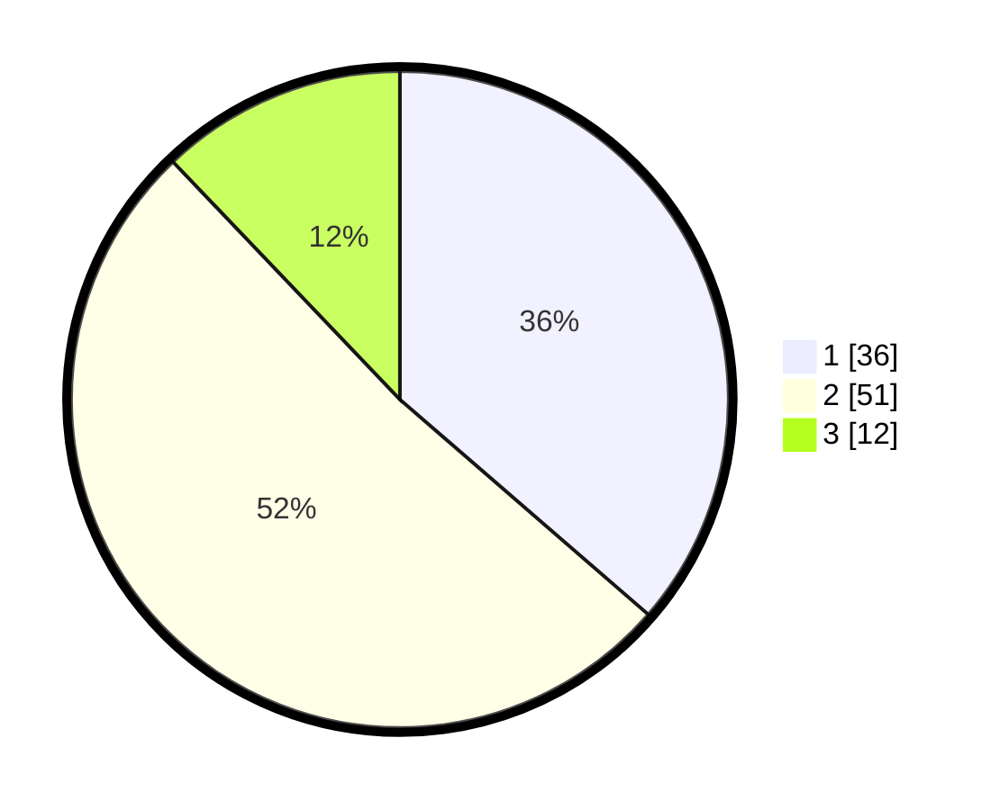

# Hasil

## Grafik

## Tabel

| No. | Nama Paslon    | Suara | Suara (raw) | Persentase |
|:--- |:-------------- | -----:| -----------:| ----------:|
| 1   | ANIES MUHAIMIN | 36    | [36][p-1]   | 36,36      |
| 2   | PRABOWO GIBRAN | 51    | [51][p-2]   | 51,52      |
| 3   | GANJAR MAHFUD  | 12    | [12][p-3]   | 12,12      |

[p-1]: https://github.com/gigit-pemilu/pemilu-2024/blob/main/pilpres/hitung-suara/sub/36-banten/sub/73-kota-serang/sub/06-taktakan/sub/1002-sayar/sub/021-tps/sub/paslon-1.txt
[p-2]: https://github.com/gigit-pemilu/pemilu-2024/blob/main/pilpres/hitung-suara/sub/36-banten/sub/73-kota-serang/sub/06-taktakan/sub/1002-sayar/sub/021-tps/sub/paslon-2.txt
[p-3]: https://github.com/gigit-pemilu/pemilu-2024/blob/main/pilpres/hitung-suara/sub/36-banten/sub/73-kota-serang/sub/06-taktakan/sub/1002-sayar/sub/021-tps/sub/paslon-3.txt

## Foto C Plano

https://sirekap-obj-formc.kpu.go.id/7a55/pemilu/ppwp/36/73/06/10/02/3673061002021-20240215-085327--e693107b-ddf5-4b18-a0c8-d991441ba97a.jpg

https://sirekap-obj-formc.kpu.go.id/7a55/pemilu/ppwp/36/73/06/10/02/3673061002021-20240215-085322--0517a81b-6e4f-4b0e-839f-0d2629c0ddf0.jpg

https://sirekap-obj-formc.kpu.go.id/7a55/pemilu/ppwp/36/73/06/10/02/3673061002021-20240215-085256--d078aea5-4cc0-4460-aa21-b6c14f2cdac2.jpg

## Metadata

| Key        | Value               |
| ---------- | ------------------- |
| Time Stamp | 2024-02-15 17:00:25 |

