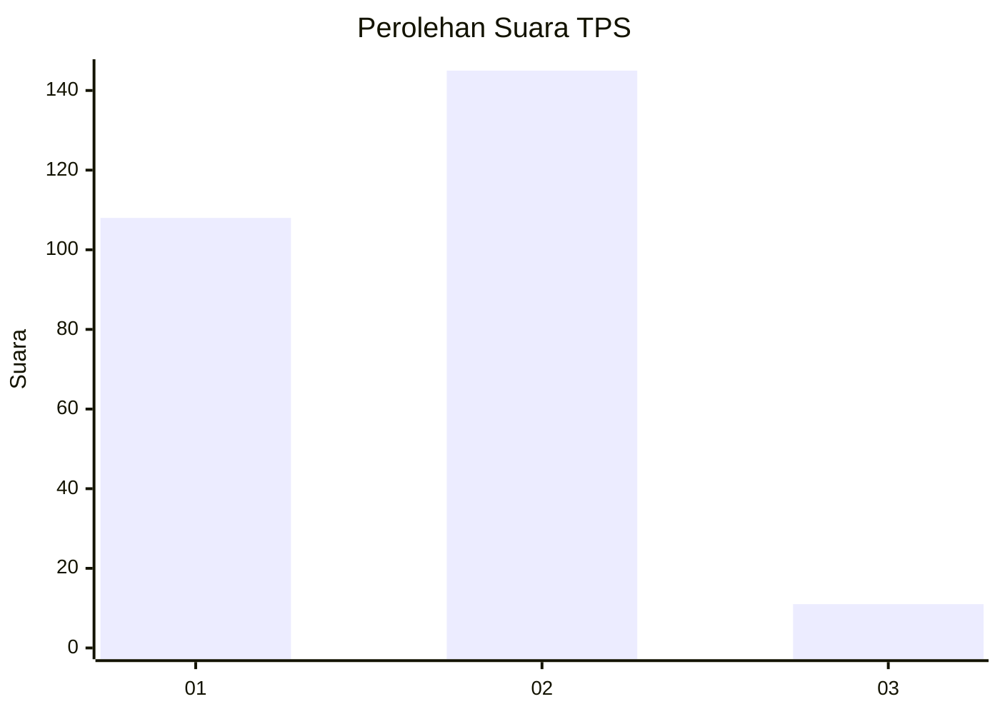
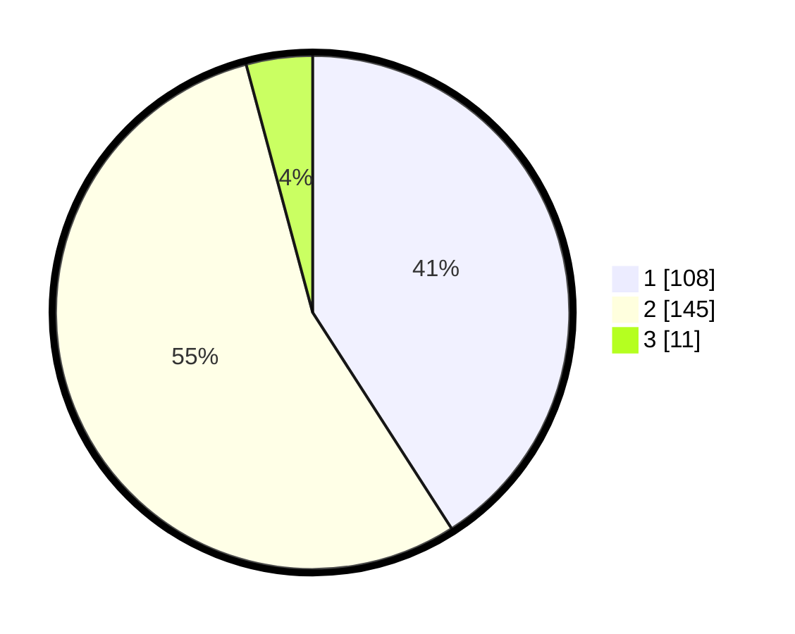

# Hasil

## Grafik

## Tabel

| No. | Nama Paslon    | Suara | Suara (raw) | Persentase |
|:--- |:-------------- | -----:| -----------:| ----------:|
| 1   | ANIES MUHAIMIN | 108   | [108][p-1]  | 40,91      |
| 2   | PRABOWO GIBRAN | 145   | [145][p-2]  | 54,92      |
| 3   | GANJAR MAHFUD  | 11    | [11][p-3]   | 4,17       |

[p-1]: https://github.com/gigit-pemilu/pemilu-2024-36-banten/blob/main/pilpres/hitung-suara/sub/36-banten/sub/73-kota-serang/sub/06-taktakan/sub/1004-kuranji/sub/002-tps/sub/paslon-1.txt
[p-2]: https://github.com/gigit-pemilu/pemilu-2024-36-banten/blob/main/pilpres/hitung-suara/sub/36-banten/sub/73-kota-serang/sub/06-taktakan/sub/1004-kuranji/sub/002-tps/sub/paslon-2.txt
[p-3]: https://github.com/gigit-pemilu/pemilu-2024-36-banten/blob/main/pilpres/hitung-suara/sub/36-banten/sub/73-kota-serang/sub/06-taktakan/sub/1004-kuranji/sub/002-tps/sub/paslon-3.txt

## Foto C Plano

https://sirekap-obj-formc.kpu.go.id/27c7/pemilu/ppwp/36/73/06/10/04/3673061004002-20240223-103923--84c5f871-538b-48d6-a42a-46b5e78c666a.jpg

https://sirekap-obj-formc.kpu.go.id/27c7/pemilu/ppwp/36/73/06/10/04/3673061004002-20240223-104000--4368de96-d43f-4636-a3c2-c32ba4381360.jpg

https://sirekap-obj-formc.kpu.go.id/27c7/pemilu/ppwp/36/73/06/10/04/3673061004002-20240223-104036--de3841bc-8f11-4703-a56d-b455615eccce.jpg

## Metadata

| Key        | Value               |
| ---------- | ------------------- |
| Time Stamp | 2024-02-26 15:00:00 |

