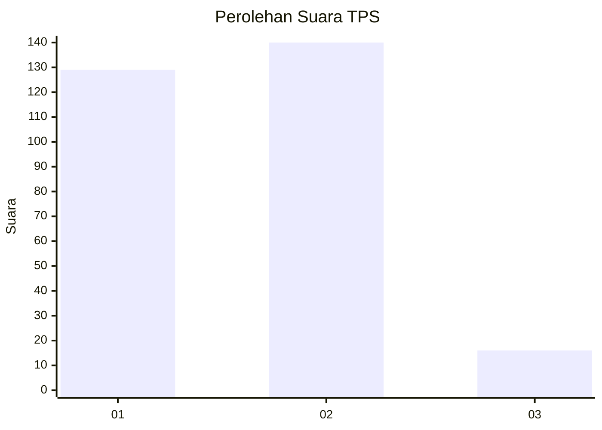
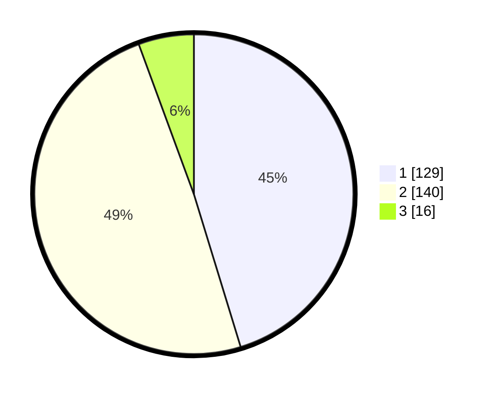

# Hasil

## Grafik

## Tabel

| No. | Nama Paslon    | Suara | Suara (raw) | Persentase |
|:--- |:-------------- | -----:| -----------:| ----------:|
| 1   | ANIES MUHAIMIN | 129   | [129][p-1]  | 45,26      |
| 2   | PRABOWO GIBRAN | 140   | [140][p-2]  | 49,12      |
| 3   | GANJAR MAHFUD  | 16    | [16][p-3]   | 5,61       |

[p-1]: https://github.com/gigit-pemilu/pemilu-2024/blob/main/pilpres/hitung-suara/sub/36-banten/sub/73-kota-serang/sub/06-taktakan/sub/1005-kalanganyar/sub/002-tps/sub/paslon-1.txt
[p-2]: https://github.com/gigit-pemilu/pemilu-2024/blob/main/pilpres/hitung-suara/sub/36-banten/sub/73-kota-serang/sub/06-taktakan/sub/1005-kalanganyar/sub/002-tps/sub/paslon-2.txt
[p-3]: https://github.com/gigit-pemilu/pemilu-2024/blob/main/pilpres/hitung-suara/sub/36-banten/sub/73-kota-serang/sub/06-taktakan/sub/1005-kalanganyar/sub/002-tps/sub/paslon-3.txt

## Foto C Plano

https://sirekap-obj-formc.kpu.go.id/5574/pemilu/ppwp/36/73/06/10/05/3673061005002-20240214-204205--eb2943b7-067d-4c17-99c2-effa696b13d9.jpg

https://sirekap-obj-formc.kpu.go.id/5574/pemilu/ppwp/36/73/06/10/05/3673061005002-20240214-204122--4fd72556-e13f-459d-b3e9-84203c4b69eb.jpg

https://sirekap-obj-formc.kpu.go.id/5574/pemilu/ppwp/36/73/06/10/05/3673061005002-20240214-204017--37e47f85-2698-41f1-aeda-b15db96f4acf.jpg

## Metadata

| Key        | Value               |
| ---------- | ------------------- |
| Time Stamp | 2024-02-15 18:30:25 |

