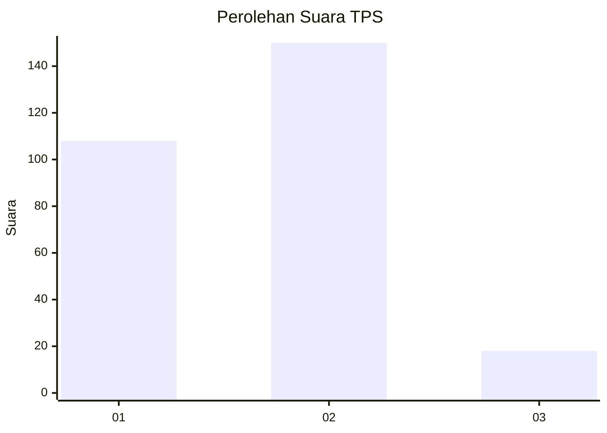

# Hasil

## Grafik

## Tabel

| No. | Nama Paslon    | Suara | Suara (raw) | Persentase |
|:--- |:-------------- | -----:| -----------:| ----------:|
| 1   | ANIES MUHAIMIN | 108   | [108][p-1]  | 39,13      |
| 2   | PRABOWO GIBRAN | 150   | [150][p-2]  | 54,35      |
| 3   | GANJAR MAHFUD  | 18    | [18][p-3]   | 6,52       |

[p-1]: https://github.com/gigit-pemilu/pemilu-2024-36-banten/blob/main/pilpres/hitung-suara/sub/36-banten/sub/73-kota-serang/sub/06-taktakan/sub/1005-kalanganyar/sub/010-tps/sub/paslon-1.txt
[p-2]: https://github.com/gigit-pemilu/pemilu-2024-36-banten/blob/main/pilpres/hitung-suara/sub/36-banten/sub/73-kota-serang/sub/06-taktakan/sub/1005-kalanganyar/sub/010-tps/sub/paslon-2.txt
[p-3]: https://github.com/gigit-pemilu/pemilu-2024-36-banten/blob/main/pilpres/hitung-suara/sub/36-banten/sub/73-kota-serang/sub/06-taktakan/sub/1005-kalanganyar/sub/010-tps/sub/paslon-3.txt

## Foto C Plano

https://sirekap-obj-formc.kpu.go.id/9d8d/pemilu/ppwp/36/73/06/10/05/3673061005010-20240215-003240--abc3884d-84b6-462a-96cc-8af9975216f3.jpg

https://sirekap-obj-formc.kpu.go.id/9d8d/pemilu/ppwp/36/73/06/10/05/3673061005010-20240215-002848--e1a8d156-c1de-43b2-bebd-f5f0fdc3bf2c.jpg

https://sirekap-obj-formc.kpu.go.id/9d8d/pemilu/ppwp/36/73/06/10/05/3673061005010-20240215-003221--44aac977-e354-409f-9af7-82ae4004d67d.jpg

## Metadata

| Key        | Value               |
| ---------- | ------------------- |
| Time Stamp | 2024-02-15 18:30:25 |

