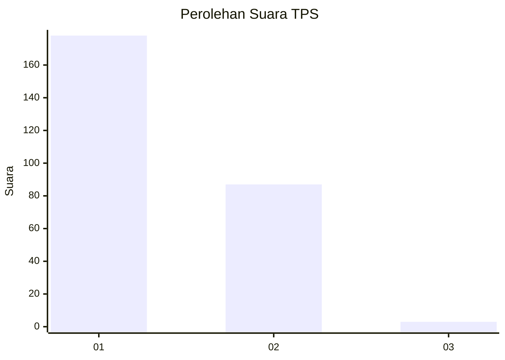
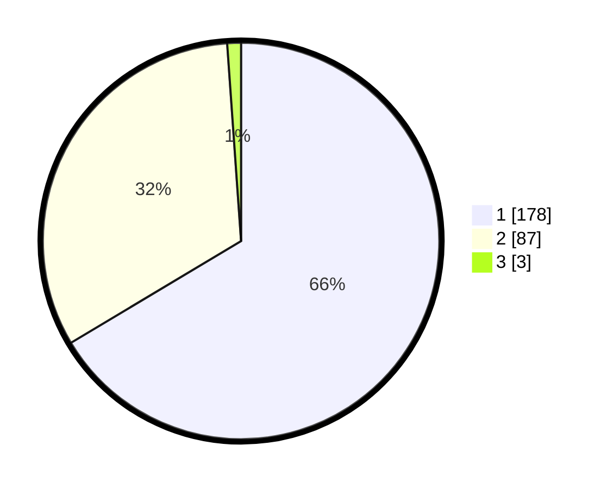

# Hasil

## Grafik

## Tabel

| No. | Nama Paslon    | Suara | Suara (raw) | Persentase |
|:--- |:-------------- | -----:| -----------:| ----------:|
| 1   | ANIES MUHAIMIN | 178   | [178][p-1]  | 66,42      |
| 2   | PRABOWO GIBRAN | 87    | [87][p-2]   | 32,46      |
| 3   | GANJAR MAHFUD  | 3     | [3][p-3]    | 1,12       |

[p-1]: https://github.com/gigit-pemilu/pemilu-2024-36-banten/blob/main/pilpres/hitung-suara/sub/36-banten/sub/73-kota-serang/sub/06-taktakan/sub/1007-panggungjati/sub/005-tps/sub/paslon-1.txt
[p-2]: https://github.com/gigit-pemilu/pemilu-2024-36-banten/blob/main/pilpres/hitung-suara/sub/36-banten/sub/73-kota-serang/sub/06-taktakan/sub/1007-panggungjati/sub/005-tps/sub/paslon-2.txt
[p-3]: https://github.com/gigit-pemilu/pemilu-2024-36-banten/blob/main/pilpres/hitung-suara/sub/36-banten/sub/73-kota-serang/sub/06-taktakan/sub/1007-panggungjati/sub/005-tps/sub/paslon-3.txt

## Foto C Plano

https://sirekap-obj-formc.kpu.go.id/14a1/pemilu/ppwp/36/73/06/10/07/3673061007005-20240226-142842--78d0f5e9-07f4-453e-a5e9-f8c78ebb4bed.jpg

https://sirekap-obj-formc.kpu.go.id/14a1/pemilu/ppwp/36/73/06/10/07/3673061007005-20240220-154707--bab3785a-a039-499c-a240-a83d4eccecd9.jpg

https://sirekap-obj-formc.kpu.go.id/14a1/pemilu/ppwp/36/73/06/10/07/3673061007005-20240217-232823--7800afac-56e1-45fe-82d3-17fdc5c3467d.jpg

## Metadata

| Key        | Value               |
| ---------- | ------------------- |
| Time Stamp | 2024-02-26 15:00:00 |

