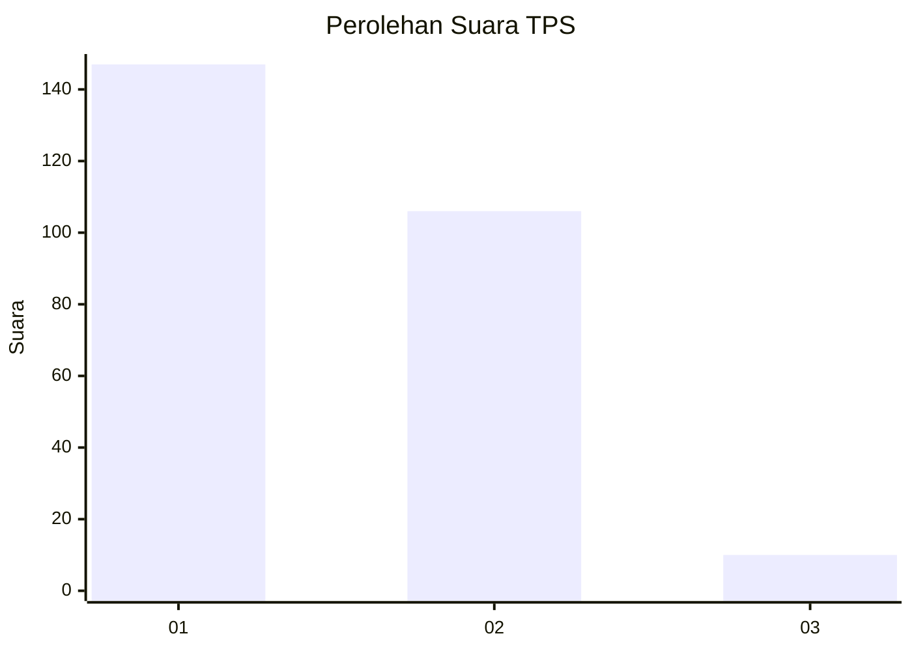
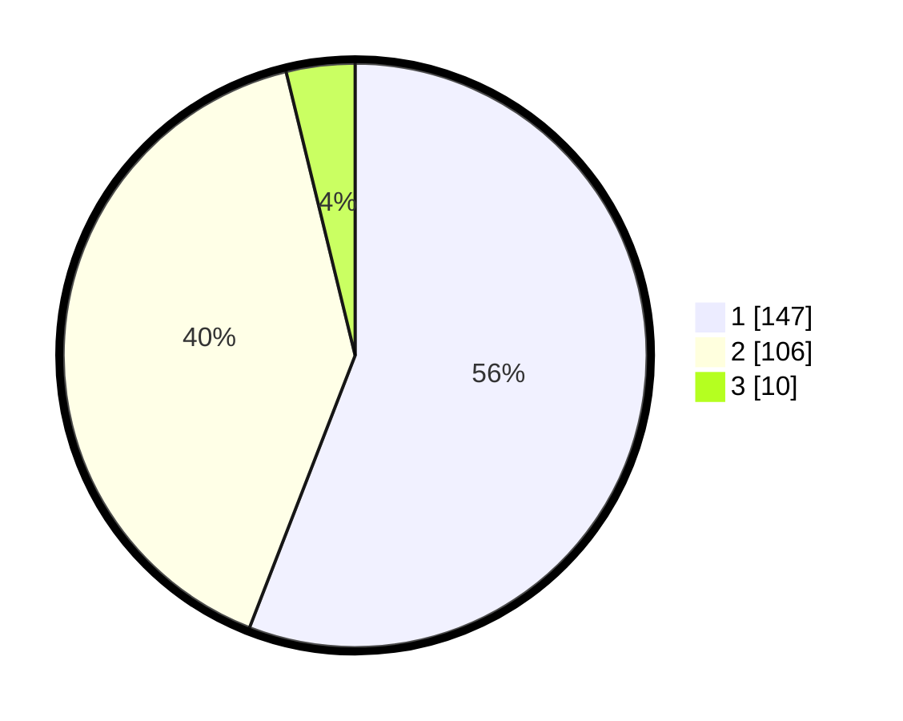

# Hasil

## Grafik

## Tabel

| No. | Nama Paslon    | Suara | Suara (raw) | Persentase |
|:--- |:-------------- | -----:| -----------:| ----------:|
| 1   | ANIES MUHAIMIN | 147   | [147][p-1]  | 55,89      |
| 2   | PRABOWO GIBRAN | 106   | [106][p-2]  | 40,30      |
| 3   | GANJAR MAHFUD  | 10    | [10][p-3]   | 3,80       |

[p-1]: https://github.com/gigit-pemilu/pemilu-2024-36-banten/blob/main/pilpres/hitung-suara/sub/36-banten/sub/73-kota-serang/sub/06-taktakan/sub/1007-panggungjati/sub/007-tps/sub/paslon-1.txt
[p-2]: https://github.com/gigit-pemilu/pemilu-2024-36-banten/blob/main/pilpres/hitung-suara/sub/36-banten/sub/73-kota-serang/sub/06-taktakan/sub/1007-panggungjati/sub/007-tps/sub/paslon-2.txt
[p-3]: https://github.com/gigit-pemilu/pemilu-2024-36-banten/blob/main/pilpres/hitung-suara/sub/36-banten/sub/73-kota-serang/sub/06-taktakan/sub/1007-panggungjati/sub/007-tps/sub/paslon-3.txt

## Foto C Plano

https://sirekap-obj-formc.kpu.go.id/b119/pemilu/ppwp/36/73/06/10/07/3673061007007-20240215-042943--07321f10-14fe-4086-a1ff-e44af9196713.jpg

https://sirekap-obj-formc.kpu.go.id/b119/pemilu/ppwp/36/73/06/10/07/3673061007007-20240215-043031--27dc9e18-4d78-4fcc-bb9b-2c6de1b05c05.jpg

https://sirekap-obj-formc.kpu.go.id/b119/pemilu/ppwp/36/73/06/10/07/3673061007007-20240214-203233--f38952f9-3396-4ec0-9580-845361e78003.jpg

## Metadata

| Key        | Value               |
| ---------- | ------------------- |
| Time Stamp | 2024-02-15 15:30:25 |

