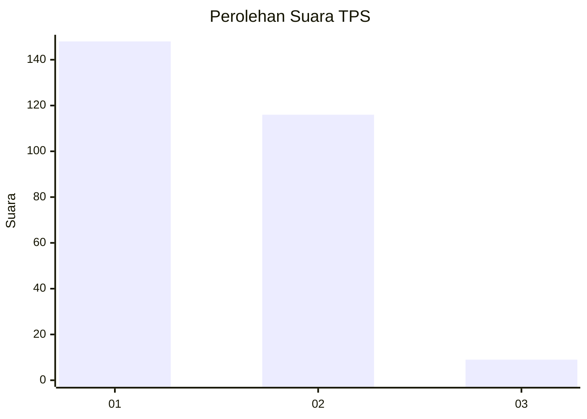
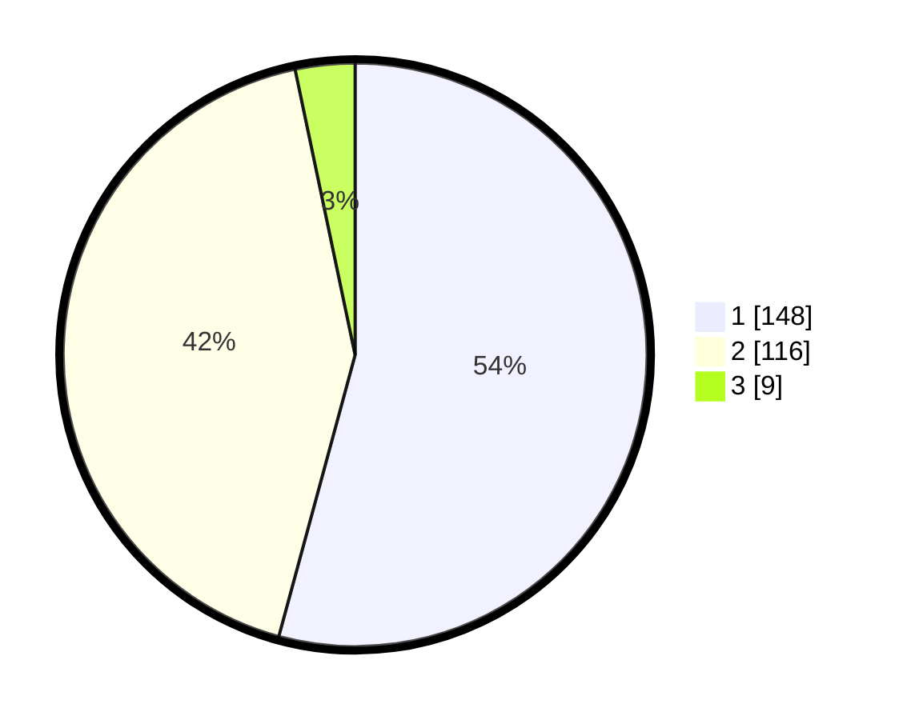

# Hasil

## Grafik

## Tabel

| No. | Nama Paslon    | Suara | Suara (raw) | Persentase |
|:--- |:-------------- | -----:| -----------:| ----------:|
| 1   | ANIES MUHAIMIN | 148   | [148][p-1]  | 54,21      |
| 2   | PRABOWO GIBRAN | 116   | [116][p-2]  | 42,49      |
| 3   | GANJAR MAHFUD  | 9     | [9][p-3]    | 3,30       |

[p-1]: https://github.com/gigit-pemilu/pemilu-2024/blob/main/pilpres/hitung-suara/sub/36-banten/sub/73-kota-serang/sub/06-taktakan/sub/1009-umbul-tengah/sub/003-tps/sub/paslon-1.txt
[p-2]: https://github.com/gigit-pemilu/pemilu-2024/blob/main/pilpres/hitung-suara/sub/36-banten/sub/73-kota-serang/sub/06-taktakan/sub/1009-umbul-tengah/sub/003-tps/sub/paslon-2.txt
[p-3]: https://github.com/gigit-pemilu/pemilu-2024/blob/main/pilpres/hitung-suara/sub/36-banten/sub/73-kota-serang/sub/06-taktakan/sub/1009-umbul-tengah/sub/003-tps/sub/paslon-3.txt

## Foto C Plano

https://sirekap-obj-formc.kpu.go.id/d8cd/pemilu/ppwp/36/73/06/10/09/3673061009003-20240214-155658--e9e15bcd-464f-4b5e-bd6a-2e7425a3149d.jpg

https://sirekap-obj-formc.kpu.go.id/d8cd/pemilu/ppwp/36/73/06/10/09/3673061009003-20240214-155847--d7e2a1b2-f1bb-45cb-82d9-3056c0ab8907.jpg

https://sirekap-obj-formc.kpu.go.id/d8cd/pemilu/ppwp/36/73/06/10/09/3673061009003-20240214-155752--09d51150-9780-4771-962e-b8c0d732905b.jpg

## Metadata

| Key        | Value               |
| ---------- | ------------------- |
| Time Stamp | 2024-02-15 00:41:44 |

