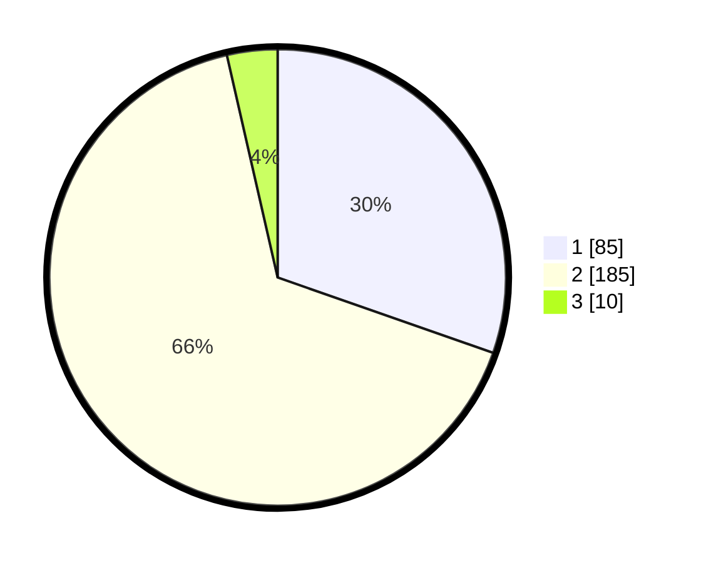

# Hasil

## Grafik

## Tabel

| No. | Nama Paslon    | Suara | Suara (raw) | Persentase |
|:--- |:-------------- | -----:| -----------:| ----------:|
| 1   | ANIES MUHAIMIN | 85    | [85][p-1]   | 30,36      |
| 2   | PRABOWO GIBRAN | 185   | [185][p-2]  | 66,07      |
| 3   | GANJAR MAHFUD  | 10    | [10][p-3]   | 3,57       |

[p-1]: https://github.com/gigit-pemilu/pemilu-2024/blob/main/pilpres/hitung-suara/sub/36-banten/sub/73-kota-serang/sub/06-taktakan/sub/1012-taman-baru/sub/012-tps/sub/paslon-1.txt
[p-2]: https://github.com/gigit-pemilu/pemilu-2024/blob/main/pilpres/hitung-suara/sub/36-banten/sub/73-kota-serang/sub/06-taktakan/sub/1012-taman-baru/sub/012-tps/sub/paslon-2.txt
[p-3]: https://github.com/gigit-pemilu/pemilu-2024/blob/main/pilpres/hitung-suara/sub/36-banten/sub/73-kota-serang/sub/06-taktakan/sub/1012-taman-baru/sub/012-tps/sub/paslon-3.txt

## Foto C Plano

https://sirekap-obj-formc.kpu.go.id/8792/pemilu/ppwp/36/73/06/10/12/3673061012012-20240214-230825--46be5244-824c-438f-96eb-73676fdecbed.jpg

https://sirekap-obj-formc.kpu.go.id/8792/pemilu/ppwp/36/73/06/10/12/3673061012012-20240214-231006--6ba8a8a7-df15-455e-9ad8-361a65609a5c.jpg

https://sirekap-obj-formc.kpu.go.id/8792/pemilu/ppwp/36/73/06/10/12/3673061012012-20240214-231121--db18a053-d2e3-4312-91f2-1c3bbc7b7d8f.jpg

## Metadata

| Key        | Value               |
| ---------- | ------------------- |
| Time Stamp | 2024-02-16 21:01:00 |

