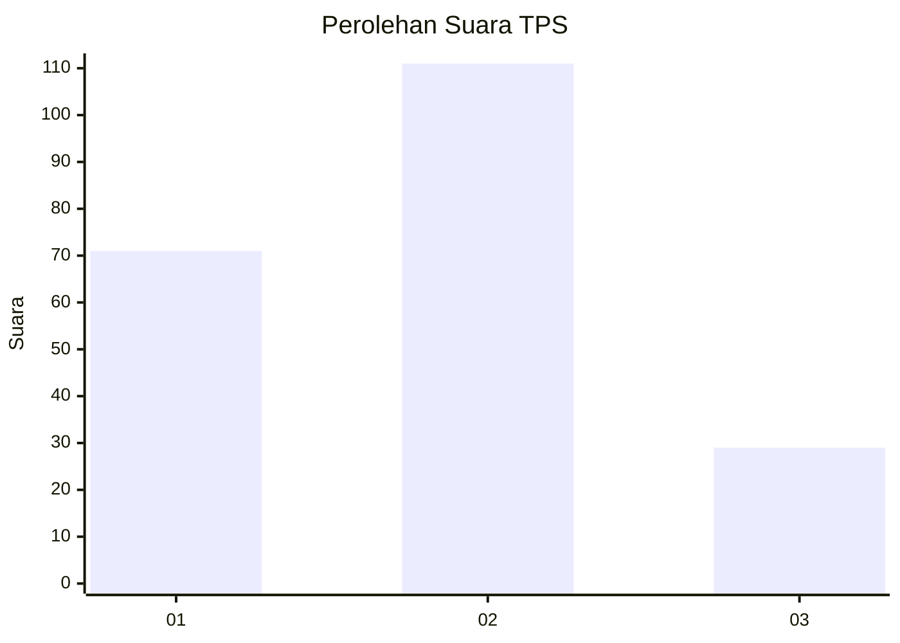
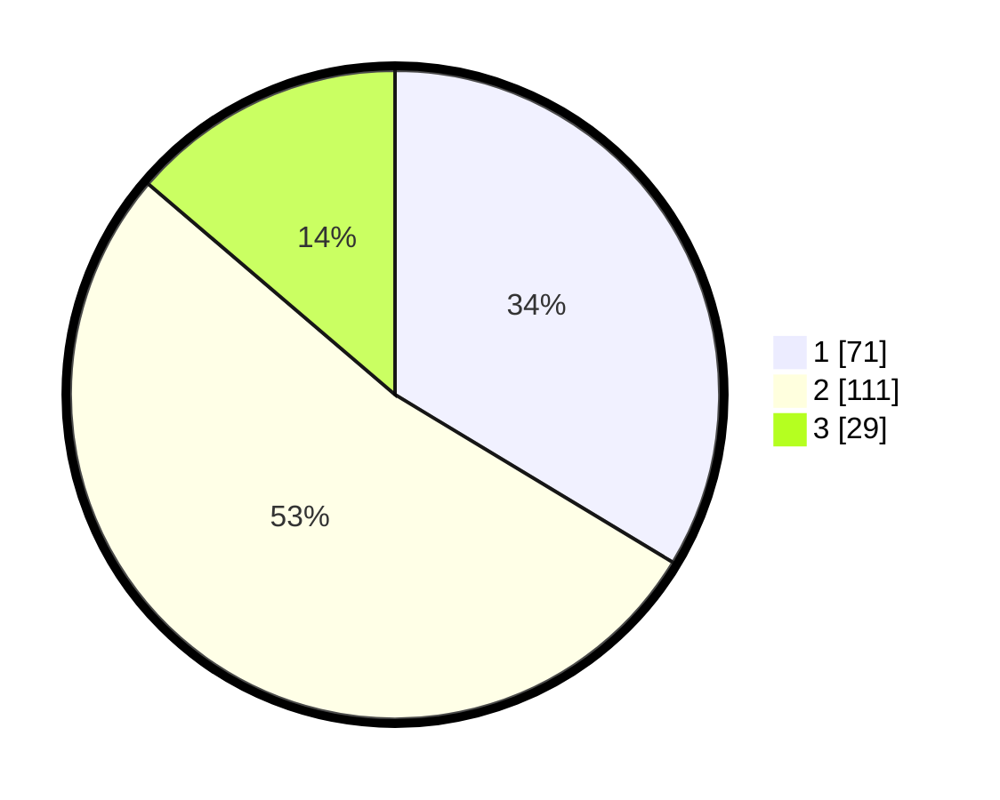

# Hasil

## Grafik

## Tabel

| No. | Nama Paslon    | Suara | Suara (raw) | Persentase |
|:--- |:-------------- | -----:| -----------:| ----------:|
| 1   | ANIES MUHAIMIN | 71    | [71][p-1]   | 33,65      |
| 2   | PRABOWO GIBRAN | 111   | [111][p-2]  | 52,61      |
| 3   | GANJAR MAHFUD  | 29    | [29][p-3]   | 13,74      |

[p-1]: https://github.com/gigit-pemilu/pemilu-2024/blob/main/pilpres/hitung-suara/sub/36-banten/sub/74-kota-tangerang-selatan/sub/01-serpong/sub/1001-ciater/sub/002-tps/sub/paslon-1.txt
[p-2]: https://github.com/gigit-pemilu/pemilu-2024/blob/main/pilpres/hitung-suara/sub/36-banten/sub/74-kota-tangerang-selatan/sub/01-serpong/sub/1001-ciater/sub/002-tps/sub/paslon-2.txt
[p-3]: https://github.com/gigit-pemilu/pemilu-2024/blob/main/pilpres/hitung-suara/sub/36-banten/sub/74-kota-tangerang-selatan/sub/01-serpong/sub/1001-ciater/sub/002-tps/sub/paslon-3.txt

## Foto C Plano

https://sirekap-obj-formc.kpu.go.id/c535/pemilu/ppwp/36/74/01/10/01/3674011001002-20240217-200532--3cbd0f1b-aaa5-4e14-b5fc-7df89202a409.jpg

https://sirekap-obj-formc.kpu.go.id/c535/pemilu/ppwp/36/74/01/10/01/3674011001002-20240214-190902--d39efee3-4bc1-47c1-a00e-6ff370a0861c.jpg

https://sirekap-obj-formc.kpu.go.id/c535/pemilu/ppwp/36/74/01/10/01/3674011001002-20240214-190621--8257e34f-279c-4060-b962-080bc03f1e85.jpg

## Metadata

| Key        | Value               |
| ---------- | ------------------- |
| Time Stamp | 2024-02-19 06:16:00 |

