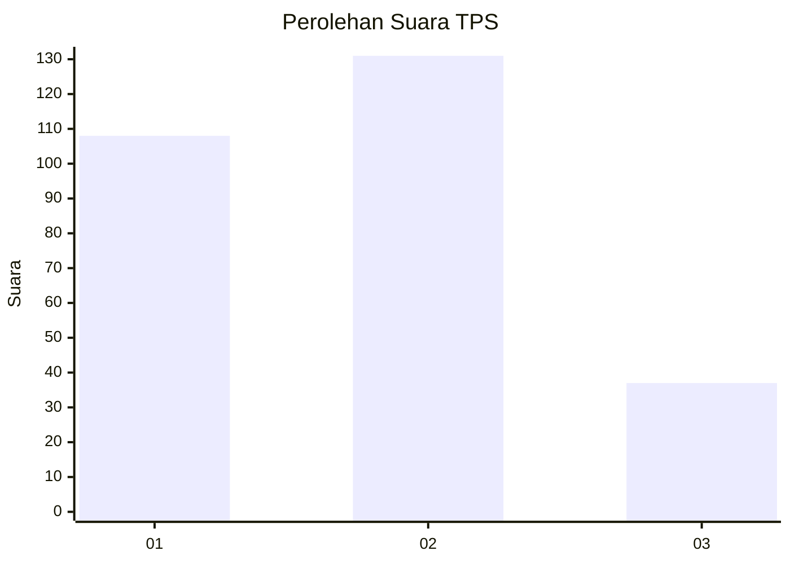
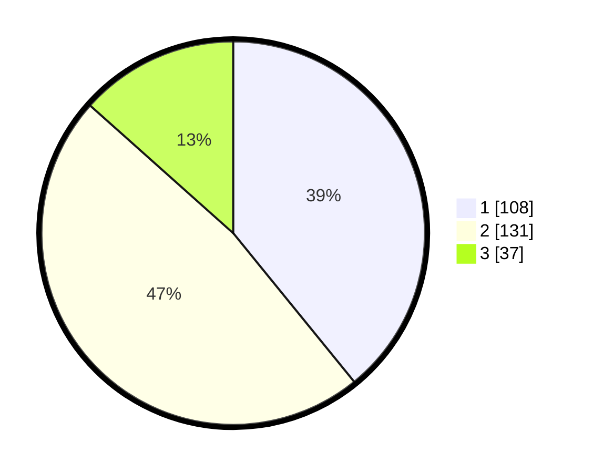

# Hasil

## Grafik

## Tabel

| No. | Nama Paslon    | Suara | Suara (raw) | Persentase |
|:--- |:-------------- | -----:| -----------:| ----------:|
| 1   | ANIES MUHAIMIN | 108   | [108][p-1]  | 39,13      |
| 2   | PRABOWO GIBRAN | 131   | [131][p-2]  | 47,46      |
| 3   | GANJAR MAHFUD  | 37    | [37][p-3]   | 13,41      |

[p-1]: https://github.com/gigit-pemilu/pemilu-2024/blob/main/pilpres/hitung-suara/sub/36-banten/sub/74-kota-tangerang-selatan/sub/01-serpong/sub/1001-ciater/sub/006-tps/sub/paslon-1.txt
[p-2]: https://github.com/gigit-pemilu/pemilu-2024/blob/main/pilpres/hitung-suara/sub/36-banten/sub/74-kota-tangerang-selatan/sub/01-serpong/sub/1001-ciater/sub/006-tps/sub/paslon-2.txt
[p-3]: https://github.com/gigit-pemilu/pemilu-2024/blob/main/pilpres/hitung-suara/sub/36-banten/sub/74-kota-tangerang-selatan/sub/01-serpong/sub/1001-ciater/sub/006-tps/sub/paslon-3.txt

## Foto C Plano

https://sirekap-obj-formc.kpu.go.id/07c1/pemilu/ppwp/36/74/01/10/01/3674011001006-20240214-213355--387fb3db-83a8-420d-ae67-c2de1707c44c.jpg

https://sirekap-obj-formc.kpu.go.id/07c1/pemilu/ppwp/36/74/01/10/01/3674011001006-20240214-213600--63eb1087-8fc6-4736-b699-a92c4c8cc038.jpg

https://sirekap-obj-formc.kpu.go.id/07c1/pemilu/ppwp/36/74/01/10/01/3674011001006-20240214-213854--e47e02bb-77f5-4533-bcaa-441961ee1b51.jpg

## Metadata

| Key        | Value               |
| ---------- | ------------------- |
| Time Stamp | 2024-02-15 12:00:28 |

