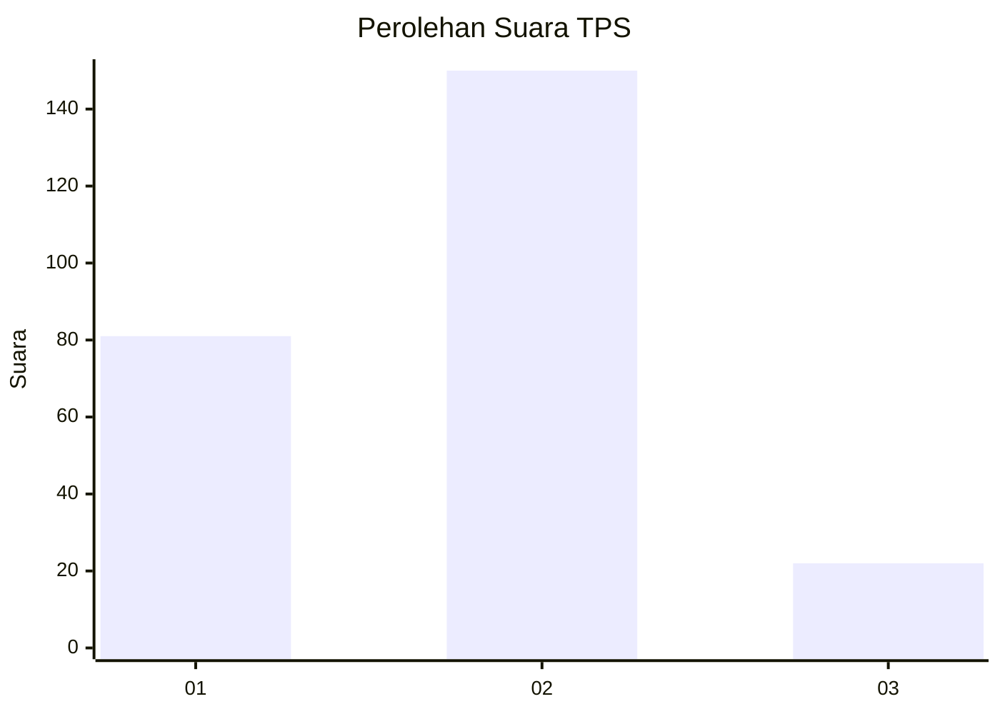
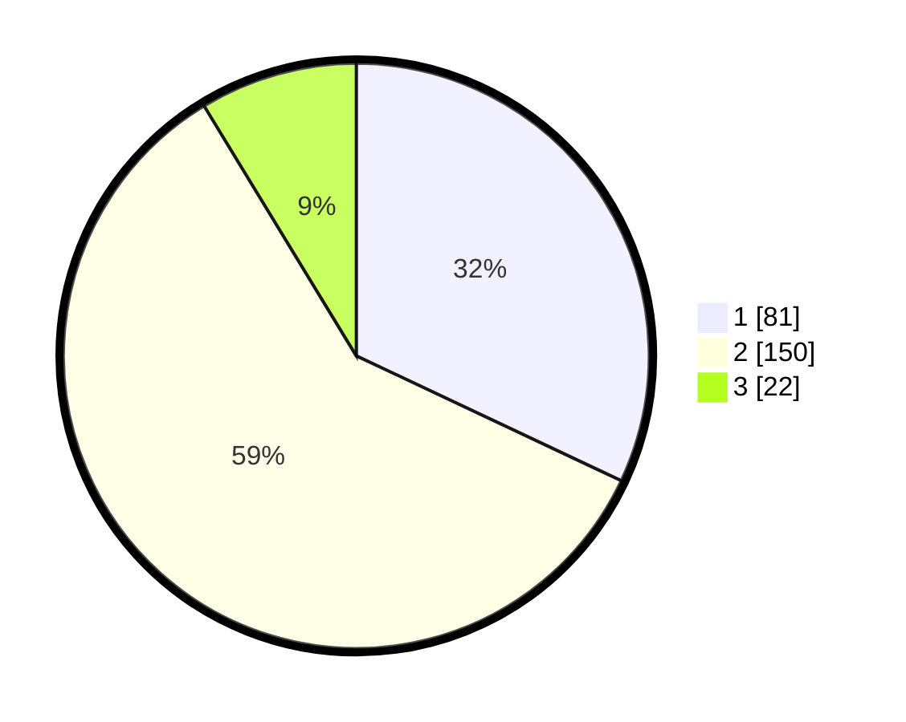

# Hasil

## Grafik

## Tabel

| No. | Nama Paslon    | Suara | Suara (raw) | Persentase |
|:--- |:-------------- | -----:| -----------:| ----------:|
| 1   | ANIES MUHAIMIN | 81    | [81][p-1]   | 32,02      |
| 2   | PRABOWO GIBRAN | 150   | [150][p-2]  | 59,29      |
| 3   | GANJAR MAHFUD  | 22    | [22][p-3]   | 8,70       |

[p-1]: https://github.com/gigit-pemilu/pemilu-2024-36-banten/blob/main/pilpres/hitung-suara/sub/36-banten/sub/74-kota-tangerang-selatan/sub/01-serpong/sub/1006-buaran/sub/003-tps/sub/paslon-1.txt
[p-2]: https://github.com/gigit-pemilu/pemilu-2024-36-banten/blob/main/pilpres/hitung-suara/sub/36-banten/sub/74-kota-tangerang-selatan/sub/01-serpong/sub/1006-buaran/sub/003-tps/sub/paslon-2.txt
[p-3]: https://github.com/gigit-pemilu/pemilu-2024-36-banten/blob/main/pilpres/hitung-suara/sub/36-banten/sub/74-kota-tangerang-selatan/sub/01-serpong/sub/1006-buaran/sub/003-tps/sub/paslon-3.txt

## Foto C Plano

https://sirekap-obj-formc.kpu.go.id/6b88/pemilu/ppwp/36/74/01/10/06/3674011006003-20240217-143850--613f110f-ff18-4a75-8e5e-09780c73705e.jpg

https://sirekap-obj-formc.kpu.go.id/6b88/pemilu/ppwp/36/74/01/10/06/3674011006003-20240217-145752--a3a31c42-477a-4f9d-b3fc-cc4e4f605bab.jpg

https://sirekap-obj-formc.kpu.go.id/6b88/pemilu/ppwp/36/74/01/10/06/3674011006003-20240217-145142--92f6c9eb-ee52-4e16-94b2-3b6e21beee3b.jpg

## Metadata

| Key        | Value               |
| ---------- | ------------------- |
| Time Stamp | 2024-02-17 16:00:02 |

## DATA PEMILIH TETAP

Jumlah pemilih dalam DPT: **293**.
 * L: **52**.
 * P: **246**.

## DATA PENGGUNA HAK PILIH

Jumlah pengguna hak pilih dalam DPT: **246**.
 * L: **228**.
 * P: **888**.

Jumlah pengguna hak pilih dalam DPTb: **0**.
 * L: **2**.
 * P: **86**.

Jumlah pengguna hak pilih dalam DPK: **3**.
 * L: **202**.
 * P: **2**.

Jumlah pengguna hak pilih: **257**.
 * L: **632**.
 * P: **125**.

## JUMLAH SUARA SAH DAN TIDAK SAH

JUMLAH SELURUH SUARA SAH: **253**.

JUMLAH SUARA TIDAK SAH: **4**.

JUMLAH SELURUH SUARA SAH DAN SUARA TIDAK SAH: **257**.

