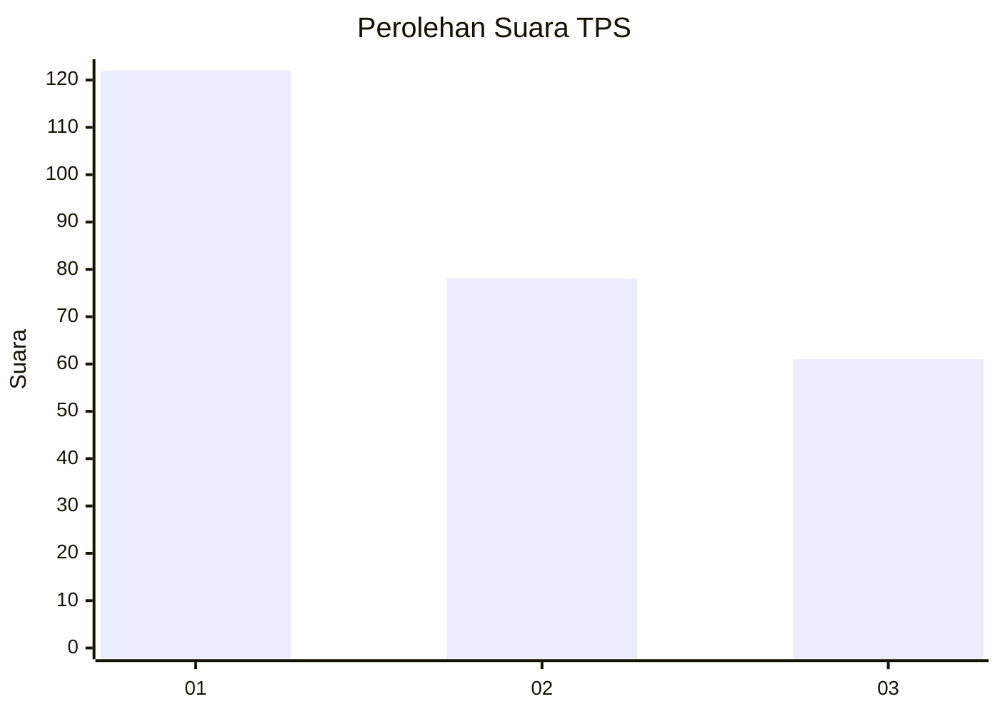
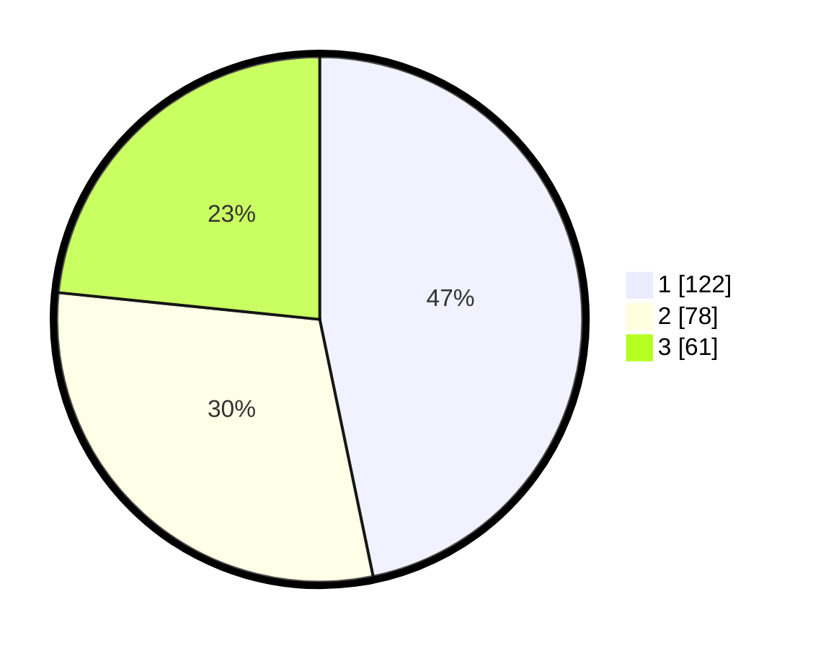

# Hasil

## Grafik

## Tabel

| No. | Nama Paslon    | Suara | Suara (raw) | Persentase |
|:--- |:-------------- | -----:| -----------:| ----------:|
| 1   | ANIES MUHAIMIN | 122   | [122][p-1]  | 46,74      |
| 2   | PRABOWO GIBRAN | 78    | [78][p-2]   | 29,89      |
| 3   | GANJAR MAHFUD  | 61    | [61][p-3]   | 23,37      |

[p-1]: https://github.com/gigit-pemilu/pemilu-2024-36-banten/blob/main/pilpres/hitung-suara/sub/36-banten/sub/74-kota-tangerang-selatan/sub/01-serpong/sub/1006-buaran/sub/024-tps/sub/paslon-1.txt
[p-2]: https://github.com/gigit-pemilu/pemilu-2024-36-banten/blob/main/pilpres/hitung-suara/sub/36-banten/sub/74-kota-tangerang-selatan/sub/01-serpong/sub/1006-buaran/sub/024-tps/sub/paslon-2.txt
[p-3]: https://github.com/gigit-pemilu/pemilu-2024-36-banten/blob/main/pilpres/hitung-suara/sub/36-banten/sub/74-kota-tangerang-selatan/sub/01-serpong/sub/1006-buaran/sub/024-tps/sub/paslon-3.txt

## Foto C Plano

https://sirekap-obj-formc.kpu.go.id/e5fe/pemilu/ppwp/36/74/01/10/06/3674011006024-20240214-195028--b486f3ba-6fc1-48d0-95d6-b2ea1989af7b.jpg

https://sirekap-obj-formc.kpu.go.id/e5fe/pemilu/ppwp/36/74/01/10/06/3674011006024-20240214-195051--691adaa3-59fe-45d9-851a-2e26be7bed52.jpg

https://sirekap-obj-formc.kpu.go.id/e5fe/pemilu/ppwp/36/74/01/10/06/3674011006024-20240219-215519--57aa1c63-1f1b-4220-8697-fe89b573409c.jpg

## Metadata

| Key        | Value               |
| ---------- | ------------------- |
| Time Stamp | 2024-02-19 22:00:00 |

