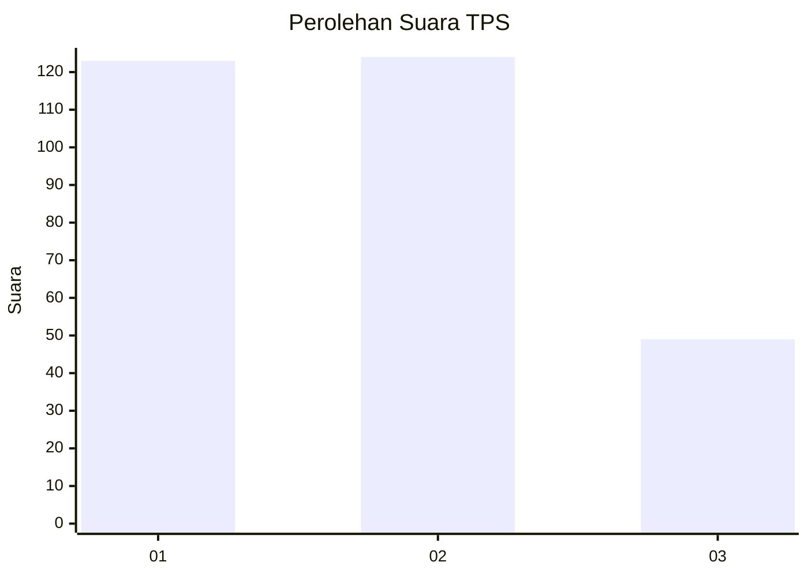
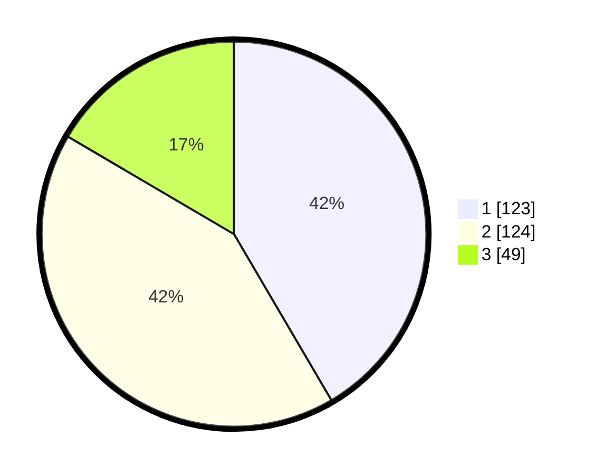

# Hasil

## Grafik

## Tabel

| No. | Nama Paslon    | Suara | Suara (raw) | Persentase |
|:--- |:-------------- | -----:| -----------:| ----------:|
| 1   | ANIES MUHAIMIN | 123   | [123][p-1]  | 41,55      |
| 2   | PRABOWO GIBRAN | 124   | [124][p-2]  | 41,89      |
| 3   | GANJAR MAHFUD  | 49    | [49][p-3]   | 16,55      |

[p-1]: https://github.com/gigit-pemilu/pemilu-2024/blob/main/pilpres/hitung-suara/sub/36-banten/sub/74-kota-tangerang-selatan/sub/01-serpong/sub/1006-buaran/sub/036-tps/sub/paslon-1.txt
[p-2]: https://github.com/gigit-pemilu/pemilu-2024/blob/main/pilpres/hitung-suara/sub/36-banten/sub/74-kota-tangerang-selatan/sub/01-serpong/sub/1006-buaran/sub/036-tps/sub/paslon-2.txt
[p-3]: https://github.com/gigit-pemilu/pemilu-2024/blob/main/pilpres/hitung-suara/sub/36-banten/sub/74-kota-tangerang-selatan/sub/01-serpong/sub/1006-buaran/sub/036-tps/sub/paslon-3.txt

## Foto C Plano

https://sirekap-obj-formc.kpu.go.id/6b08/pemilu/ppwp/36/74/01/10/06/3674011006036-20240214-200353--50f7d709-7c8c-4798-8535-609ff445a3ff.jpg

https://sirekap-obj-formc.kpu.go.id/6b08/pemilu/ppwp/36/74/01/10/06/3674011006036-20240214-200356--dcb91839-7e64-44e2-82be-c2d251efebb4.jpg

https://sirekap-obj-formc.kpu.go.id/6b08/pemilu/ppwp/36/74/01/10/06/3674011006036-20240214-200402--5af0ad06-92d1-43b7-bfa0-9de320c82be2.jpg

## Metadata

| Key        | Value               |
| ---------- | ------------------- |
| Time Stamp | 2024-02-17 19:30:00 |

