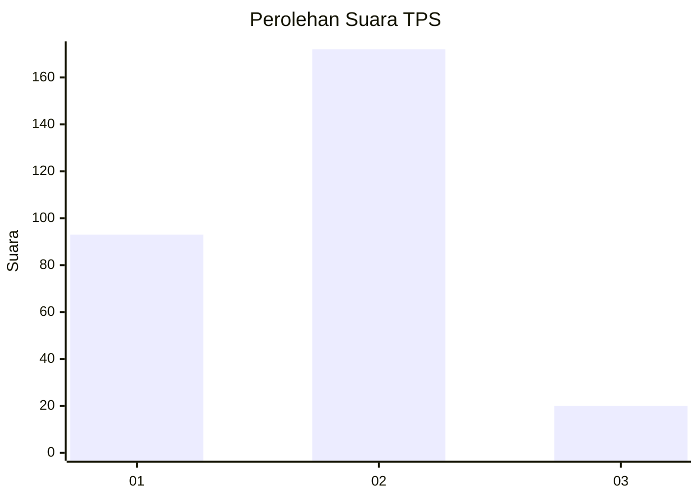
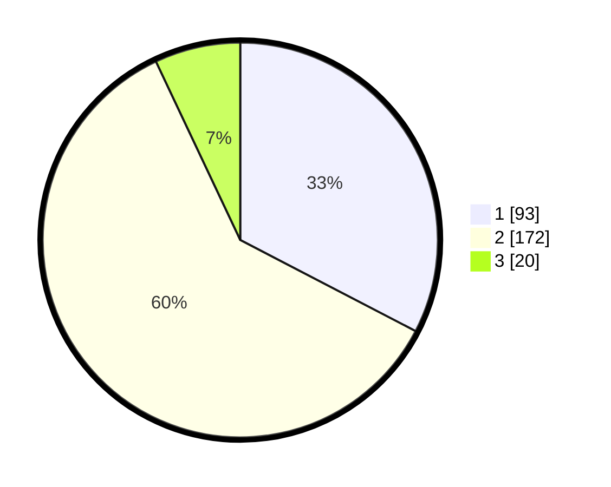

# Hasil

## Grafik

## Tabel

| No. | Nama Paslon    | Suara | Suara (raw) | Persentase |
|:--- |:-------------- | -----:| -----------:| ----------:|
| 1   | ANIES MUHAIMIN | 93    | [93][p-1]   | 32,63      |
| 2   | PRABOWO GIBRAN | 172   | [172][p-2]  | 60,35      |
| 3   | GANJAR MAHFUD  | 20    | [20][p-3]   | 7,02       |

[p-1]: https://github.com/gigit-pemilu/pemilu-2024/blob/main/pilpres/hitung-suara/sub/36-banten/sub/74-kota-tangerang-selatan/sub/01-serpong/sub/1006-buaran/sub/048-tps/sub/paslon-1.txt
[p-2]: https://github.com/gigit-pemilu/pemilu-2024/blob/main/pilpres/hitung-suara/sub/36-banten/sub/74-kota-tangerang-selatan/sub/01-serpong/sub/1006-buaran/sub/048-tps/sub/paslon-2.txt
[p-3]: https://github.com/gigit-pemilu/pemilu-2024/blob/main/pilpres/hitung-suara/sub/36-banten/sub/74-kota-tangerang-selatan/sub/01-serpong/sub/1006-buaran/sub/048-tps/sub/paslon-3.txt

## Foto C Plano

https://sirekap-obj-formc.kpu.go.id/7a09/pemilu/ppwp/36/74/01/10/06/3674011006048-20240214-213822--f6eca636-7027-4d07-8d23-fc0086604744.jpg

https://sirekap-obj-formc.kpu.go.id/7a09/pemilu/ppwp/36/74/01/10/06/3674011006048-20240214-214120--45480403-010e-441f-b5fa-e2d8bcb080ea.jpg

https://sirekap-obj-formc.kpu.go.id/7a09/pemilu/ppwp/36/74/01/10/06/3674011006048-20240214-213519--a149b066-1536-4756-8c11-ed452e99ed26.jpg

## Metadata

| Key        | Value               |
| ---------- | ------------------- |
| Time Stamp | 2024-02-17 19:30:00 |

